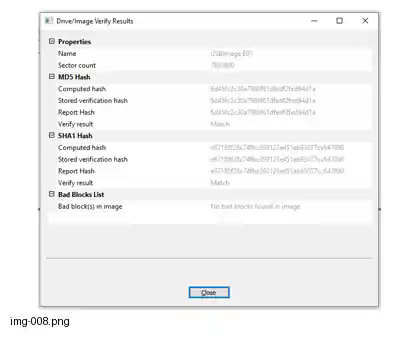

# Case 01 — Forensic USB Acquisition with FTK Imager

## Case Overview

This case documents the forensic acquisition of a USB storage device using **FTK Imager**. The objective was to create a forensic image of the physical USB drive in **E01 format**, preserve relevant acquisition metadata, and verify the resulting image using cryptographic hashes.

## Objective

- Acquire a forensic image of a USB storage device.
- Preserve acquisition and case metadata.
- Create the image in E01 format.
- Verify the acquired image using MD5 and SHA-1 hashes.
- Confirm that no bad blocks were reported during acquisition.

## Evidence

| Item | Value |
|---|---|
| Evidence type | USB storage device |
| Acquisition type | Physical drive acquisition |
| Image format | E01 |
| Tool | FTK Imager |
| Bad blocks reported | None |
| Sector count | 7,880,800 |

## Acquisition Methodology

### 1. Select the Physical Drive

The USB device was identified in FTK Imager as a physical drive and selected as the acquisition source.

### 2. Select the Image Format

The destination image format was configured as **E01**.

E01 was used because it supports forensic acquisition metadata, compression, and integrity verification within a format commonly supported by forensic-analysis tools.

### 3. Enter Case and Evidence Metadata

Case and evidence information was entered during the acquisition configuration process so that the resulting image contained the relevant acquisition metadata.

> Embedded image metadata should not be confused with a complete chain-of-custody record. Chain of custody also requires appropriate external documentation of evidence handling and transfer.

### 4. Configure the Destination

The destination location and image filename were configured before acquisition. The acquisition settings were reviewed before the process was started.

### 5. Perform the Acquisition

FTK Imager acquired the selected physical USB drive and created the E01 image. The acquisition process reported no bad blocks.

### 6. Verify the Image

After acquisition, the resulting image was verified using the hashes reported by FTK Imager.

## Acquisition Results

The completed acquisition reported:

```text
Sector count: 7,880,800
Bad blocks: None
```

The report recorded the following verification values:

```text
MD5:
6d45fc2c30a7986f61dfedf2fed94d1a

SHA-1:
e67188f28c74fbc393123e451eb93077cc647890
```

Both the MD5 and SHA-1 verification results were reported as **Match**.

## Hash Verification

Hash verification provides evidence that the acquired image corresponds to the source data represented by the acquisition at the time of verification.

The recorded matching hashes support evidence-integrity verification. Hash matching alone does not establish legal admissibility or, by itself, prove that every aspect of an acquisition process was forensically sound.

MD5 and SHA-1 were the algorithms recorded by FTK Imager for this exercise. They are preserved here because they are part of the original acquisition record. For new security-sensitive workflows, algorithm selection should follow the requirements of the forensic tool, organization, and applicable procedures.

### Verification Evidence

The original FTK Imager verification screen recorded matching MD5 and SHA-1 results and reported no bad blocks.



*Figure 1 — FTK Imager Drive/Image Verify Results from the original case report.*

## Why a Forensic Image?

A forensic image provides an analysis copy of the acquired storage media while preserving the original evidence as the source. Working from an acquired image reduces the need to repeatedly access the original physical device during subsequent examination.

## Why E01?

E01 was selected for this acquisition because it can store forensic evidence together with acquisition-related metadata and integrity information, while also supporting compression and compatibility with forensic-analysis software.

## Evidence Integrity

The acquisition produced the following integrity-related results:

| Check | Result |
|---|---|
| MD5 verification | Match |
| SHA-1 verification | Match |
| Bad blocks | None |

These results support the integrity verification of the acquired image for this exercise.

## Evidence Screenshots

The original report contains screenshots documenting the FTK Imager workflow, including physical-drive selection, image-format selection, evidence metadata, destination configuration, acquisition progress, completion, and hash verification.

The repository now embeds the most important verification screenshot directly in the Markdown report. Additional workflow screenshots can be added to `assets/case-01/` as individual image assets during the remaining repository cleanup.

## Conclusion

The USB storage device was acquired using FTK Imager as an E01 forensic image. The acquisition completed without reported bad blocks, and the recorded MD5 and SHA-1 verification values matched.

The exercise demonstrates a basic forensic acquisition workflow: identify the physical evidence, configure the acquisition, preserve acquisition metadata, create a forensic image, and verify the resulting image using recorded hashes.

## Skills Demonstrated

- Forensic evidence acquisition
- FTK Imager
- Physical-drive imaging
- E01 forensic image format
- Hash-based integrity verification
- Evidence metadata handling
- Basic forensic evidence preservation principles
