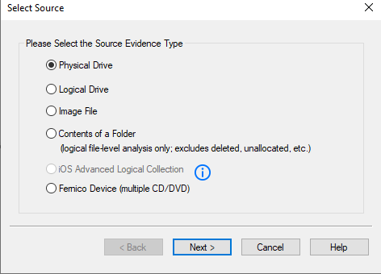
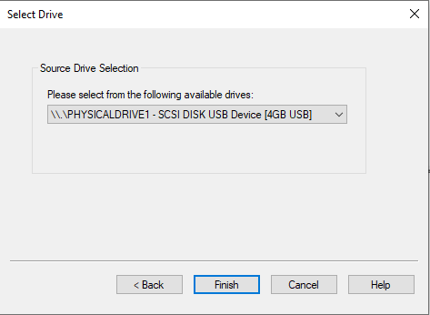
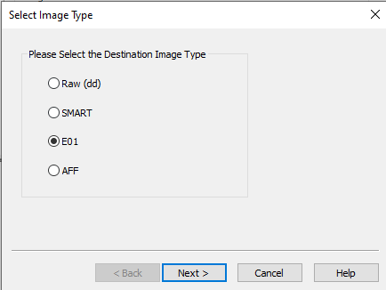
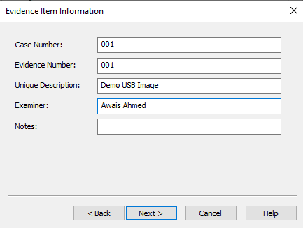
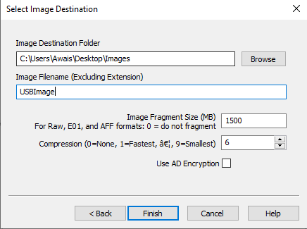
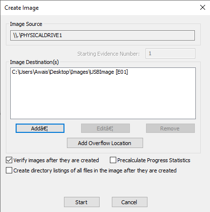
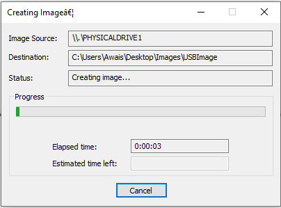
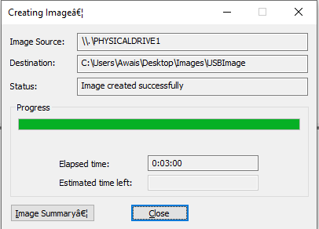
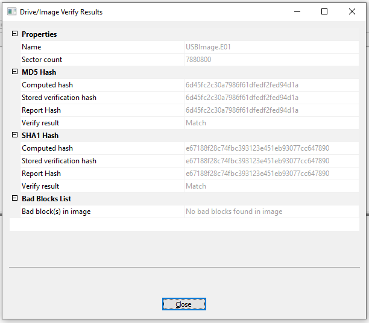

# Forensic Acquisition of a USB Storage Device

*Bit-by-Bit E01 Imaging and Hash Verification with AccessData FTK Imager*

**Author:** Awais Ahmed
**Program:** B.S. Digital Forensics and Cyber Security (DFCS)
**Certification Track:** Certified Computer Forensics Analyst (CCFA)

| Field | Detail |
|---|---|
| **Examiner**         | Awais Ahmed                                                           |
| **Role**             | Digital Forensics Student / Examiner-in-Training                      |
| **Source Practical** | “Creating a Forensic Bit-by-Bit (E01) Image of a USB Drive” worksheet |
| **Evidence Source**  | 4 GB USB flash drive, imaged via AccessData FTK Imager                |

---

## 1. Executive Summary

This report documents the forensically sound acquisition of a 4 GB USB
flash drive using AccessData FTK Imager, as part of Digital Forensics
and Cyber Security (DFCS) coursework aligned to Certified Computer
Forensics Analyst (CCFA) competencies. It covers the full acquisition
workflow end to end: selecting the correct source device, choosing the
E01 (EnCase) evidence format, recording case and evidence metadata,
configuring the destination and compression settings, running the
bit-by-bit acquisition, and verifying the resulting image's integrity
through MD5 and SHA-1 hash comparison.

The resulting file, USBImage.E01, was confirmed to be a complete,
unaltered copy of the source drive: both computed hashes matched their
stored verification values exactly, and no bad blocks were found. This
report walks through every step of that process in order, with the
reasoning behind each choice made along the way, so the acquisition can
be understood and reproduced by anyone reviewing it.

## 2. Background: Why a Forensic Image, Not a File Copy

An ordinary copy-paste operation only captures the files that are
currently visible on a device, and can itself alter file timestamps or
metadata in the process, exactly the kind of change an examiner cannot
afford to introduce into evidence. A forensic bit-by-bit (bit-stream)
image instead captures every sector of the source media, including
deleted files, file-system slack space, and unallocated space, while
leaving the original device completely unmodified.

Hashing the resulting image, both immediately after acquisition and
again on demand afterward, and confirming it matches the hash taken from
the source during acquisition, is what proves the image is a perfect,
unaltered duplicate. That proof is what makes a forensic image
admissible and defensible as digital evidence, rather than merely a
convenient backup.

### 2.1 Evidence Image Formats

FTK Imager supports several forensic image formats. E01 (EnCase Evidence
File) was selected for this acquisition because it embeds case metadata
and cryptographic hashes directly inside the image file itself and
supports compression, which is why it remains the most widely used
format in forensic casework.

|                                    |                                                                                                           |
|------------------------------------|-----------------------------------------------------------------------------------------------------------|
| **Format**                         | **Notes**                                                                                                 |
| **Raw (dd)**                       | A pure, unstructured sector-by-sector copy with no embedded metadata or hashes of its own.                |
| **SMART**                          | An older ASR Data format, largely superseded in modern casework.                                          |
| **E01 (EnCase)**                   | Embeds case metadata and hash values in the file itself, supports compression; used for this acquisition. |
| **AFF (Advanced Forensic Format)** | An open, extensible container format, less universally supported by commercial tools than E01.            |

## 3. Examination Environment and Tools

- AccessData FTK Imager (Windows), a free imaging and
evidence-preview tool from AccessData/Exterro, used for the full
acquisition and verification workflow documented in this report.

- Source media: a 4 GB USB flash drive, presented to Windows as
`\\.\PHYSICALDRIVE1`.

- Destination format: E01 (EnCase Evidence File), compression level
6, balancing output file size against processing time.

- Verification: FTK Imager's built-in MD5 and SHA-1 hashing,
computed during acquisition and re-checked in an automatic
post-acquisition verify pass.

## 4. Procedure and Results

### 4.1 Select the Source Evidence Type

**Purpose:** Tells FTK Imager what kind of source it is about to acquire
from, which determines whether the entire physical device is imaged or
only a single logical partition.

In FTK Imager, File → Create Disk Image… opens the source-selection
dialog. Since the evidence here is a physical USB drive rather than a
single partition on it, Physical Drive was selected, ensuring the whole
device, including its full partition table and any unpartitioned space,
is captured.

*Figure 1. Selecting “Physical Drive” as the source evidence type.*

**Finding:** Source evidence type: Physical Drive.

### 4.2 Select the Physical Drive

**Purpose:** Confirms the exact physical device being acquired before
any data is read, since acquiring the wrong drive cannot be undone.

FTK Imager lists every physical drive currently connected to the system.
The 4 GB USB device appeared as `\\.\PHYSICALDRIVE1`, clearly identified
by its size and interface (SCSI Disk USB Device), which confirmed the
correct drive before proceeding.

*Figure 2. Choosing the correct physical drive from the dropdown list.*

**Finding:** Selected drive: `\\.\PHYSICALDRIVE1`, SCSI Disk USB Device
\[4GB USB\].

### 4.3 Choose the Destination Image Type

**Purpose:** Selects the evidence file format the acquisition will be
written in, which determines what metadata and compression options are
available.

Of the four formats FTK Imager offers (Raw/dd, SMART, E01, AFF), E01 was
selected, for the reasons given in Section 2.1: embedded hashes and case
metadata, plus compression support.

*Figure 3. Selecting E01 as the destination image format.*

**Finding:** Destination image type: E01 (EnCase Evidence File).

### 4.4 Enter Evidence Item Information

**Purpose:** Records the case metadata that gets embedded directly into
the E01 file's header, tying the image to a specific case and examiner
from the moment it is created.

Before creating the image, FTK Imager prompts for Case Number, Evidence
Number, a Unique Description, the examiner's name, and optional notes.
This information is embedded into the E01 file's header, preserving
chain-of-custody details alongside the image itself rather than in a
separate document that could become disconnected from the evidence.

*Figure 4. Entering case number, evidence number, description, and
examiner name.*

**Finding:** Case Number: 001. Evidence Number: 001. Unique Description:
Demo USB Image. Examiner: Awais Ahmed.

### 4.5 Configure the Image Destination

**Purpose:** Sets where the finished image file will be written and how
it will be split and compressed, balancing manageability and processing
time against final file size.

The destination folder and image filename were specified, along with a
fragment size of 1500 MB (splitting the image into manageable segments
rather than one very large file) and a compression level of 6 (balancing
output size against processing time). AD Encryption was left unchecked
for this exercise.

*Figure 5. Setting the destination folder, filename, fragment size, and
compression level.*

**Finding:** Destination folder: C:\Users\Awais\Desktop\Images.
Filename: USBImage. Fragment size: 1500 MB. Compression: 6. AD
Encryption: not used.

### 4.6 Review the Create Image Summary

**Purpose:** Gives a final chance to confirm the source and destination
are correct, and to enable automatic post-acquisition verification,
before any data is written.

Before starting, FTK Imager displays a summary of the source and
destination, with the option to add additional destinations or overflow
locations. “Verify images after they are created” was checked, which
tells FTK Imager to automatically re-hash the finished image and compare
it against the source once acquisition completes, a critical integrity
step covered in full in Section 4.9.

*Figure 6. Final review before starting acquisition, with verification
enabled.*

**Finding:** Image source: `\\.\PHYSICALDRIVE1`. Image destination:
C:\Users\Awais\Desktop\Images\USBImage \[E01\]. Verify images after they
are created: enabled.

### 4.7 Acquisition in Progress

**Purpose:** Documents that the acquisition ran to completion as a
normal, monitored process, with live progress rather than an opaque
background task.

Once Start was clicked, FTK Imager read the source drive sector by
sector and wrote it to the destination E01 file, displaying live
progress, elapsed time, and an estimated time remaining throughout.

*Figure 7. Imaging in progress, with elapsed time tracked in real time.*

**Finding:** Status during acquisition: Creating image…

### 4.8 Acquisition Complete

**Purpose:** Confirms the sector-by-sector copy finished without error
before moving on to the separate, and equally important, verification
step.

When the sector-by-sector copy finished, the status updated to “Image
created successfully.” From this dialog, an Image Summary can be opened,
or the dialog can simply be closed to move on to verification.

*Figure 8. Confirmation that the image was created successfully.*

**Finding:** Status: Image created successfully. Elapsed time: 0:03:00.

### 4.9 Verify Image Integrity

**Purpose:** This is the step that actually proves the acquisition is
trustworthy: without independent hash verification, a successfully
completed copy is not yet forensically proven to be an accurate one.

FTK Imager computed MD5 and SHA-1 hashes of the newly created image and
compared them against the hashes computed from the original source drive
during acquisition.

*Figure 9. Drive/Image Verify Results showing matching MD5 and SHA-1
hashes.*

**Finding:** Sector count: 7,880,800. MD5 computed hash:
6d45fc2c30a7986f61dfedf2fed94d1a, verify result: Match. SHA-1 computed
hash: e67188f28c74fbc393123e451eb93077cc647890, verify result: Match.
Bad blocks: none found.

## 5. Technical Discussion

### 5.1 What Hash Verification Actually Proves

A matching hash between the source drive and the finished E01 image does
not just mean the two files happen to be similar, it means they are
bit-for-bit identical. MD5 and SHA-1 are cryptographic hash functions:
changing even a single bit anywhere in gigabytes of source data produces
a completely different hash value, with no practical way to predict or
force a collision. Running two independent algorithms (MD5 and SHA-1)
rather than just one further reduces the already-negligible chance that
an undetected error could produce a coincidental match in both
simultaneously.

### 5.2 Why This Matters for Admissibility

A forensic image is only as useful as an opposing party's willingness to
trust that it accurately represents the original evidence. Recording the
acquisition hash at the moment of imaging, then independently
re-computing and comparing that hash on demand, gives any later
reviewer, not just the original examiner, a way to confirm the image has
not been altered since it was created. This is what separates a
forensically sound acquisition from an ordinary backup: the backup might
be perfectly accurate, but only the hashed, documented acquisition can
prove it.

## 6. Result and Conclusion

> **TECHNICAL NOTE: Result**
>
> The resulting file, USBImage.E01, is a verified forensic image of the source USB drive. Both MD5 and SHA-1 computed hashes matched their stored verification hashes exactly, and no bad blocks were found, confirming the image is a complete, unaltered, and court-defensible copy of the original evidence.

### 6.1 Key Takeaways

- A physical-drive acquisition captures the entire device (allocated
data, deleted data, and unallocated space), not just visible files.

- The E01 format embeds case metadata and hash values directly into
the evidence file, supporting chain of custody.

- Hash verification (MD5/SHA-1) before and after imaging is what
proves forensic integrity; a mismatch would indicate the image cannot be
trusted as evidence.

- Documenting each step with case/evidence numbers and an examiner
name is standard practice for reproducibility and admissibility.

### 6.2 Skills Demonstrated

- Forensic disk imaging and evidence acquisition using FTK Imager.

- Understanding of forensic image formats (Raw/dd, SMART, E01, AFF)
and when to use each.

- Chain-of-custody documentation (case number, evidence number,
examiner).

- Cryptographic hash verification (MD5, SHA-1) for evidence
integrity.

- Familiarity with core digital forensics acquisition methodology.
