# Windows Registry Artifact Analysis

*The State vs. Wes Mantooth: Digital Media Examination*

**Author:** Awais Ahmed
**Program:** B.S. Digital Forensics and Cyber Security (DFCS)
**Certification Track:** Certified Computer Forensics Analyst (CCFA)

| Field | Detail |
|---|---|
| **EXAMINER**           | Awais Ahmed                                                                    |
| **ROLE**               | Digital Forensics Student / Examiner-in-Training                               |
| **SOURCE PRACTICALS**  | “Week 1: Windows Registry Practical” and “System Forensic” worksheets          |
| **EVIDENCE CUSTODIAN** | Course-provided image (Mantooth.E01), examined in a controlled lab environment |

---

## 1. Executive Summary

This report documents a Windows Registry forensic examination performed
against the “Mantooth” training disk image (Mantooth.E01) as part of
Digital Forensics and Cyber Security (DFCS) coursework aligned to
Certified Computer Forensics Analyst (CCFA) competencies. The objective
was to reconstruct system configuration, user activity, and
connected-device history for a single user account of interest, Wes
Mantooth, entirely from registry artifacts.

Thirty-six examination questions were answered. For every question, the
finding was independently derived from up to three sources and
cross-checked for consistency:

- Autopsy, the case-loaded Mantooth.E01 image, examined through its
built-in Registry and Recent Activity modules.

- RegRipper-parsed hive output, the SAM, SECURITY, SOFTWARE, SYSTEM
and NTUSER.DAT hives were extracted from the image via FTK Imager and
parsed offline into plugin-based .txt reports using RegRipper 3.0.

- Host baseline comparison, the same artifact categories were pulled
from the examiner's own live Windows registry (HP laptop) to illustrate
how each key behaves on a known, non-evidentiary system.

Cross-source validation surfaced several evidentiary items of
investigative significance, most notably: a BitLocker recovery key file,
a spreadsheet named consistent with stored credit card numbers, a
presentation titled ATM_THEFTS1.ppt, Prefetch evidence that the
disk-encryption utility BestCrypt was executed, a plaintext-recoverable
WinVNC remote-access password, and login/failed-login timestamps for two
user accounts (Wes Mantooth and Dracula) that failed within one second
of each other. These findings, and their recommended investigative
follow-up, are detailed in Sections 4 and 5.

## 2. Case Background

The Mantooth scenario is a widely used digital forensics training image
built around a fictional financial-crime investigation. The disk image
(Mantooth.E01) represents a single-partition NTFS system (volume label
MANTOOTH) seized as evidence, containing multiple local user profiles
including Wes Mantooth, Dracula, and other named accounts.

The investigative premise treats Wes Mantooth as the primary subject of
interest. Filenames and artifacts recovered from his profile, including
references to ATM-related theft material, a file suggestive of stored
credit card numbers, and encryption/anti-forensic tool usage, point
toward a financial-crime narrative involving unauthorized access to card
data and possible concealment of evidence through disk or file
encryption.

This report treats the image strictly as coursework evidence: all
conclusions are drawn only from what the registry artifacts themselves
support, and every finding is framed the way it would be in a real
examination, as an artifact with a source, a path, and an evidentiary
interpretation, not as a proven fact about a real person or event.

## 3. Methodology

### 3.1 Examination Environment and Tools

The examination was carried out in a controlled lab environment using
the following tools:

- Autopsy 4.23.1, used to mount and browse the Mantooth.E01 image,
and to inspect registry and recent-activity artifacts directly within
the case.

- AccessData FTK Imager, used to navigate the image's file system
and export the raw registry hive files for offline parsing.

- RegRipper 3.0 (master branch, github.com/keydet89/RegRipper3.0),
used to run hive-specific plugins against each exported hive and
generate structured, human-readable .txt reports.

- Windows Registry Editor (regedit) on the examiner's own HP laptop,
used as a live, known-good baseline for comparison against the
evidentiary artifacts.

### 3.2 Three-Source Examination Approach

Each of the 36 questions below was answered three times, from three
independent vantage points, rather than relying on a single tool's
output. This mirrors real-world practice, where a single-source finding
is treated as provisional until corroborated:

- Source 1: Autopsy: the interpreted, GUI-level view of the artifact
as Autopsy's registry parser presents it inside the loaded case.

- Source 2: RegRipper Parsed Hive Output: the same artifact
re-derived independently from the raw exported hive, using purpose-built
RegRipper plugins, to confirm Autopsy's interpretation against the
underlying registry data.

- Source 3: Host Registry Comparison: the equivalent key pulled from
a live, non-evidentiary Windows installation, to establish what the
artifact normally looks like absent any suspicious modification, and to
sanity-check the examiner's own tooling and technique.

Where an artifact is inherently specific to the Mantooth image (a
particular file path, an MRU entry, a stored credential), no equivalent
exists on the comparison host; this is marked “Not applicable” rather
than omitted, so the absence of a third source is explicit rather than
silent.

### 3.3 Registry Hive Locations

The following hives were located and extracted from the Mantooth image
via FTK Imager prior to RegRipper analysis:

Mantooth.E01 / Partition 1 / MANTOOTH \[NTFS\] / \[root\] / Windows /
System32 / config /

- SAM

- SECURITY

- SOFTWARE

- SYSTEM

Two per-user NTUSER.DAT hives were additionally extracted to examine
user-specific activity:

Mantooth.E01 / Partition 1 / MANTOOTH \[NTFS\] / \[root\] / Users / Wes
Mantooth / NTUSER.DAT

Mantooth.E01 / Partition 1 / MANTOOTH \[NTFS\] / \[root\] / Users /
Dracula / NTUSER.DAT

SYSTEM and SOFTWARE hive plugins were used to answer questions 1–16; the
SAM hive was used for question 17–18 (user account auditing); and Wes
Mantooth's NTUSER.DAT was used for questions 19–36 (user-level activity,
MRU lists, and application-specific credentials).

### 3.4 Report Structure

Section 4 presents all 36 findings in the order examined. Each finding
states the question, the three-source evidence, and, for items of direct
investigative significance, a short forensic-significance note
explaining why the artifact matters and what it would justify doing
next. Section 5 consolidates the case-critical findings into an overall
assessment.

## 4. Findings

Findings are numbered to match the original practical worksheet
(Questions 1–36). Each finding is labeled by source rather than by
letter, to keep attribution unambiguous.

### Finding 1: Computer Name

**Purpose:** Establishes the system's assigned hostname, used to
positively identify this machine across every other artifact in the
examination.

#### Source 1: Autopsy

**Registry path:** `SYSTEM\ControlSet001\Control\ComputerName\ComputerName`**Result:** ComputerName = WESMANTOOTH-PC (Owner: Wes Mantooth;
Organization: Volturi Enterprises).

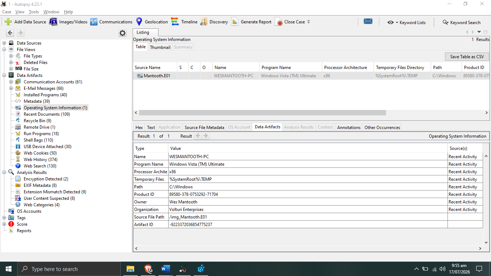

*Figure 1. Operating System Information panel showing ComputerName in
Autopsy.*

#### Source 2: RegRipper (SYSTEM hive)

**Result:** ComputerName = WESMANTOOTH-PC; TCP/IP Hostname =
WesMantooth-PC.

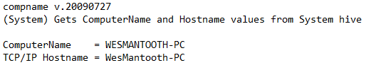

*Figure 2. compname plugin output confirming the ComputerName value
independently.*

#### Source 3: Host Registry Comparison

**Result:** Same key structure confirmed on the comparison host (value
not disclosed for the examiner's personal device).

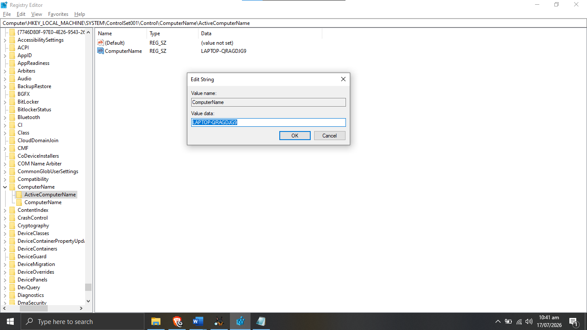

*Figure 3. Equivalent ComputerName key located on the host system.*

### Finding 2: System Time Zone

**Purpose:** Confirms the system's configured time zone so every other
timestamp recovered in this examination can be converted to a common
reference and compared accurately.

#### Source 1: Autopsy

**Registry path:** SYSTEM\ControlSet001\Control\TimeZoneInformation

**Result:** Data-source timezone tag: Asia/Karachi (examiner's ingest
setting for the case).

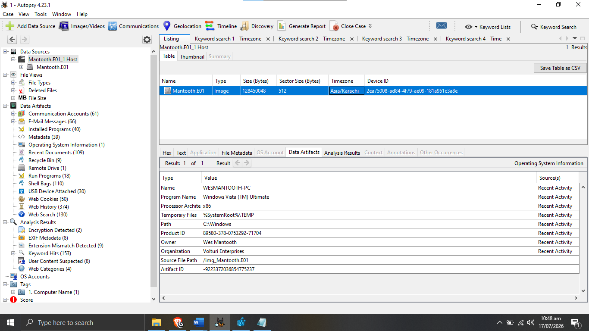

*Figure 4. Data source properties and image metadata in Autopsy.*

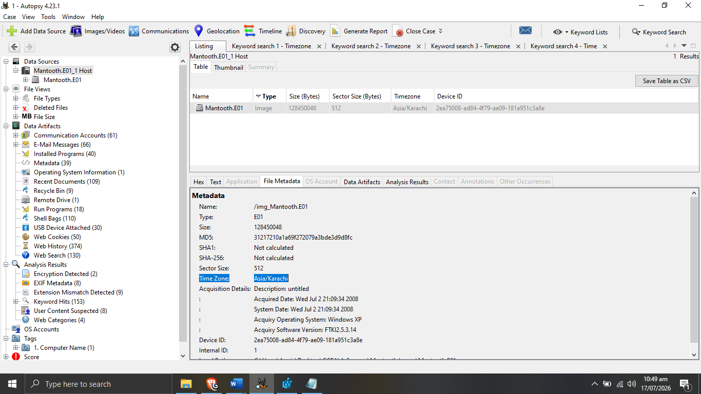

*Figure 5. Data source properties and image metadata in Autopsy.*

#### Source 2: RegRipper (SYSTEM hive)

**Result:** TimeZoneKeyName = Mountain Standard Time; Bias = 420 minutes
(UTC-7); LastWrite 2007-03-26 15:04:03Z.

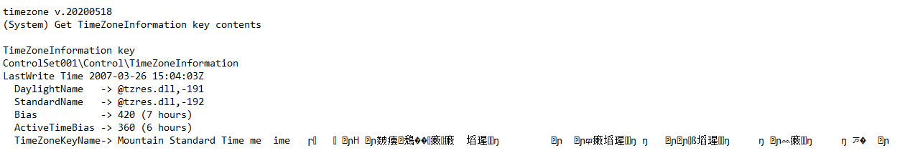

*Figure 6. timezone plugin output decoding TimeZoneInformation.*

#### Source 3: Host Registry Comparison

**Result:** Comparison host is configured for Pakistan Standard Time,
confirms the key decodes correctly outside the evidence file.

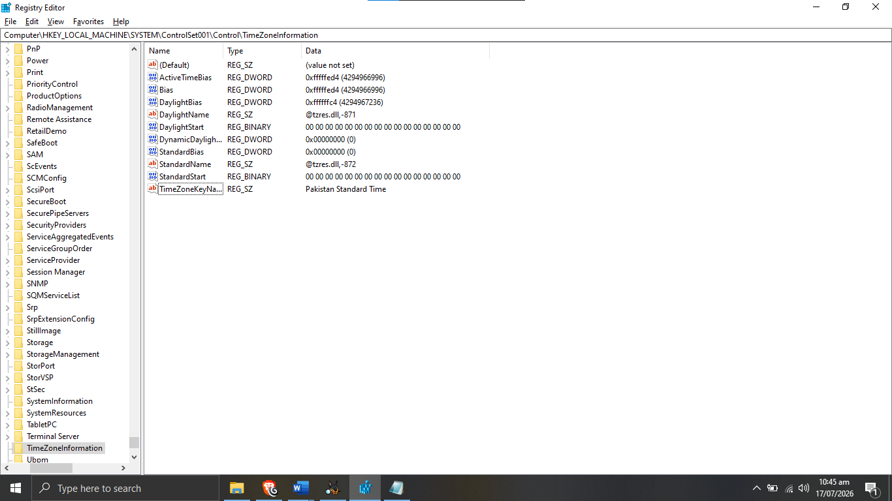

*Figure 7. TimeZoneInformation key on the host system.*

> **EVIDENCE NOTE: Forensic Significance**
>
> The registry's TimeZoneInformation (Mountain Standard Time, UTC-7) is the system-configured zone and is distinct from Autopsy's Asia/Karachi tag, which only reflects the examiner's ingest/display setting, a useful reminder to always convert timestamps against the artifact's own recorded zone, not the analysis workstation's.

### Finding 3: IDE Hard Drive Enumeration

**Purpose:** Attempts to identify the system's internal storage
controller/disk enumeration, to build a complete hardware inventory of
the machine.

*Examiner's note: the screenshots captured for this item in the original
worksheet document USB mass-storage enumeration (USBSTOR) rather than
the SYSTEM\Enum\IDE branch. They are reported below exactly as captured,
with the mismatch flagged rather than silently corrected.*

#### Source 1: Autopsy

**Registry path:** SYSTEM\ControlSet001\Enum\IDE (not directly captured,
see note above)

**Result:** View captured shows the case data-source summary rather than
an IDE controller entry.

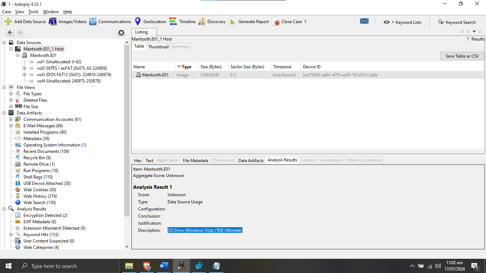

*Figure 8. Data source summary and USB Device Attached listing captured
under this item.*

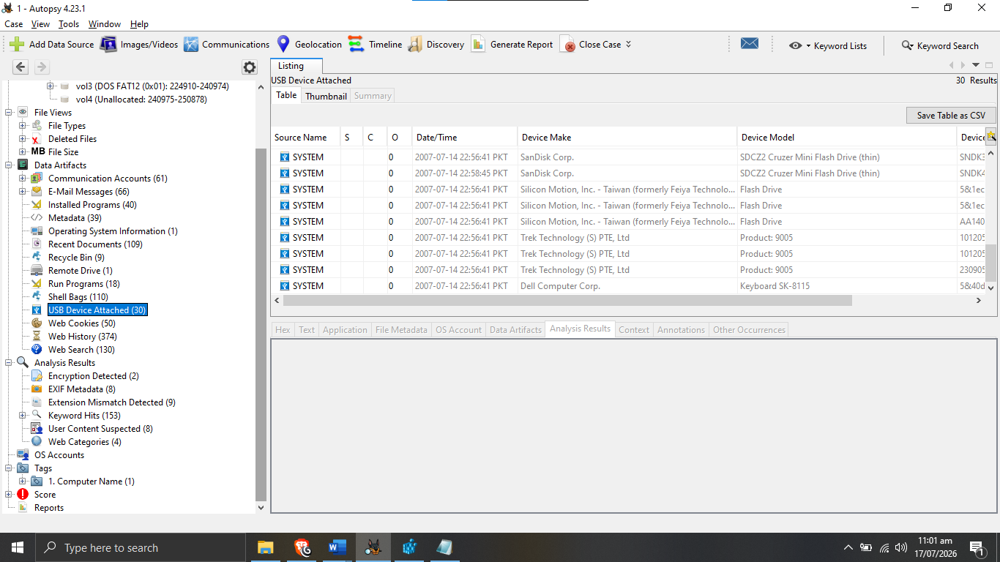

*Figure 9. Data source summary and USB Device Attached listing captured
under this item.*

#### Source 2: RegRipper (SYSTEM hive)

**Result:** usbstor plugin output: “General UDisk USB Device” and
related USBSTOR entries, not an IDE/ATA device string.

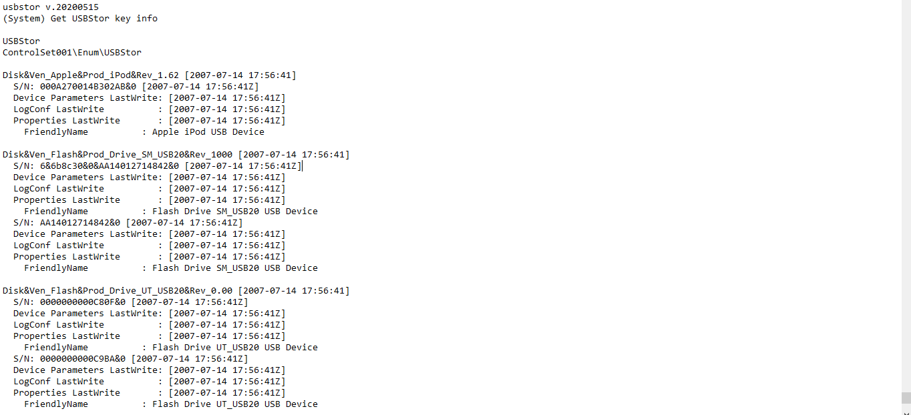

*Figure 10. usbstor plugin output captured under this item.*

#### Source 3: Host Registry Comparison

**Result:** USBSTOR\Disk&Ven_General&Prod_UDisk&Rev_5.00 key structure
shown for comparison.

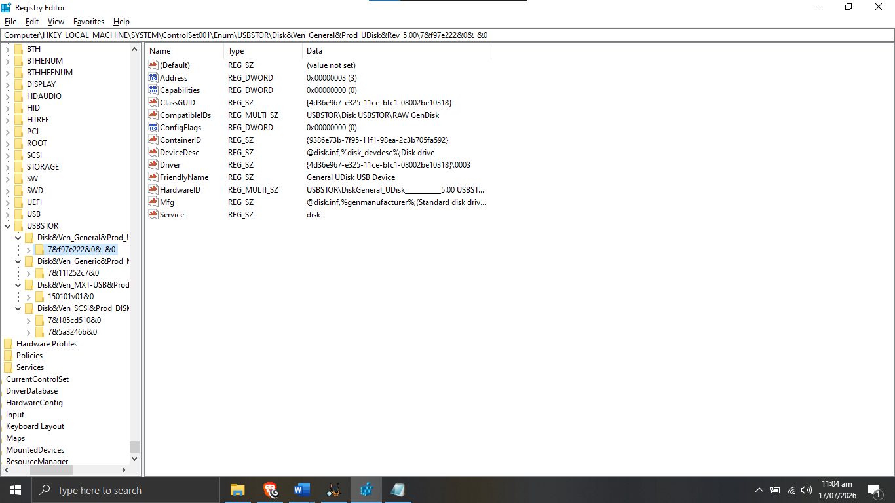

*Figure 11. USBSTOR key on the host system.*

### Finding 4: Configured IP Address / DHCP Information

**Purpose:** Identifies the network configuration in effect at the time
of the image, which is a prerequisite for interpreting any
network-related artifacts.

#### Source 1: Autopsy

**Registry path:** `SYSTEM\ControlSet001\Services\Tcpip\Parameters\Interfaces\\37D092BF-ED97-466D-AF27-CA19AAFDCC17}`**Result:** DhcpIPAddress = 172.60.33.130; DhcpServer = 172.60.60.1;
Domain hint decodes to a comcast.net DHCP lease.

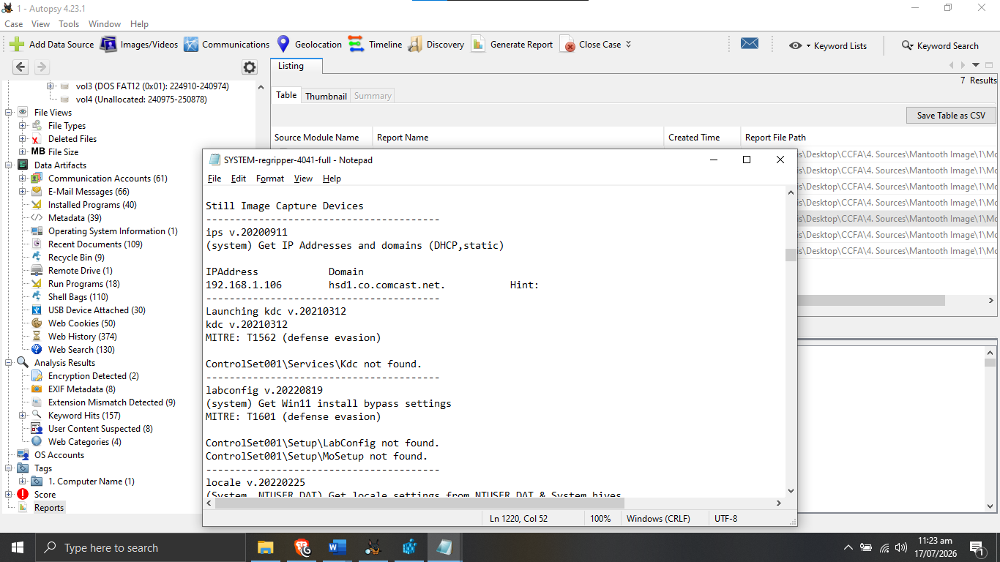

*Figure 12. RegRipper report browsed inside Autopsy, and the
Tcpip\Parameters\Interfaces enumeration.*

#### Source 2: RegRipper (SYSTEM hive)

**Result:** IPAddress 192.168.1.106, Domain hsd1.co.comcast.net (ips
plugin, resolved DHCP-assigned address and ISP domain).

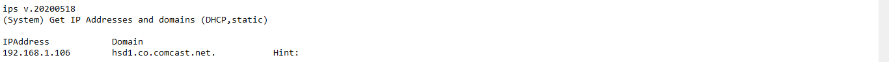

*Figure 13. ips plugin output listing the IP address and DHCP domain.*

#### Source 3: Host Registry Comparison

**Result:** Equivalent DHCP-leased interface parameters located for
structural comparison (value not disclosed for the examiner's personal
network).

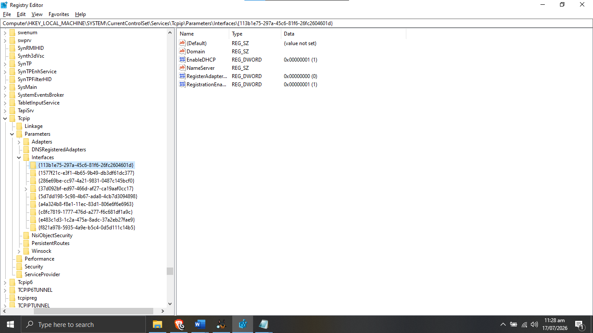

*Figure 14. Tcpip\Parameters\Interfaces key on the host system.*

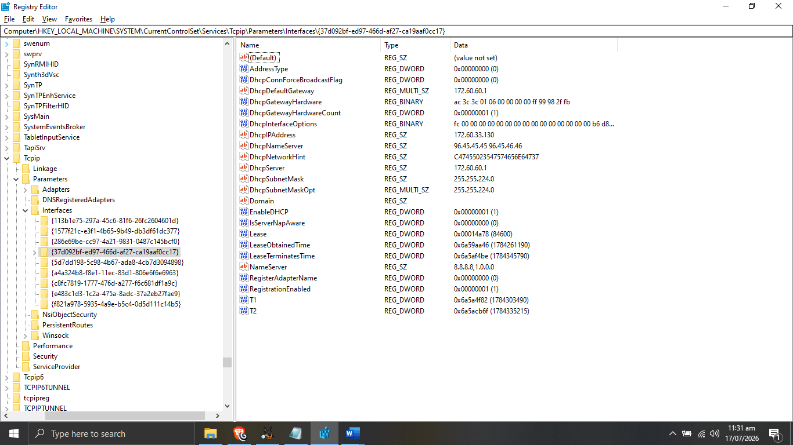

*Figure 15. Tcpip\Parameters\Interfaces key on the host system.*

### Finding 5: Prefetch Parameters (EnablePrefetcher) Setting

**Purpose:** Confirms whether Windows Prefetch was enabled, which
determines whether Prefetch (.pf) files are a reliable secondary source
of program-execution evidence later in this examination.

#### Source 1: Autopsy

**Registry path:** SYSTEM\ControlSet001\Control\Session Manager\Memory
Management\PrefetchParameters

**Result:** EnablePrefetcher = 3 (both boot and application prefetching
enabled).

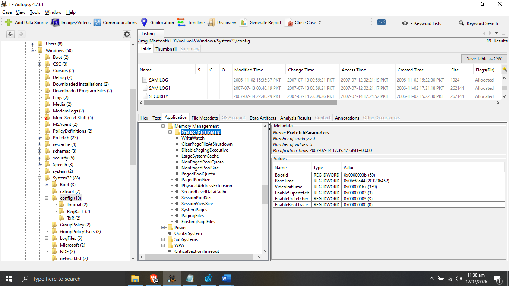

*Figure 16. PrefetchParameters key values in Autopsy's registry viewer.*

#### Source 2: RegRipper (SYSTEM hive)

**Result:** EnablePrefetcher = 3, confirming boot + application
prefetching, meaning Prefetch (.pf) files were actively being written
for executed programs.

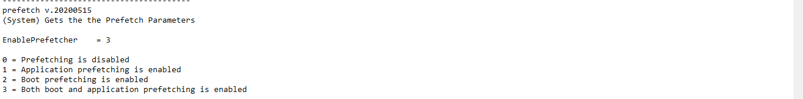

*Figure 17. prefetch plugin output and its value legend.*

#### Source 3: Host Registry Comparison

**Result:** EnablePrefetcher = 3 on the comparison host as well (Windows
default on most desktop builds).

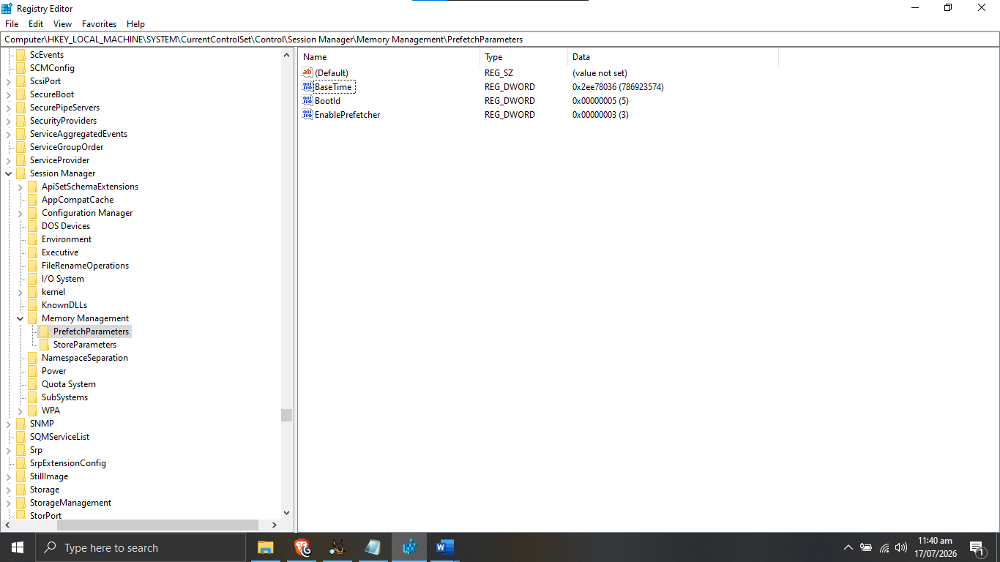

*Figure 18. PrefetchParameters key on the host system.*

> **EVIDENCE NOTE: Forensic Significance**
>
> Because prefetching was enabled for applications (not just boot), the Prefetch folder is a reliable secondary source of program-execution evidence for this case, it is what makes the BESTCRYPT.EXE execution evidence in Finding 30 possible to recover.

### Finding 6: TrueCrypt Service Start Type

**Purpose:** Determines whether the disk-encryption utility TrueCrypt
was installed and how its driver was configured to load, which is
directly relevant to a case narrative involving concealment of data.

#### Source 1: Autopsy

**Registry path:** SYSTEM\ControlSet001\Services\truecrypt

**Result:** Start = 0x00000001 (1), “System” start type, loaded by the
I/O manager during kernel initialization, immediately after boot-start
drivers.

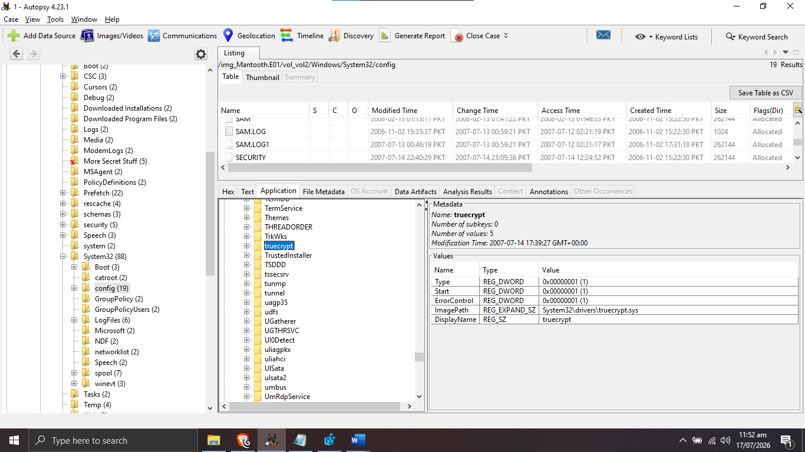

*Figure 19. truecrypt service key and its Start value in Autopsy.*

#### Source 2: RegRipper (SYSTEM hive)

**Result:** Name/Display = truecrypt; ImagePath =
System32\drivers\truecrypt.sys; Type = Kernel driver.

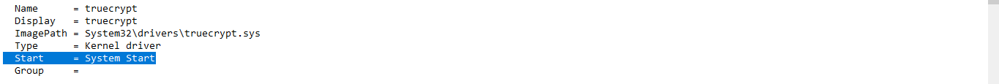

*Figure 20. services plugin output for the truecrypt driver entry.*

#### Source 3: Host Registry Comparison

No truecrypt service key exists in the host system's registry: the
software is not installed on the comparison machine, confirming the
service key is specific to evidence handling on the Mantooth system.

> **EVIDENCE NOTE: Forensic Significance**
>
> A registered TrueCrypt service, regardless of Start value, confirms the software was installed on the Mantooth system, directly relevant to a case narrative involving concealment of financial data.
>
> A System-start driver loads automatically at every boot, but the volume itself must still be manually mounted with a password; this is consistent with an encrypted container the user opens deliberately rather than an always-mounted system volume.
>
> Next step: correlate this service entry with Prefetch/UserAssist evidence of truecrypt.exe execution and search unallocated space for .tc container files or a hidden volume header.

### Finding 7: Last Recorded System Shutdown Time

**Purpose:** Establishes the last time the system was cleanly shut down,
providing a boundary for the period of legitimate system use.

#### Source 1: Autopsy

**Registry path:** SYSTEM\ControlSet001\Control\Windows (ShutdownTime)

**Result:** Not clearly resolved from Autopsy's generic registry viewer
for this key, a legible ShutdownTime value could not be confirmed from
this view alone.

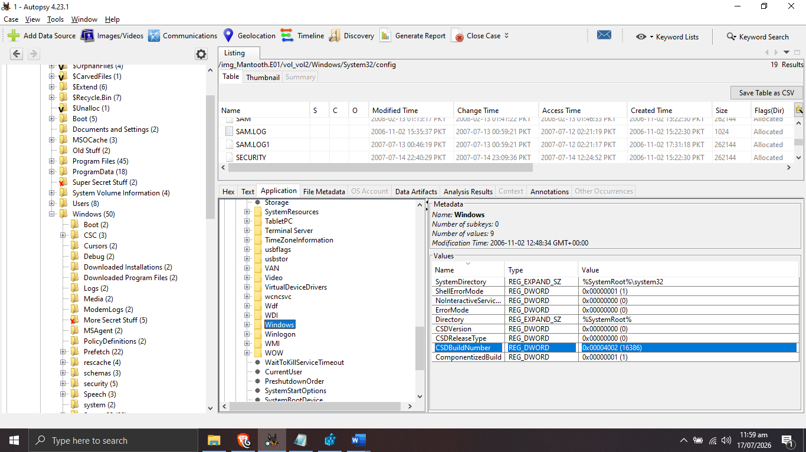

*Figure 21. Windows key browsed in Autopsy, ShutdownTime not clearly
rendered in this view.*

#### Source 2: RegRipper (SYSTEM hive)

**Result:** Decoded value: 2006-11-02 12:48:34 UTC.

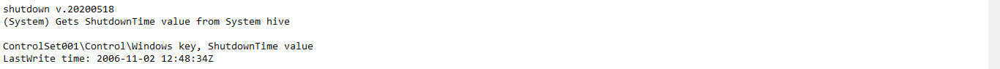

*Figure 22. shutdown plugin output decoding the ShutdownTime FILETIME
value.*

#### Source 3: Host Registry Comparison

**Result:** Windows key located on the host system for structural
comparison; no ShutdownTime value is currently set on the comparison
host at the time of capture.

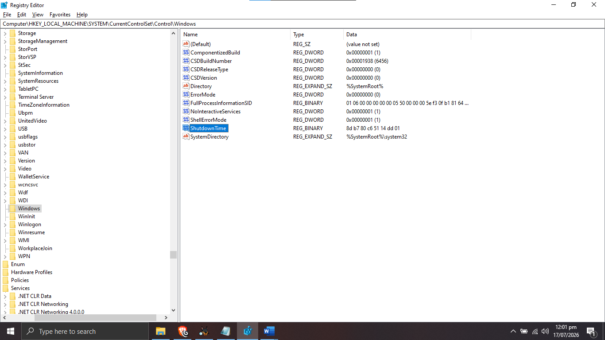

*Figure 23. Windows key on the host system's SYSTEM hive.*

> **EVIDENCE NOTE: Forensic Significance**
>
> SYSTEM\...\Windows\ShutdownTime stores a FILETIME written on every clean shutdown and is one of the few registry values that updates automatically without user interaction, making it useful for bounding the last known period of legitimate system use, here, 2006-11-02, which is earlier than the bulk of the user-activity evidence (2007–2008) recovered elsewhere in this examination.
>
> Because Autopsy's generic viewer did not clearly surface this value, RegRipper's targeted plugin was the more reliable source: a good illustration of why single-tool findings should be corroborated rather than accepted at face value.
>
> In an active investigation this timestamp would be cross-referenced against Windows Event Log shutdown/restart events (Event ID 1074/6006) to confirm consistency.

### Finding 8: Canon PowerShot SD500: Device Serial / Connection Time

**Purpose:** Identifies a specific USB-connected digital camera and when
it was first connected, a possible source of evidence photographs
relevant to the case.

#### Source 1: Autopsy

**Registry path:** SYSTEM\ControlSet001\Enum\USBSTOR

**Result:** Device Model: “Digital IXUS 700 (normal mode) / Digital IXUS
700 (PTP mode) / IXY Digital 600 (normal mode) / PowerShot SD500 (normal
mode) / PowerShot SD500 (PTP mode)”; Device ID 5&1ec84238&0&4; connected
2007-07-14 22:56:41 PKT (= 17:56:41 UTC).

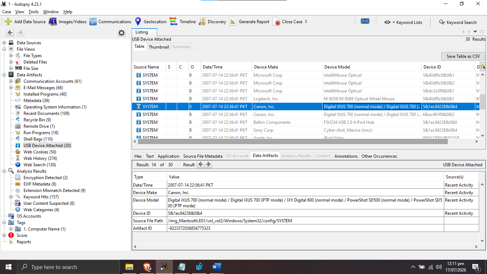

*Figure 24. USB Device Attached entry for the Canon device in Autopsy.*

#### Source 2: RegRipper (SYSTEM hive)

**Result:** Serial numbers 5&1ec84238&0&4 and 6&ac461f8&0&3, both first
connected 2007-07-14 17:56:41Z; FriendlyName “Canon PowerShot SD500”.

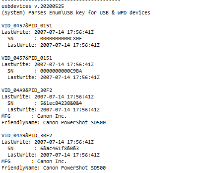

*Figure 25. usbdevices/usbstor plugin output for the Canon PowerShot
SD500.*

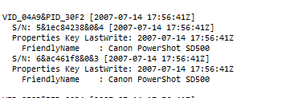

*Figure 26. usbdevices/usbstor plugin output for the Canon PowerShot
SD500.*

#### Source 3: Host Registry Comparison

Not applicable: no Canon PowerShot device has ever been connected to the
comparison host.

> **EVIDENCE NOTE: Forensic Significance**
>
> USBSTOR container IDs and the associated device class GUID uniquely identify a physical device connected to this machine, and the parent key's LastWrite time approximates when it was last first connected.
>
> A digital camera is a plausible vector for both evidence photographs and, in an ATM-fraud narrative, images of card skimmers or ATM interiors, which is worth timelining against the file-system creation dates of any image files recovered from the same period.

### Finding 9: Five Portable Devices Connected to the System

**Purpose:** Builds a complete inventory of portable/USB devices ever
connected to the system, to identify every potential data-exfiltration
or evidence-carrying device.

#### Source 1: Autopsy

**Registry path:** SYSTEM\ControlSet001\Enum\USBSTOR

**Result:** (1) Microsoft IntelliMouse Optical; (2) Logitech M-BJ69
Optical Wheel Mouse; (3) Canon Digital IXUS 700 / PowerShot SD500; (4)
Belkin F5U234 USB 2.0 4-Port Hub; (5) Sony Cyber-shot/Mavica (msc), all
first seen 2007-07-14 22:56:41 PKT.

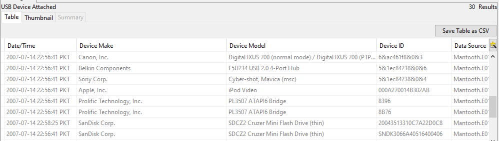

*Figure 27. USB Device Attached listing in Autopsy.*

#### Source 2: RegRipper (SYSTEM hive)

**Result:** usbstor plugin corroborates the same device set, including
the Apple iPod (S/N 00082700148302AB) and multiple flash-storage
devices, all LastWrite 2007-07-14 17:56:41Z.

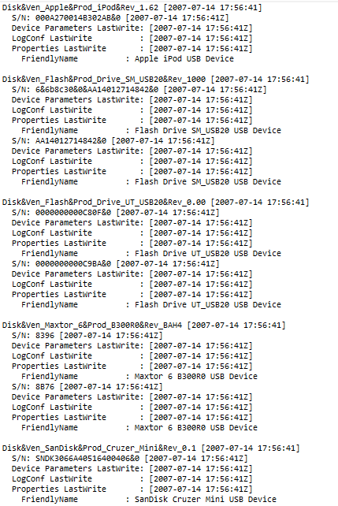

*Figure 28. usbstor plugin output enumerating connected devices.*

#### Source 3: Host Registry Comparison

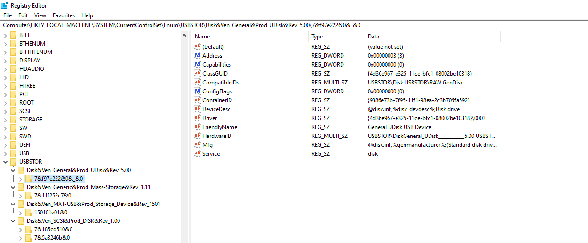

*Figure 29. Portable devices recorded on the host comparison system.*

### Finding 10: Default Web Browser

**Purpose:** Identifies which browser the user relied on by default, to
help scope which browser artifacts (history, downloads, cache) are most
relevant to pursue.

*Examiner's note: the Autopsy screenshot captured for this item shows
the Installed Programs list rather than the browser file-association
key; the actual default-browser value was not independently isolated on
the Mantooth image in this examination.*

#### Source 1: Autopsy

**Result:** Not conclusively isolated from the captured view, installed
browser-related entries include Yahoo! Browser Services, consistent with
a Yahoo! toolbar/software suite, but no explicit UserChoice ProgId was
captured.

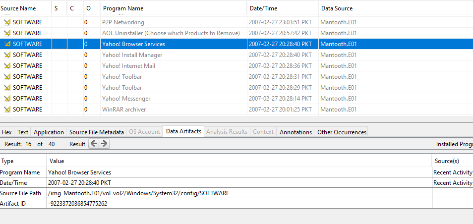

*Figure 30. Installed Programs listing captured under this item.*

#### Source 3: Host Registry Comparison

**Registry path:** `HKCU\Software\Microsoft\Windows\Shell\Associations\UrlAssociations\http\UserChoice`**Result:** ProgId decodes to Brave, confirms the UserChoice key and
hashing mechanism (introduced in Windows 8+) as the modern equivalent of
this artifact on the examiner's own system.

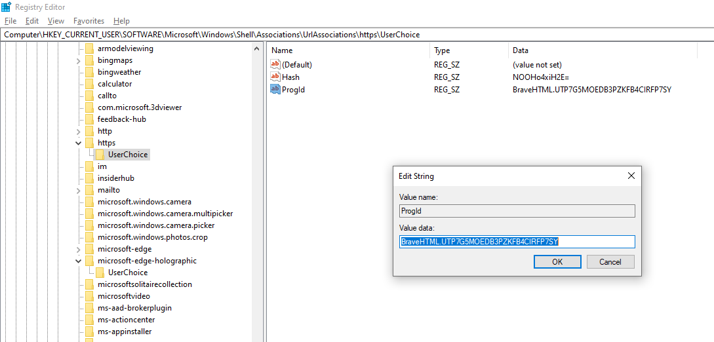

*Figure 31. UserChoice key on the host system showing the Brave ProgId.*

### Finding 11: Network Interface Cards Installed

**Purpose:** Inventories the network hardware installed on the system,
to understand what network paths were available to the user.

#### Source 1: Autopsy

**Registry path:** SOFTWARE\Microsoft\Windows
NT\CurrentVersion\NetworkCards

**Result:** Network Connections folder enumerated in Autopsy,
corroborating the two adapters identified below.

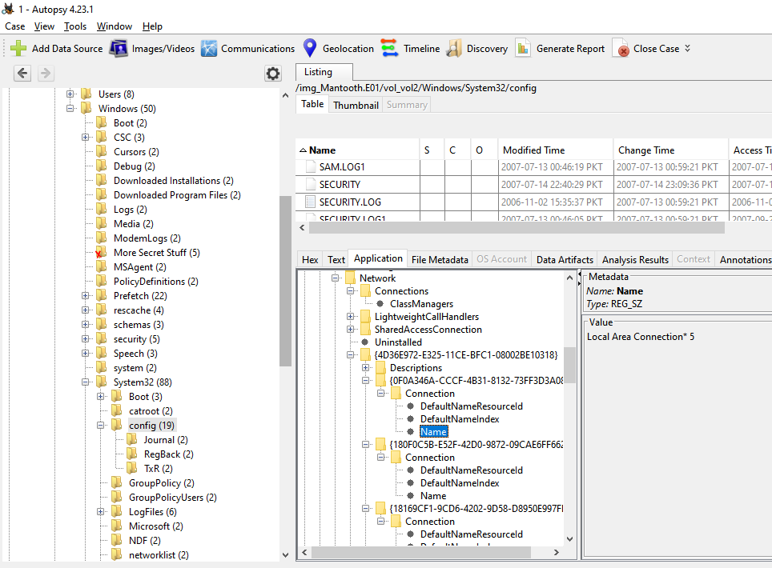

*Figure 32. Network adapter enumeration in Autopsy.*

#### Source 2: RegRipper (SOFTWARE hive)

**Result:** Linksys Wireless-G USB Network Adapter (key LastWrite
2008-02-12 18:14:42Z); Realtek RTL8139/810x Family Fast Ethernet NIC
(key LastWrite 2007-02-27 19:21:27Z).

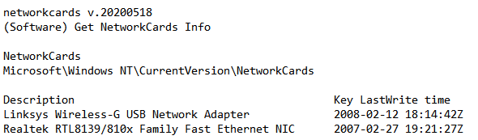

*Figure 33. networkcards plugin output listing both adapters.*

#### Source 3: Host Registry Comparison

**Result:** Host system's own NetworkCards key located for structural
comparison (e.g. Realtek RTL8821CE 802.11ac PCIe Adapter).

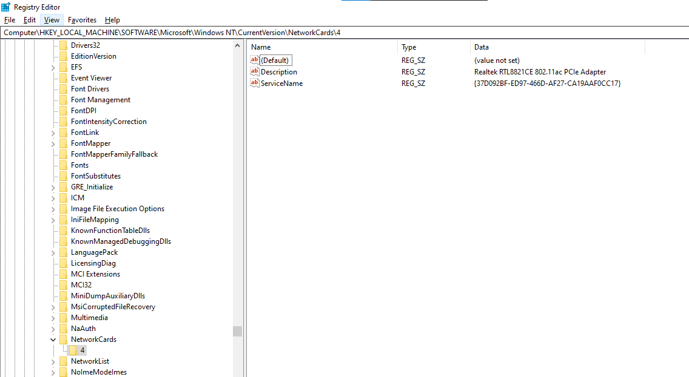

*Figure 34. NetworkCards key on the host system.*

### Finding 12: Configured Wireless Network Profile Name

**Purpose:** Identifies which wireless network the system connected to,
which can help corroborate a suspect's location or identify a shared
network relevant to the case.

#### Source 1: Autopsy

**Registry path:** SOFTWARE\Microsoft\Windows
NT\CurrentVersion\NetworkList\Profiles\\GUID}

Among the three saved network profiles, only one carries NameType 0x47
(71 decimal), the Windows-standard indicator for an 802.11 Wireless
(Wi-Fi) connection; the other two are wired (NameType 0x06).

**Result:** ProfileName = Frankenwave2 (NameType 0x47 / wireless;
DateLastConnected 2008-02-12).

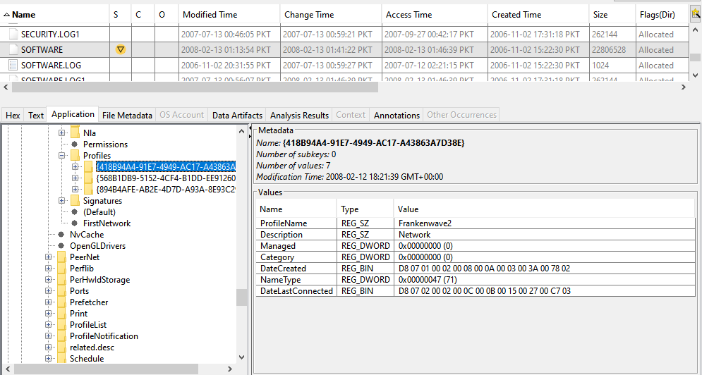

*Figure 35. The three NetworkList profile keys in Autopsy, Frankenwave2,
adata.com, and Network.*

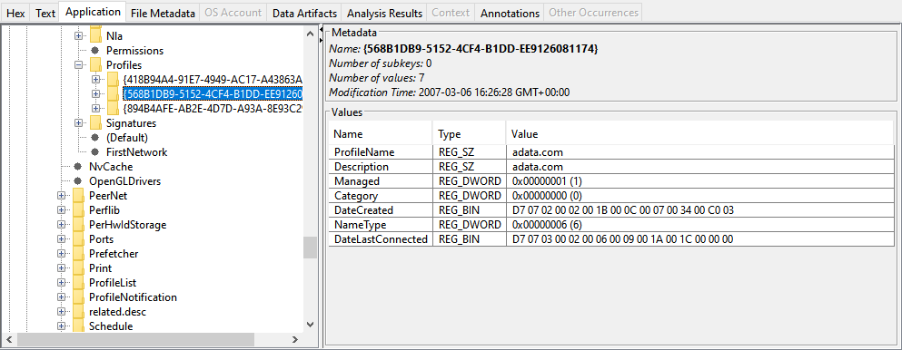

*Figure 36. The three NetworkList profile keys in Autopsy, Frankenwave2,
adata.com, and Network.*

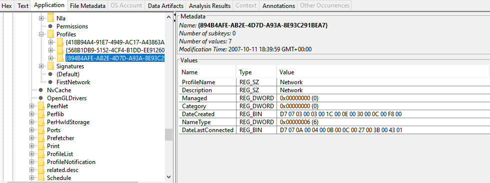

*Figure 37. The three NetworkList profile keys in Autopsy, Frankenwave2,
adata.com, and Network.*

#### Source 2: RegRipper (SOFTWARE hive)

**Result:** networklist plugin explicitly labels Frankenwave2 as Type:
wireless, distinct from the two Type: wired profiles (adata.com,
Network).

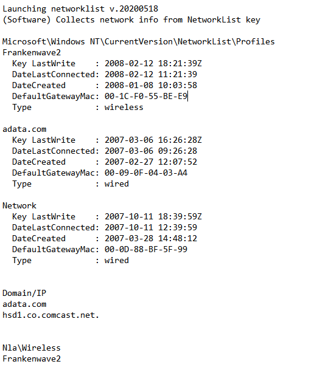

*Figure 38. networklist plugin output labeling each profile's connection
type.*

#### Source 3: Host Registry Comparison

**Result:** Two NameType 0x47 (wireless) profiles located on the host
for comparison, confirming the same artifact structure applies on modern
Windows builds.

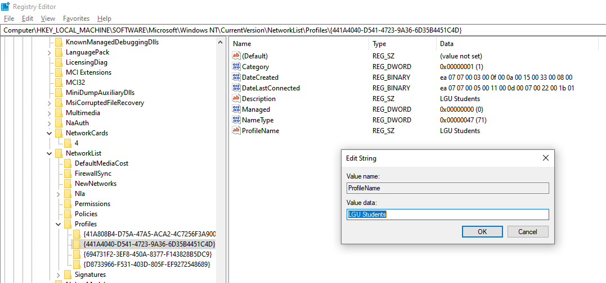

*Figure 39. NetworkList profile keys on the host system.*

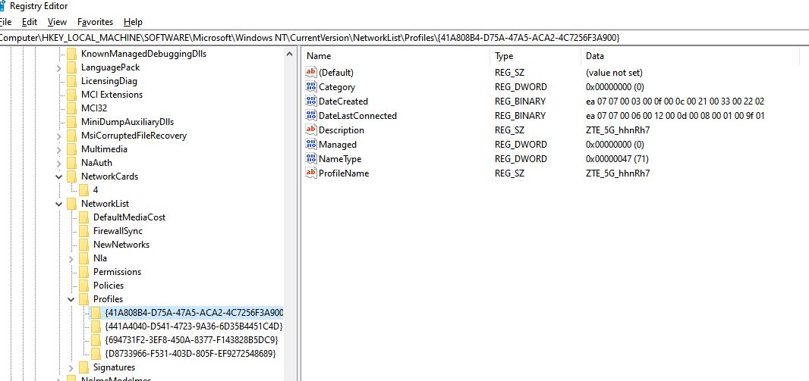

*Figure 40. NetworkList profile keys on the host system.*

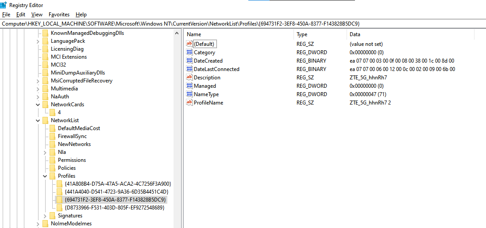

*Figure 41. NetworkList profile keys on the host system.*

> **EVIDENCE NOTE: Forensic Significance**
>
> A saved SSID places the machine, at some point, within range of a specific network, which is useful for corroborating a suspect's claimed location or identifying a shared/public network relevant to the case timeline.

### Finding 13: Three Removable Storage Devices (Last-Write, Serial, Drive
Letter)

**Purpose:** Examines three specific removable storage devices in detail
(connection time, serial number, and drive letter) to assess their
potential role in moving files off the system.

#### Source 1: Autopsy

**Registry path:** SYSTEM\ControlSet001\Enum\USBSTOR

**Result:** Apple iPod (S/N 00082700148302AB), TREK TD2SMART_G3 (Rev
2.20/2.40), and USB_2.0_Prod_Flash_Disk (Rev 1100), all three parent
keys carry the identical LastWrite timestamp of 2007-07-14 17:56:41Z.

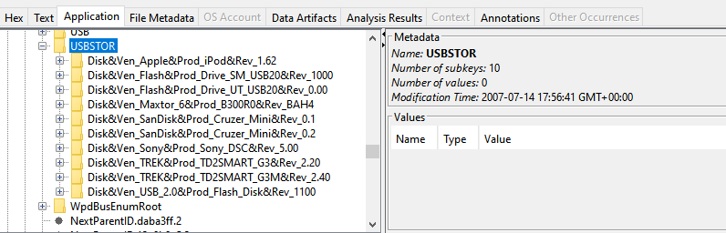

*Figure 42. USBSTOR entries for the three removable devices in Autopsy.*

#### Source 2: RegRipper (SYSTEM hive)

**Result:** Same three devices independently confirmed, alongside a
Maxtor 6 B300R0 external drive and a SanDisk Cruzer Mini.

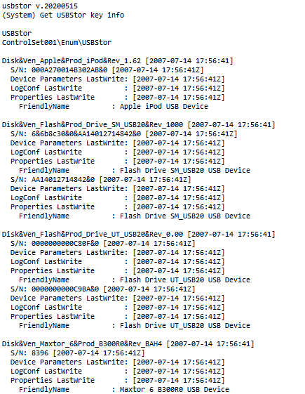

*Figure 43. usbstor plugin output listing the removable devices.*

#### Source 3: Host Registry Comparison

**Result:** USBSTOR key structure (General UDisk / Generic Mass-Storage
/ MXT-USB Storage Device) confirmed on the host for comparison.

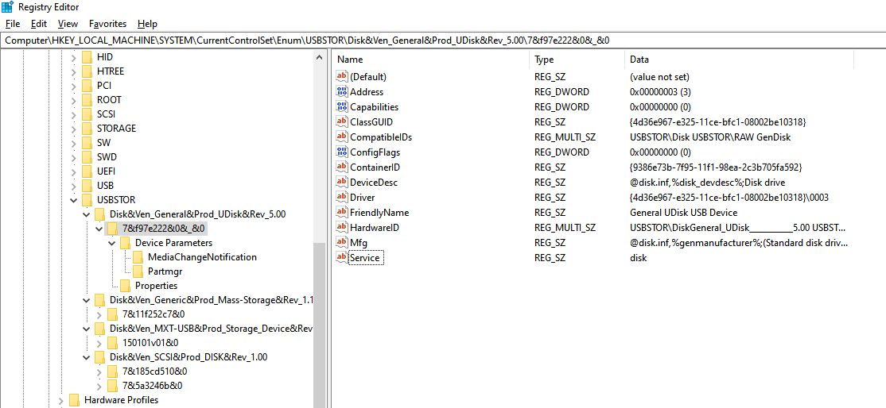

*Figure 44. USBSTOR entries on the host comparison system.*

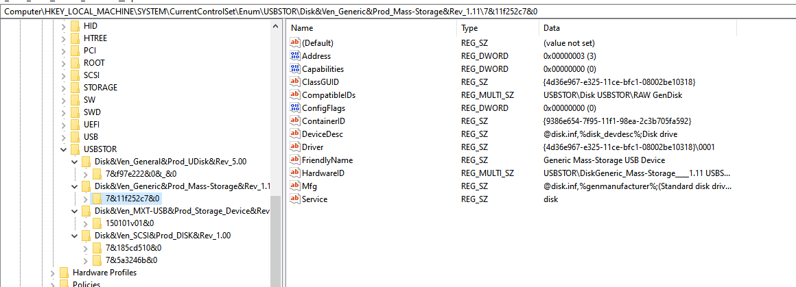

*Figure 45. USBSTOR entries on the host comparison system.*

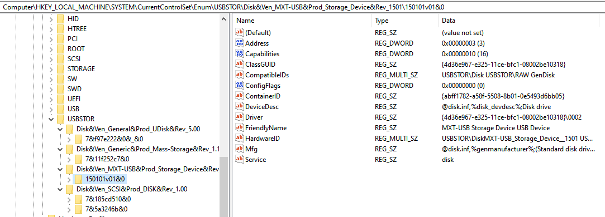

*Figure 46. USBSTOR entries on the host comparison system.*

> **EVIDENCE NOTE: Forensic Significance**
>
> All three devices sharing an identical LastWrite time is expected behavior, not a coincidence: LastWrite on the parent USBSTOR key updates only on first-ever connection, so devices first plugged in during the same session legitimately share a timestamp.
>
> The mix of an Apple iPod (audio/media capacity) and flash-type drives is worth noting given the media-player and Recent Documents artifacts found elsewhere (Findings 27 and 30), all are plausible vehicles for moving files off the system.

### Finding 14: Five Installed Software Titles (with Install Timestamps)

**Purpose:** Builds a timeline of software installation on the system,
to identify when key tools (including encryption utilities) were
introduced.

#### Source 1: Autopsy

**Registry path:** SOFTWARE\Microsoft\Windows\CurrentVersion\Uninstall

**Result:** AOL Uninstaller (2007-02-27 20:57:42Z); AIM_6 (2007-02-27
19:21:04Z); ActiveTouchMeetingClient / WebEx (2007-10-10 10:12:40Z);
BestCrypt 8.0 (2007-02-27 23:08:21Z); FileZilla (2007-06-24 00:23:53Z).

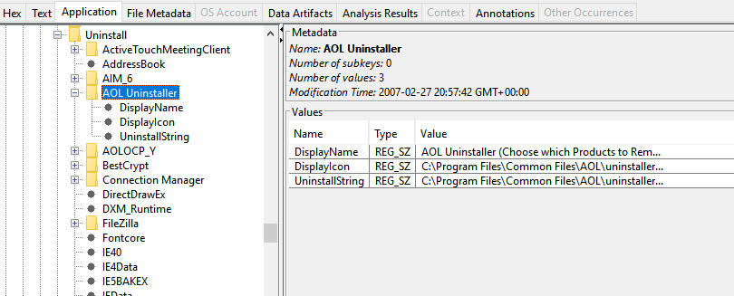

*Figure 47. Installed-application registry entries browsed in Autopsy,
including BestCrypt and Mozilla Firefox.*

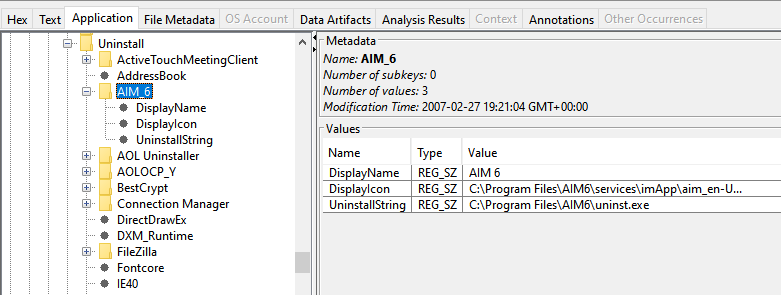

*Figure 48. Installed-application registry entries browsed in Autopsy,
including BestCrypt and Mozilla Firefox.*

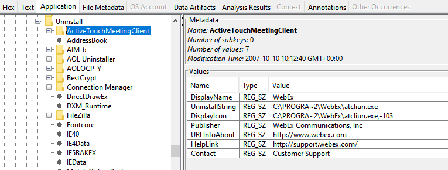

*Figure 49. Installed-application registry entries browsed in Autopsy,
including BestCrypt and Mozilla Firefox.*

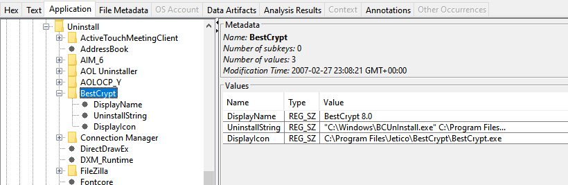

*Figure 50. Installed-application registry entries browsed in Autopsy,
including BestCrypt and Mozilla Firefox.*

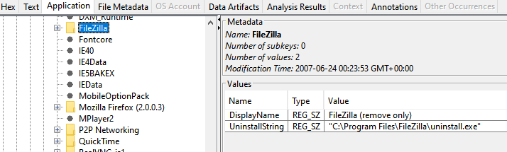

*Figure 51. Installed-application registry entries browsed in Autopsy,
including BestCrypt and Mozilla Firefox.*

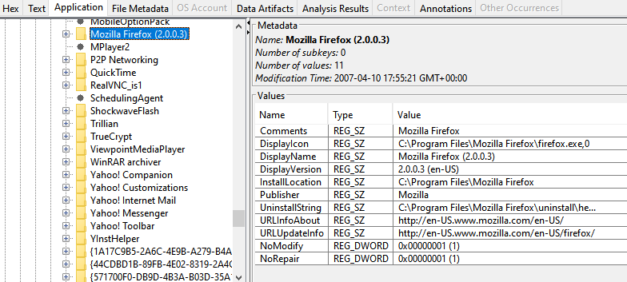

*Figure 52. Installed-application registry entries browsed in Autopsy,
including BestCrypt and Mozilla Firefox.*

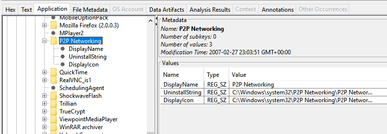

*Figure 53. Installed-application registry entries browsed in Autopsy,
including BestCrypt and Mozilla Firefox.*

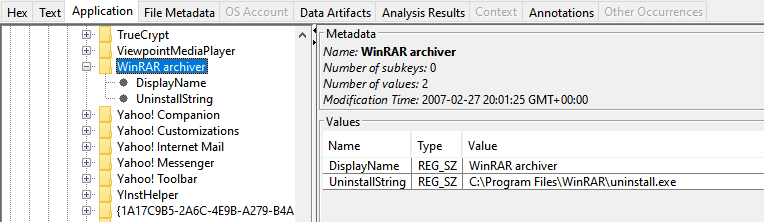

*Figure 54. Installed-application registry entries browsed in Autopsy,
including BestCrypt and Mozilla Firefox.*

#### Source 2: RegRipper (SOFTWARE hive)

**Result:** uninstall plugin corroborates the list and adds: TrueCrypt
(2007-04-10 17:55:21Z), VNC Free Edition 4.1.2 (2007-04-11 01:37:31Z),
Adobe Reader 8 (2007-04-11 17:24:00Z), AccessData Registry Viewer 1.5,
and Microsoft Office Standard 2003.

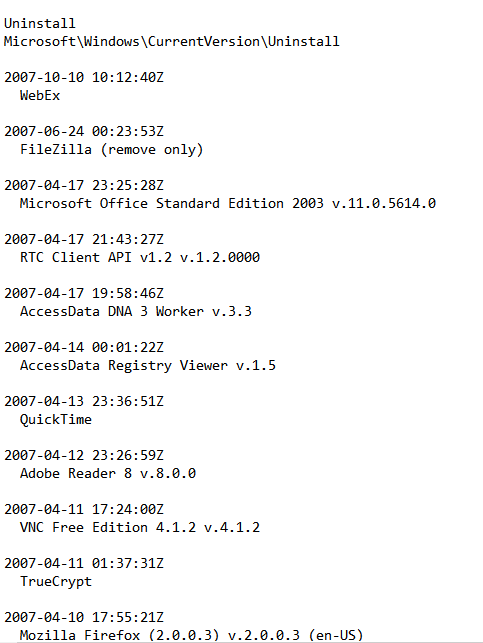

*Figure 55. uninstall plugin output listing installed applications
chronologically.*

#### Source 3: Host Registry Comparison

**Result:** Equivalent Uninstall key entries confirmed on the host (e.g.
CodeMeter Runtime Kit, Exterro FTK Imager, Autopsy itself, Windows
Update Health Tools).

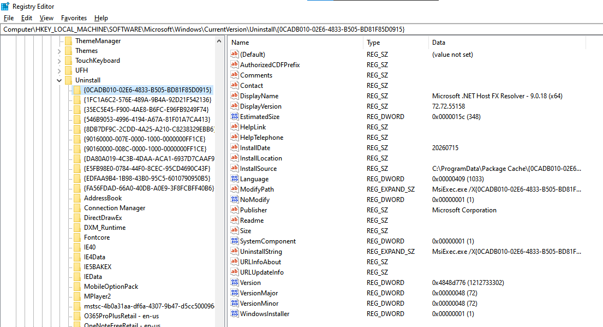

*Figure 56. Installed applications on the host comparison system.*

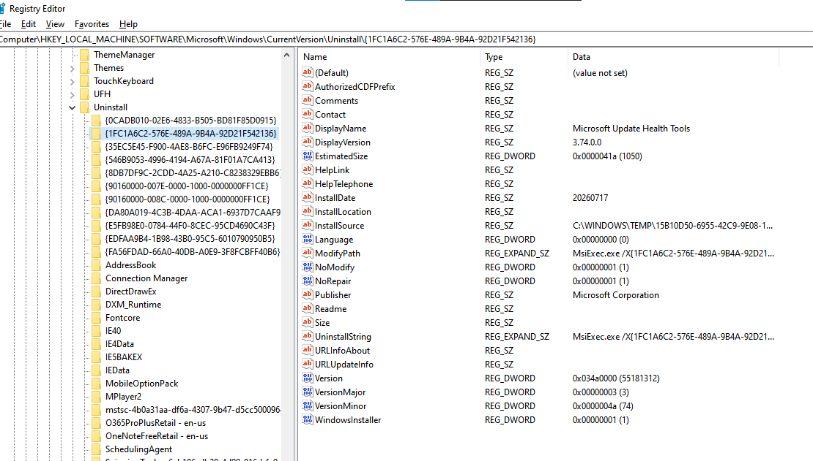

*Figure 57. Installed applications on the host comparison system.*

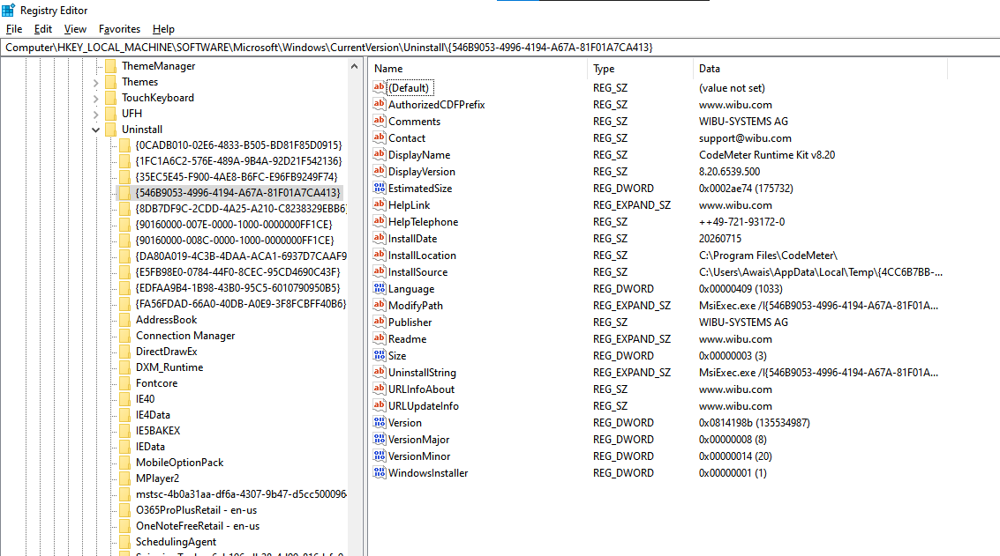

*Figure 58. Installed applications on the host comparison system.*

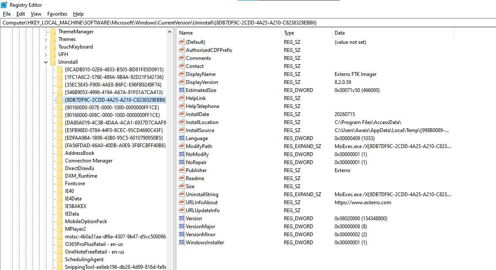

*Figure 59. Installed applications on the host comparison system.*

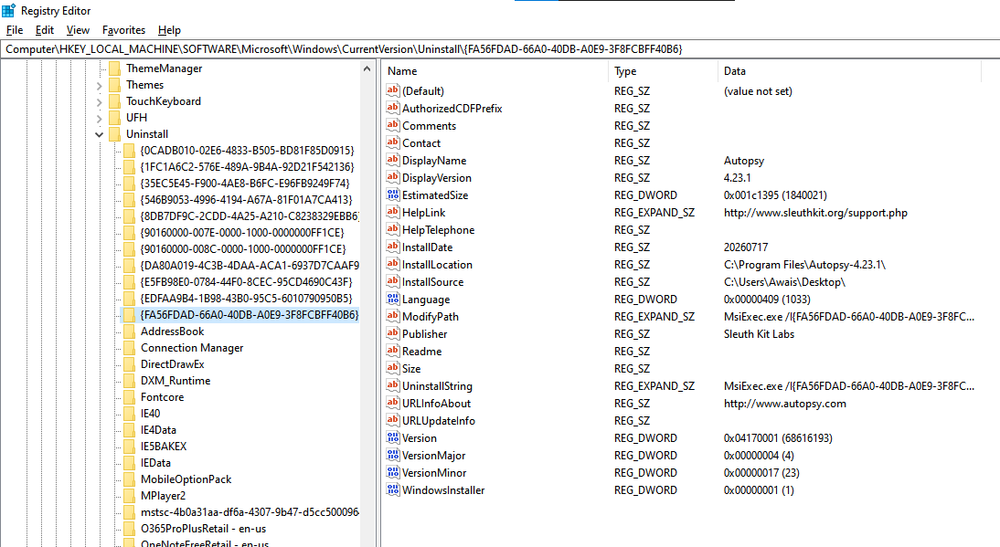

*Figure 60. Installed applications on the host comparison system.*

### Finding 15: Registered Organization, Install Date, Product ID, Product
Name, Registered Owner

**Purpose:** Confirms the licensing/registration details of the
operating system itself, tying the machine to a specific registered
owner and organization.

#### Source 1: Autopsy

**Registry path:** SOFTWARE\Microsoft\Windows NT\CurrentVersion

**Result:** ProductName: Windows Vista (TM) Ultimate; RegisteredOwner:
Wes Mantooth; RegisteredOrganization: Volturi Enterprises; ProductId:
89580-378-0753292-71704.

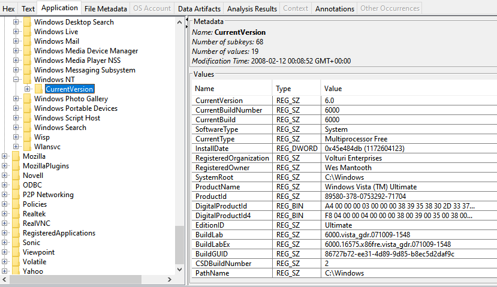

*Figure 61. CurrentVersion registration block in Autopsy.*

#### Source 2: RegRipper (SOFTWARE hive)

**Result:** winver plugin confirms: BuildLab 6000.vista_gdr.071009-1548;
InstallDate 2007-02-27 19:22:03Z.

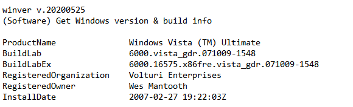

*Figure 62. winver plugin output.*

#### Source 3: Host Registry Comparison

**Result:** Host system: ProductName Windows 10 Home; illustrates the
same CurrentVersion key persisted through later Windows versions.

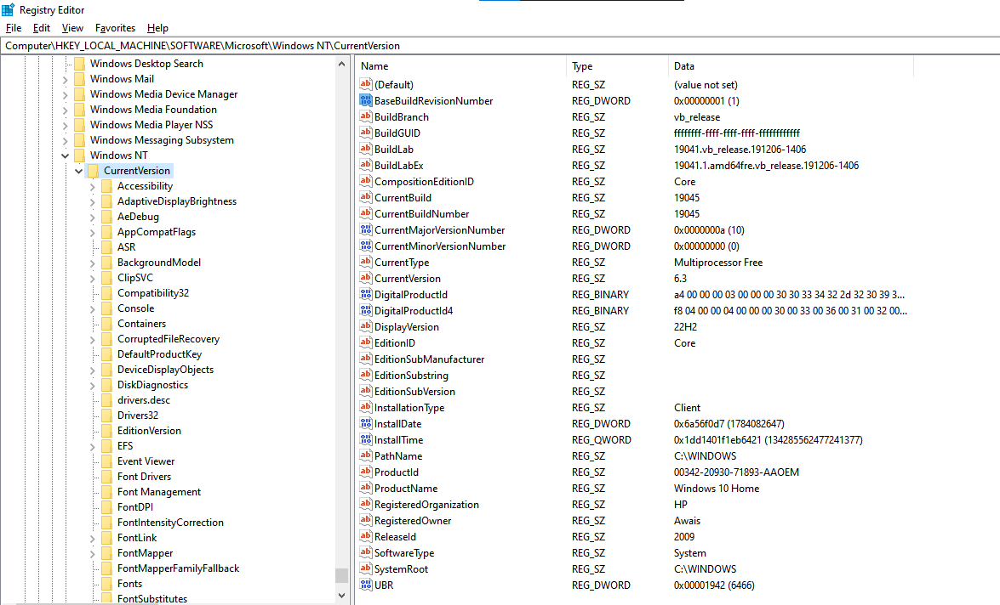

*Figure 63. CurrentVersion key on the host comparison system.*

### Finding 16: User Profiles Present on the System

**Purpose:** Enumerates every local user profile on the system,
establishing which accounts existed before investigating their
individual activity.

#### Source 1: Autopsy

**Registry path:** SOFTWARE\Microsoft\Windows
NT\CurrentVersion\ProfileList

**Result:** Wes Mantooth, C:\Users\Wes Mantooth (SID ...-1000); Dracula,
C:\Users\Dracula (SID ...-1002); plus built-in
System/LocalService/NetworkService profiles.

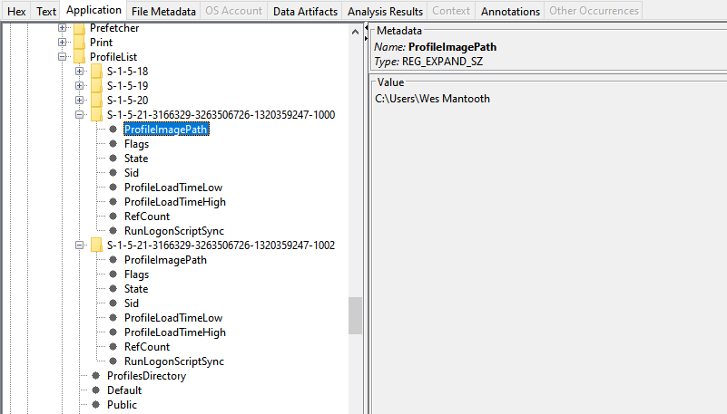

*Figure 64. ProfileList entries in Autopsy for Wes Mantooth and
Dracula.*

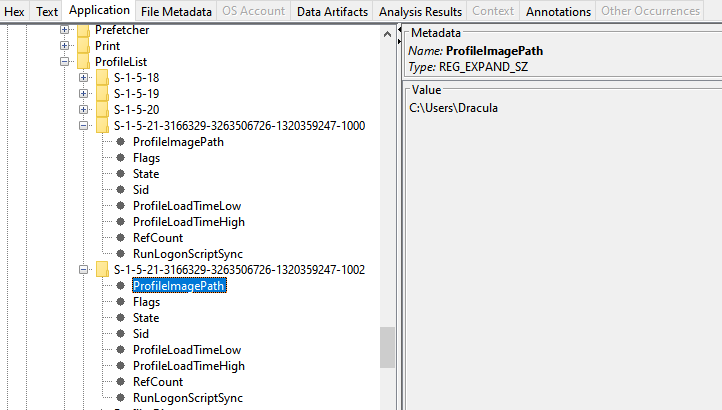

*Figure 65. ProfileList entries in Autopsy for Wes Mantooth and
Dracula.*

#### Source 2: RegRipper (SOFTWARE hive)

**Result:** profilelist plugin confirms both paths and SIDs, with
LastWrite 2008-02-12 20:13:25Z (Wes Mantooth) and 2007-03-23 (Dracula).

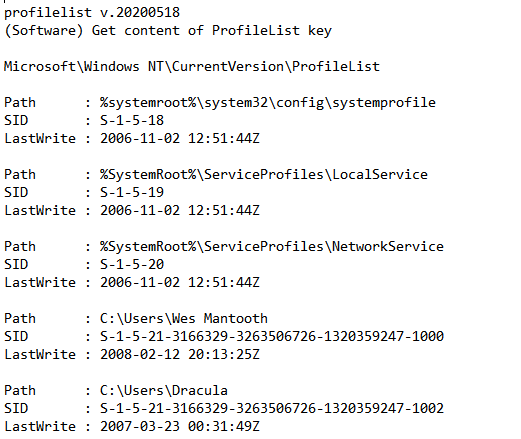

*Figure 66. profilelist plugin output.*

#### Source 3: Host Registry Comparison

**Result:** Host profile (C:\Users\Awais) located under the same
ProfileList structure.

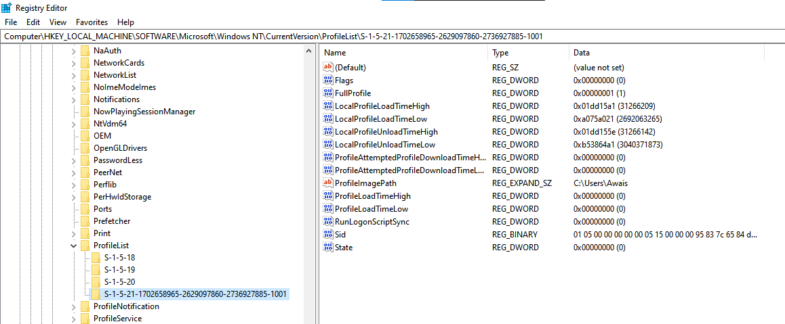

*Figure 67. ProfileList key on the host comparison system.*

### Finding 17: SAM Account Details Per User (Login Count, Last Login,
Failed Logins)

**Purpose:** Extracts detailed account-level statistics (login counts,
last login, failed logins) for each user, to identify which accounts
were actually in active use.

#### Source 1: Autopsy

**Registry path:** SAM\SAM\Domains\Account\Users\\RID\>

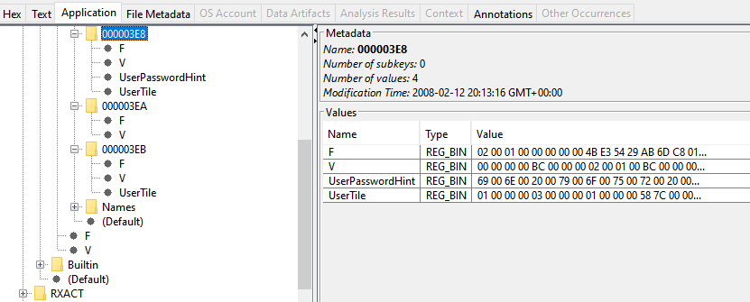

*Figure 68. Raw V-value structure for a SAM user record, viewed in
Autopsy's hex view.*

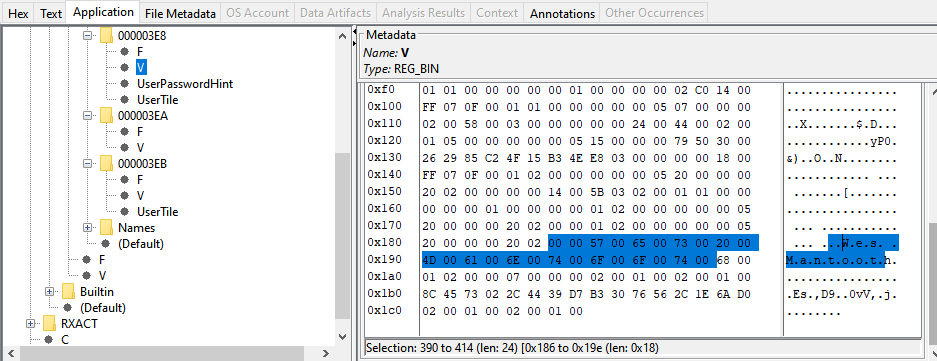

*Figure 69. Raw V-value structure for a SAM user record, viewed in
Autopsy's hex view.*

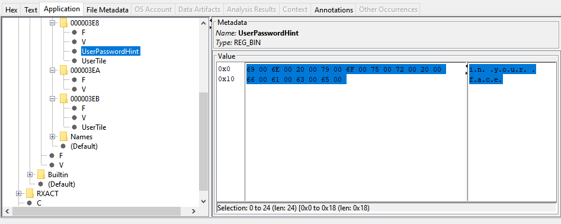

*Figure 70. Raw V-value structure for a SAM user record, viewed in
Autopsy's hex view.*

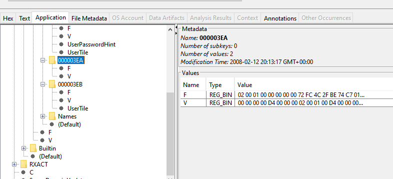

*Figure 71. Raw V-value structure for a second SAM user record.*

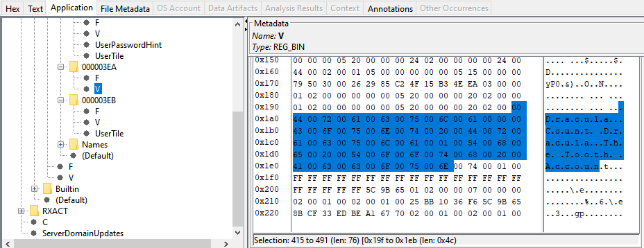

*Figure 72. Raw V-value structure for a second SAM user record.*

#### Source 2: RegRipper (SAM hive)

**Result:** Administrator \[500\]: Disabled, Login Count 0. Guest
\[501\]: Disabled, Login Count 0.

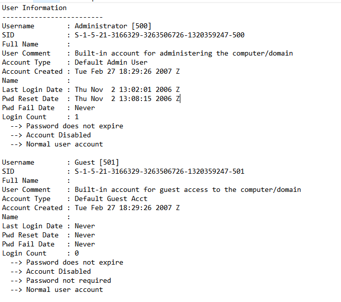

*Figure 73. samparse plugin output for the Administrator and Guest
accounts.*

**Result:** Wes Mantooth \[1000\]: Admin account, Password Hint “in your
face”, Last Login 2008-02-12 19:12:08Z, Pwd Fail Date 2008-02-12
20:13:16Z, Login Count 96. Dracula \[1002\]: Full Name “Count Dracula”,
Custom Limited Acct, Last Login 2007-04-02 00:30:58Z, Pwd Fail Date
2008-02-12 20:13:17Z, Login Count 3.

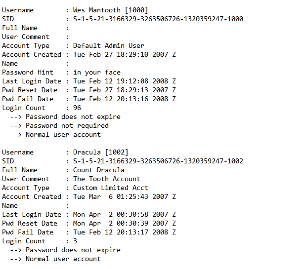

*Figure 74. samparse plugin output for Wes Mantooth and Dracula.*

**Result:** Laurent \[1003\]: Custom Limited Acct, created 2008-02-12,
never logged in.

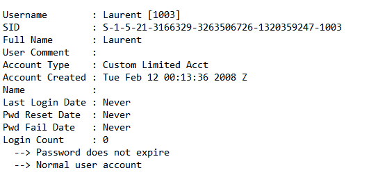

*Figure 75. samparse plugin output for the Laurent account.*

#### Source 3: Host Registry Comparison

**Result:** SAM\Domains\Account\Users structure confirmed on the host
for comparison (account details not disclosed).

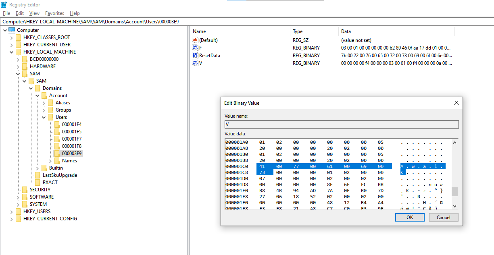

*Figure 76. SAM Users key on the host comparison system.*

### Finding 18: Which User Account Warrants Further Investigation, and Why

**Purpose:** Synthesizes the account data from Finding 17 into an
investigative judgment about which account(s) most warrant further
examination, and why.

Wes Mantooth \[RID 1000\] is the primary subject: an Admin-level account
with 96 recorded logins, a personal password hint (“in your face”), and
a profile that is the source of every case-relevant file artifact in
this examination (Findings 19–35).

Dracula \[RID 1002\] is the secondary account of interest. Its SAM
record shows a failed-login timestamp of 2008-02-12 20:13:17Z, exactly
one second after Wes Mantooth's own failed-login timestamp of 2008-02-12
20:13:16Z. That one-second gap is tight enough to warrant explanation:
it is consistent with either the same physical person attempting both
accounts in quick succession, or a scripted/automated logon attempt, and
should not be dismissed as coincidental without further timeline
correlation against Security Event Log logon events (Event ID
4624/4625).

Administrator \[500\] and Guest \[501\] are both disabled with zero
recorded logins and are dismissed as lower priority. Laurent \[1003\]
was created 2008-02-12 (the same day as the Dracula/Wes Mantooth
failed-login events) but has never been logged into, its creation on
that specific date is worth noting as a possible artifact of the same
session, even though the account itself shows no activity.

### Finding 19: Recent PDF Files Opened by Wes Mantooth

**Purpose:** Recovers the specific PDF files the primary user account
recently opened, to identify documents worth reviewing in full.

#### Source 1: Autopsy

**Registry path:** `NTUSER.DAT\Software\Microsoft\Windows\CurrentVersion\Explorer\RecentDocs\\pdf`**Result:** order851797-2007-04-12-13-17-02.pdf and
order851797-2007-04-12-13-17-02 (1).pdf, an online order confirmation,
opened twice.

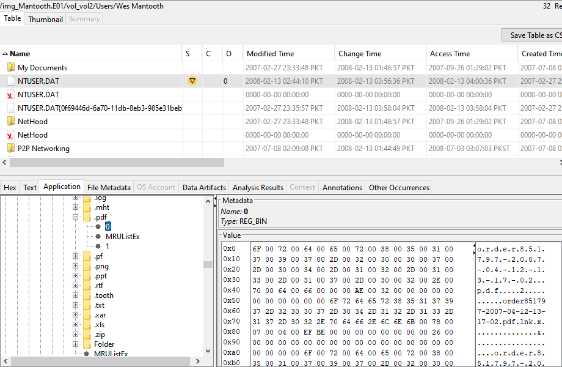

*Figure 77. RecentDocs\\pdf MRU list and raw MRUListEx bytes for Wes
Mantooth, in Autopsy.*

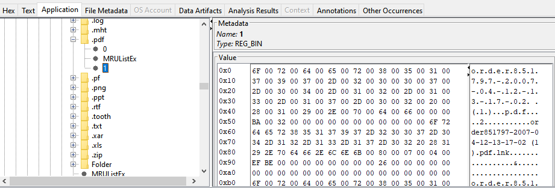

*Figure 78. RecentDocs\\pdf MRU list and raw MRUListEx bytes for Wes
Mantooth, in Autopsy.*

Cross-checked via the ComDlg32\OpenSavePidlMRU\pdf key, which
independently confirms the same filename.

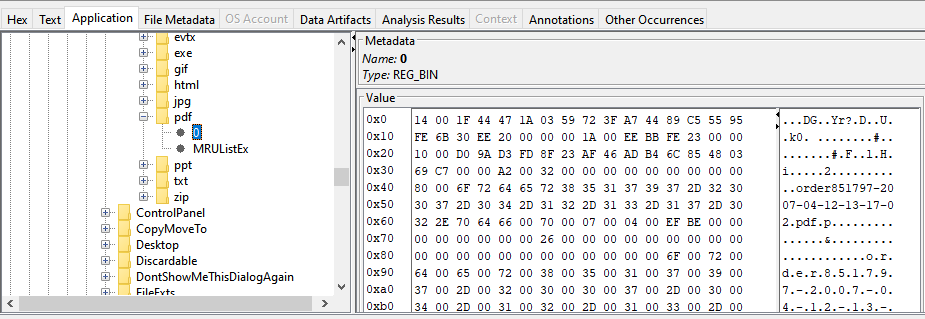

*Figure 79. OpenSavePidlMRU\pdf raw MRU bytes confirming the same recent
PDF file.*

#### Source 2: RegRipper (NTUSER.DAT)

**Result:** recentdocs plugin confirms MRUListEx = 1,0 resolving to the
same two order851797 PDF filenames, LastWrite 2007-04-13 00:28:47Z.

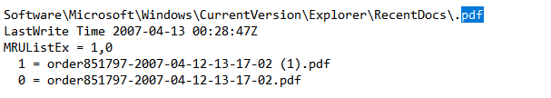

*Figure 80. recentdocs plugin output for the .pdf subkey.*

#### Source 3: Host Registry Comparison

**Result:** RecentDocs key structure located on the host for comparison;
no .pdf subkey activity of evidentiary relevance.

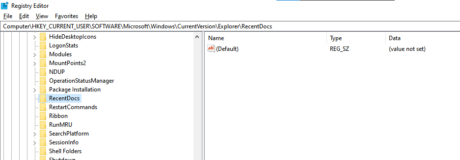

*Figure 81. RecentDocs key on the host comparison system.*

### Finding 20: Three Most Recent Paint Files

**Purpose:** Recovers the specific image files recently edited in Paint
by the primary user account, to identify possible document-editing or
forgery activity.

#### Source 1: Autopsy

**Registry path:** `NTUSER.DAT\Software\Microsoft\Windows\CurrentVersion\Applets\Paint\Recent File List`**Result:** File1: nationaltall.bmp; File2: prescription.gif; File3:
nationaltal.gif; File4: nationaltall.gif, all under C:\Users\Wes
Mantooth\Documents\Scripts.

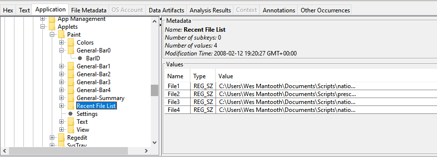

*Figure 82. Paint\Recent File List entries in Autopsy.*

#### Source 2: RegRipper (NTUSER.DAT)

**Result:** applets plugin confirms the same four files, LastWrite
2008-02-12 19:20:27Z, plus a related RegEdit LastKey entry from the same
session (19:56:15Z).

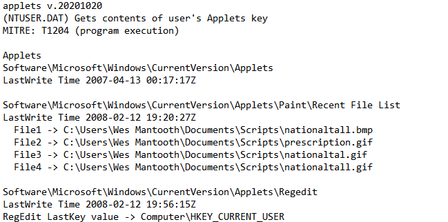

*Figure 83. applets plugin output listing the Paint Recent File List.*

#### Source 3: Host Registry Comparison

**Result:** Microsoft Paint has not been executed on the host comparison
system, no Recent File List entries exist for this application.

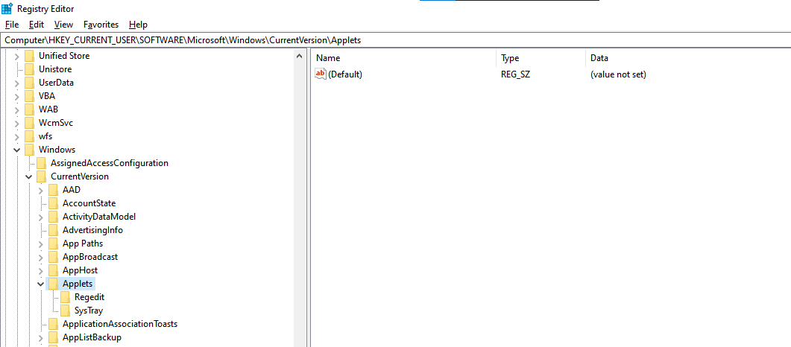

*Figure 84. Absent/empty Paint MRU entry on the host comparison system.*

> **EVIDENCE NOTE: Forensic Significance**
>
> The filename “prescription.gif” alongside “nationaltall”-named files edited in Paint, combined with “Prescription2.gif” and “doc-prescription.jpg” later found in the broader Recent Documents list (Finding 30), is worth flagging as a possible document-forgery indicator (e.g., editing a scanned prescription or ID template), separate from the ATM/financial-fraud thread.

### Finding 21: Five Most Recently Used Run Commands

**Purpose:** Recovers the most recently executed Run-box commands, which
can reveal direct system/registry access or use of remote-access tools
shortly before key events in the case.

#### Source 1: Autopsy

**Registry path:** `NTUSER.DAT\Software\Microsoft\Windows\CurrentVersion\Explorer\RunMRU`**Result:** By MRUList order (most-recent first): regedt32, explorer,
devmgmt.msc, calc, www.sourceforge.net.

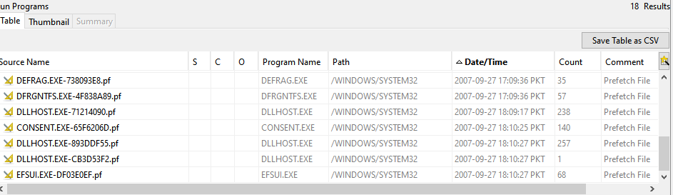

*Figure 85. Prefetch/Run Programs listing referenced in Autopsy for this
item.*

#### Source 2: RegRipper (NTUSER.DAT)

**Result:** runmru plugin confirms MRUList = qponmlkjihgfedcba,
LastWrite 2008-02-12 19:28:02Z; full history also includes
c:\gdisk32.exe, mstsc, and two non-standard URLs (www.hellokitty.com,
www.bigbadandugly.com).

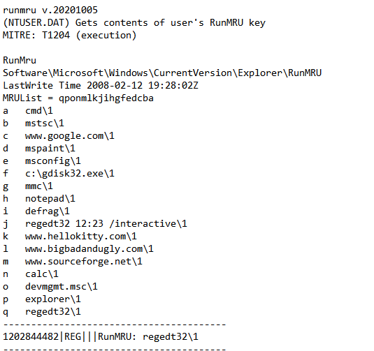

*Figure 86. runmru plugin output with the full Run-command history.*

#### Source 3: Host Registry Comparison

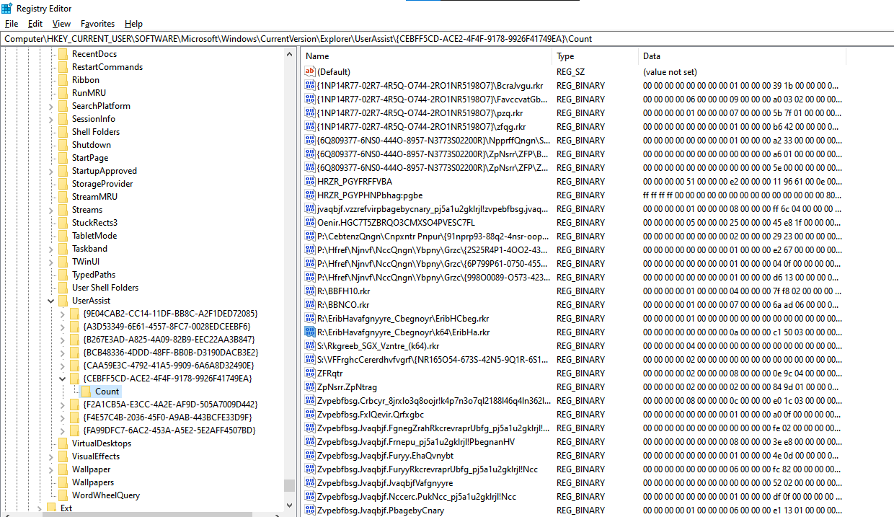

*Figure 87. RunMRU key structure on the host comparison system.*

> **EVIDENCE NOTE: Forensic Significance**
>
> regedt32 and devmgmt.msc as the two most recent Run commands show the user directly accessing the Registry Editor and Device Manager shortly before the 2008-02-12 failed-login events in Finding 17–18, consistent with manual system/registry inspection during that session. mstsc (Remote Desktop Connection client) and gdisk32.exe (a disk-partitioning/wiping utility) are also worth flagging as anti-forensic-adjacent tool usage.

### Finding 22: File Path for ATM_THEFTS1.ppt

**Purpose:** Resolves the exact file-system location(s) of a file named
in a way that is directly relevant to the case narrative, to determine
where it can be recovered from.

#### Source 1: Autopsy

**Registry path:** `NTUSER.DAT\Software\Microsoft\Office\PowerPoint\Recent File List`**Result:** File1: E:\Business Idea\ATM_THEFTS1.ppt; File2: C:\Users\Wes
Mantooth\Desktop\ATM_THEFTS1.ppt, the file exists in two locations: an
external/removable E: drive and the user's own Desktop.

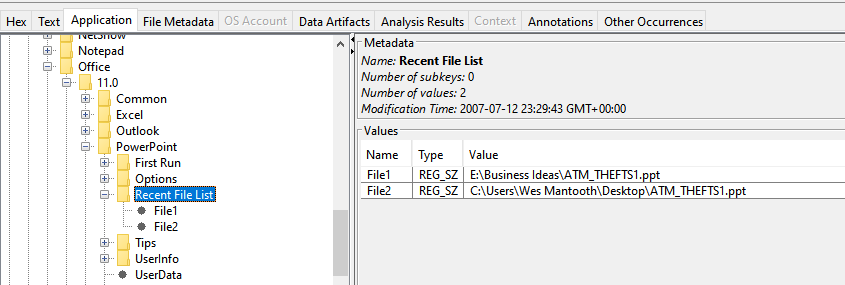

*Figure 88. PowerPoint Recent File List entries resolving both paths for
ATM_THEFTS1.ppt, in Autopsy.*

#### Source 2: RegRipper (NTUSER.DAT)

**Result:** OpenSavePidlMRU\ppt independently confirms: My
Computer\E:\Business Ideas\ATM_THEFTS1.ppt (LastWrite 2007-07-12
23:28:57Z).

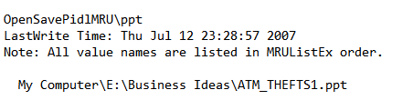

*Figure 89. OpenSavePidlMRU\ppt plugin output confirming the same file
path.*

> **EVIDENCE NOTE: Forensic Significance**
>
> A file explicitly named ATM_THEFTS1.ppt is one of the most directly case-relevant artifacts recovered in this examination. Its presence in two locations (a removable E: drive and the Desktop) suggests the user copied it locally for editing or review. Presence in a Recent Files MRU list proves the file was opened by this user profile, it does not by itself prove authorship or intent, an important distinction to preserve in any report.
>
> Next step: locate and export the file itself, hash it, examine its metadata (author, creation/modified times, embedded revision history), and correlate its timestamps against the account activity in Finding 18.

### Finding 23: Recommended Investigator Response to Finding 22

**Purpose:** Defines the concrete next investigative steps required to
turn the file path recovered in Finding 22 into usable evidence.

Recovery of the file path alone is not sufficient to draw conclusions.
The recommended next steps are to: (1) locate and export the actual
ATM_THEFTS1.ppt file from the image (both the E:\Business Idea and
Desktop copies) and confirm whether it still exists or must be recovered
from unallocated space; (2) compute and record its cryptographic hash
for the evidence log; (3) review its content and any embedded
author/editing metadata; and (4) build a timeline correlating the file's
creation/access dates against the SAM login activity identified in
Findings 17–18 to establish who was logged in when the file was created
or last modified.

### Finding 24: Internet Explorer Start Page

**Purpose:** Identifies the browser's configured start page, part of
establishing the user's typical browsing configuration.

#### Source 1: Autopsy

**Registry path:** NTUSER.DAT\Software\Microsoft\Internet Explorer\Main
(Start Page)

**Result:** Captured view shows the Internet Explorer Main configuration
branch; the explicit Start Page string was not clearly legible in this
capture and should be re-verified directly against the Start Page value
on re-examination.

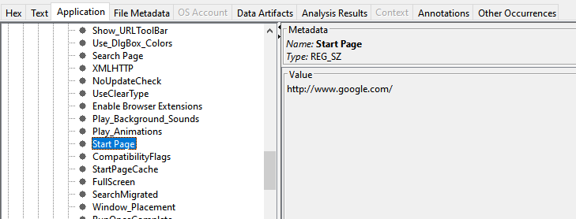

*Figure 90. Internet Explorer Main key browsed in Autopsy.*

### Finding 25: Internet Explorer Default Download Directory

**Purpose:** Identifies where the browser was configured to save
downloaded files, relevant to locating any downloaded evidence.

#### Source 1: Autopsy

**Registry path:** NTUSER.DAT\Software\Microsoft\Internet Explorer\Main
(Download Directory)

**Result:** Download Directory = C:\Users\Wes Mantooth\Desktop\\.. (a
subfolder on the user's own Desktop, rather than the Windows default
Downloads folder).

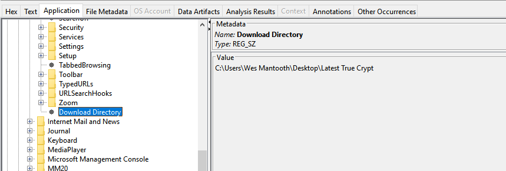

*Figure 91. Download Directory value in Autopsy.*

### Finding 26: Internet Explorer Address-Bar / Favorites Activity

**Purpose:** Recovers the user's browser address-bar/favorites activity,
to identify sites of investigative interest.

*Examiner's note: the screenshot captured for this item shows the
TypedURLs key (also used to answer Finding 32) rather than the IE
Favorites list; no separate Favorites capture was available in the
original worksheet.*

#### Source 1: Autopsy

**Registry path:** NTUSER.DAT\Software\Microsoft\Internet
Explorer\TypedURLs

**Result:** 25 TypedURLs entries recovered (see Finding 32 for the full
breakdown); no dedicated Favorites subkey was captured separately.

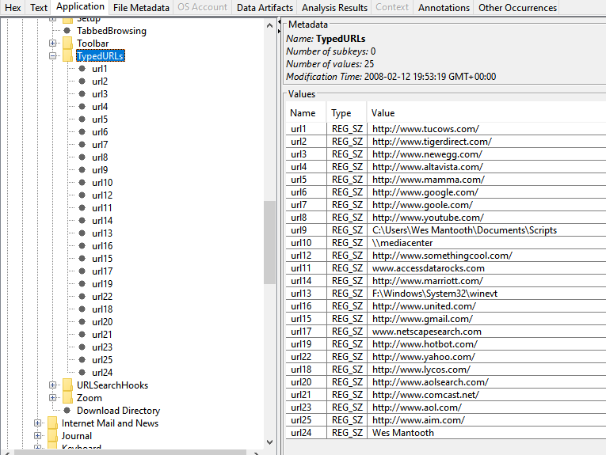

*Figure 92. TypedURLs key entries in Autopsy, captured under this item.*

### Finding 27: Media Player Files Referenced from the F: Drive

**Purpose:** Identifies media files referenced from a removable drive
letter, linking media-player activity back to the removable-device
evidence identified earlier in this examination.

#### Source 1: Autopsy

**Registry path:** `NTUSER.DAT\Software\Microsoft\MediaPlayer\Player\RecentFileList`**Result:** Two files on F:\\ F:\Sounds and Video\wizoz18d.wav and
F:\Sounds and Video\pf3.wav, alongside other RecentFileList entries on
the E:\\ (iPod_Control) and local C:\\ drives.

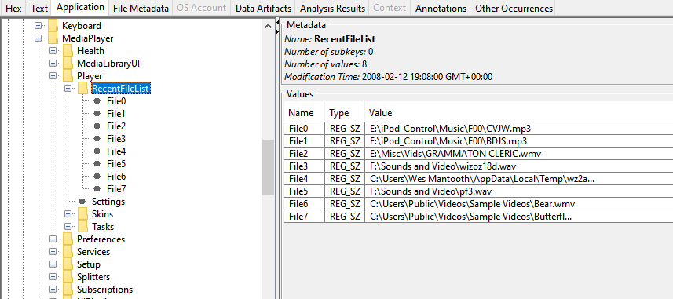

*Figure 93. Windows Media Player RecentFileList entries in Autopsy,
including the two F:\\ .wav files.*

> **EVIDENCE NOTE: Forensic Significance**
>
> Media Player's RecentFileList records files by full path regardless of whether the referenced volume is still attached, which is why F:\, almost certainly a removable drive letter, appears here even though it is not the system volume. This directly links back to the removable-media activity identified in Finding 13.
>
> Non-descriptive filenames (pf3.wav, wizoz18d.wav) on removable media are worth recovering and reviewing directly; steganographic or renamed-extension concealment is a common pattern worth ruling in or out.

### Finding 28: Recommended Investigator Response to Finding 27

**Purpose:** Defines the concrete next investigative steps required to
recover and verify the removable-media files referenced in Finding 27.

Because the F: drive is not part of the imaged system volume, the two
referenced .wav files cannot be recovered from Mantooth.E01 directly.
The recommended response is to: (1) identify which of the removable
devices in Finding 13 was mapped to F: at the relevant time, using
MountedDevices and drive-letter artifacts; (2) if that physical device
is available as separate evidence, image and examine it directly; and
(3) if not available, note the reference as an investigative lead rather
than a confirmed artifact, since its content cannot be verified from
this image alone.

### Finding 29: Two Most Recent PowerPoint Files

**Purpose:** Confirms which presentation files were most recently
accessed, cross-validating the file-path evidence recovered in Finding
22.

#### Source 1: Autopsy

**Registry path:** `NTUSER.DAT\Software\Microsoft\Office\PowerPoint\Recent File List`**Result:** Both entries resolve to ATM_THEFTS1.ppt at its two
locations: E:\Business Idea\ATM_THEFTS1.ppt and C:\Users\Wes
Mantooth\Desktop\ATM_THEFTS1.ppt, no other .ppt files appear in the
list.

*Figure 94. PowerPoint Recent File List in Autopsy, both entries are the
two ATM_THEFTS1.ppt locations.*

### Finding 30: Five Items in the Recent Documents List and Their
Investigative Value

**Purpose:** Reviews the user's complete Recent Documents history as a
single body of evidence, to identify the full pattern of case-relevant
files rather than just the one or two files already flagged
individually.

The full RecentDocs MRU list for Wes Mantooth's profile (LastWrite
2008-02-12 21:38:57Z) was reviewed. Five items stand out as directly
relevant to the case narrative:

##### 1. Vista Mantooth Bitlocker Key 1.4.txt

Listed alongside a second, related entry “Wes Mantooth Image_Key
Dustin.txt” and “Bitlocker Command.txt.txt”, locating encryption keys is
a top priority during disk analysis. If encrypted volumes or BitLocker
partitions are discovered elsewhere, a recovered plaintext key allows
investigators to decrypt and analyze hidden evidence without
brute-forcing it.

##### 2. CC Nums.xls

A spreadsheet whose filename strongly implies a collection of credit
card numbers. Analyzing this file helps establish motive related to
identity theft or financial fraud; inspecting its metadata ($MACE
timestamps, author fields) can also link the document to specific
external sources or user actions.

##### 3. ATM_THEFTS1.ppt

Covered in detail in Findings 22–23 and 29; its presence here confirms
it as part of the same broad pattern of financially-themed documents.

##### 4. BestCrypt Prefetch/Uninstall Evidence

BestCrypt 8.0 (Finding 14) is a commercial volume-encryption and
data-wiping utility. Its presence, together with the TrueCrypt service
entry in Finding 6, establishes a pattern of active use of more than one
encryption tool, which is worth investigating for hidden or encrypted
containers.

##### 5. securityevt.evtx / testevt.evtx / Internet Explorer.evtx

Three separate exported/standalone Windows Event Log files appear in the
Recent Documents list. Their presence suggests the user exported or
copied log data for review, unusual end-user behavior that may indicate
an attempt to review or tamper with audit evidence.

Broader review of the same MRU list also surfaced a cluster of filenames
consistent with document forgery, “Prescription2.gif”,
“doc-prescription.jpg”, “C money plates.doc”, and personal
correspondence (“Dear Sweetie.doc”, “Dear Sweetie2.doc”). These fall
outside the five items selected for priority review but are noted here
as a lead for a fuller examination.

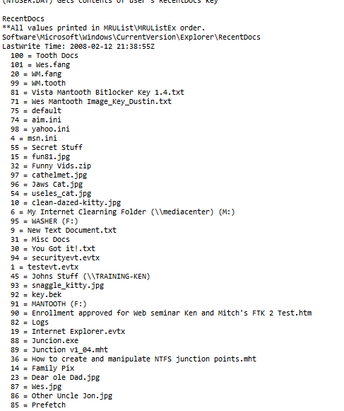

*Figure 95. Full RecentDocs MRUListEx enumeration in Autopsy, spanning
the items discussed above.*

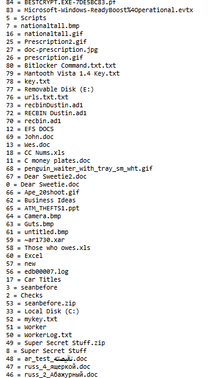

*Figure 96. Full RecentDocs MRUListEx enumeration in Autopsy, spanning
the items discussed above.*

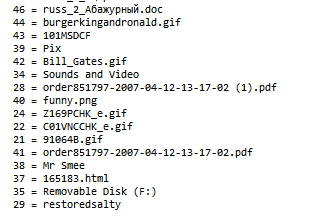

*Figure 97. Full RecentDocs MRUListEx enumeration in Autopsy, spanning
the items discussed above.*

> **EVIDENCE NOTE: Case Assessment: Finding 30**
>
> Taken together, these items form a coherent pattern: financial data (CC Nums.xls), a related fraud narrative document (ATM_THEFTS1.ppt), signs of anti-forensic behavior (a BitLocker key export, BestCrypt installation, and exported Security-log files), and a separate possible document-forgery thread (prescription-themed image files). This is the strongest single piece of evidence in the examination that the user was both handling sensitive financial data and taking active steps to protect or conceal it.
>
> Recommended priority order for follow-up: (1) recover and hash CC Nums.xls and ATM_THEFTS1.ppt; (2) attempt to locate the BitLocker-protected volume and apply the recovered key; (3) search for BestCrypt/TrueCrypt container files; (4) review the exported .evtx files for signs of log tampering; (5) examine the prescription-themed image files as a possible secondary forgery lead.

### Finding 31: Five Programs Listed in the Run/RunMRU Key

**Purpose:** Recovers a secondary view of recently executed Run-box
commands, to corroborate Finding 21 with a fuller command history.

#### Source 1: Autopsy

**Registry path:** `NTUSER.DAT\Software\Microsoft\Windows\CurrentVersion\Explorer\RunMRU`**Result:** Raw RunMRU values: a=cmd, b=mstsc, c=www.google.com,
d=mspaint, e=msconfig (MRUList order q,p,o,n,m ranks regedt32, explorer,
devmgmt.msc, calc, and sourceforge.net as most recent, see Finding 21).

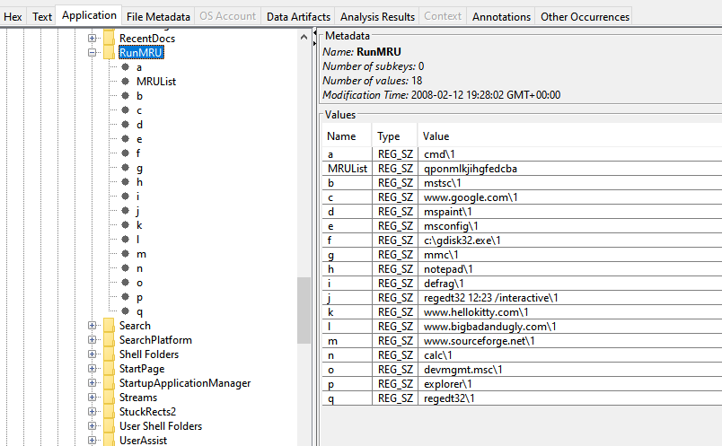

*Figure 98. RunMRU raw values a–q in Autopsy.*

#### Source 2: RegRipper (NTUSER.DAT)

**Result:** runmru plugin corroborates the identical 17-entry list and
MRUList order.

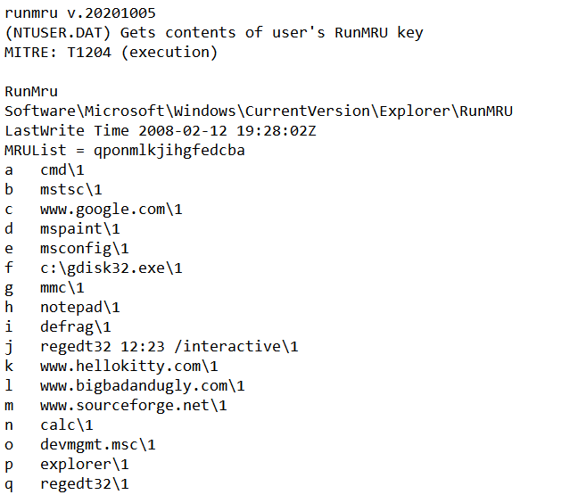

*Figure 99. runmru plugin output confirming the Run command history.*

### Finding 32: Five URLs Typed into Internet Explorer

**Purpose:** Recovers the addresses the user manually typed into the
browser, which can reveal sites not present in normal browsing/favorites
history.

#### Source 1: Autopsy

**Registry path:** NTUSER.DAT\Software\Microsoft\Internet
Explorer\TypedURLs

**Result:** url1–url5: http://www.tucows.com/,
http://www.tigerdirect.com/, http://www.newegg.com/,
http://www.altavista.com/, http://www.mamma.com/ (25 entries total;
later entries include a non-http path F:\Windows\System32\winevt,
notable given the exported .evtx files in Finding 30).

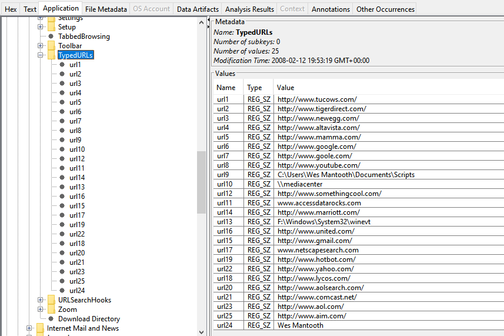

*Figure 100. TypedURLs key entries in Autopsy.*

#### Source 2: RegRipper (NTUSER.DAT)

**Result:** typedurls plugin confirms all 25 entries verbatim, LastWrite
2008-02-12 19:53:19Z, including url24 = “Wes Mantooth” (a non-URL entry,
likely a mistyped search or name).

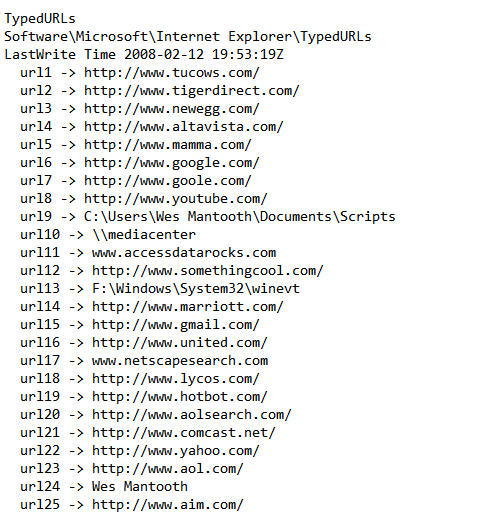

*Figure 101. typedurls plugin output listing all 25 recovered entries.*

### Finding 33: Email Addresses / Usernames Associated with Mantooth

**Purpose:** Identifies email addresses or messaging usernames
associated with the primary user account, which is useful for
correlating with other communications evidence.

#### Source 1: Autopsy

**Registry path:** NTUSER.DAT\Software\Yahoo\Pager

**Result:** Yahoo! Pager configuration resolves the account/username
incisorman420, consistent with the Yahoo! Messenger username in Finding
35.

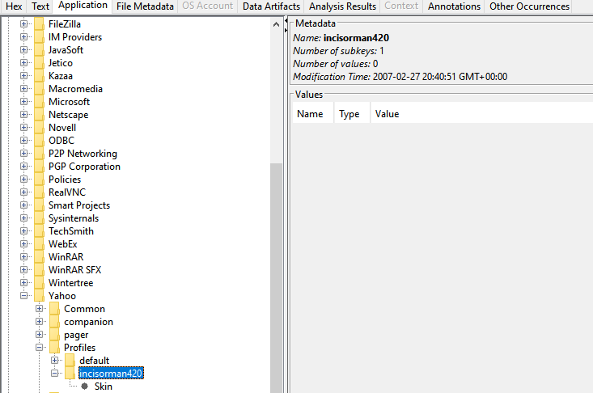

*Figure 102. Yahoo account configuration keys in Autopsy resolving the
username incisorman420.*

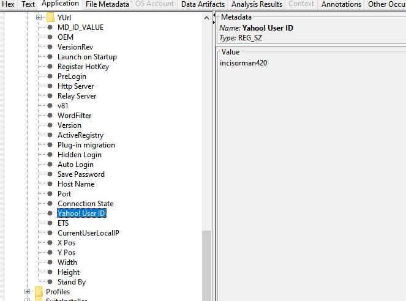

*Figure 103. Yahoo account configuration keys in Autopsy resolving the
username incisorman420.*

### Finding 34: WinVNC Remote Access Password

**Purpose:** Determines whether the system was configured for remote
access via VNC, and whether the stored credential can be recovered,
which is directly relevant to assessing whether the machine could have
been accessed by a third party.

#### Source 1: Autopsy

**Registry path:** SOFTWARE\RealVNC\WinVNC4

**Result:** An 8-byte obfuscated Password value is present (Type:
VncAuth); PortNumber 5900; Hosts filter restricts connections to
+,192.168.1.103/255.255.255.255, i.e. only a single specific host is
permitted to connect.

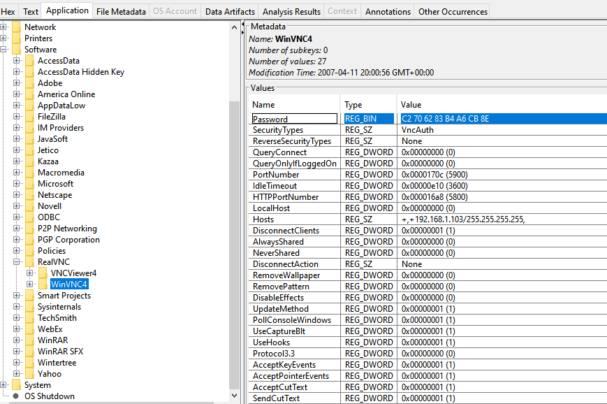

*Figure 104. WinVNC4 configuration key in Autopsy, including the
obfuscated Password value and Hosts filter.*

> **EVIDENCE NOTE: Forensic Significance**
>
> WinVNC (and its RealVNC successor) historically obfuscates its stored password using DES with a fixed, publicly documented key, meaning the stored value is reversible with widely available tools, not genuinely secure encryption. This examination confirmed the value is present and DES-obfuscated but did not conclusively recover a printable plaintext from the captured bytes; the raw 8-byte value should be re-extracted directly from the hive and decoded with the standard fixed VNC key on re-examination.
>
> The presence of a configured VNC server, restricted to a single host IP, indicates this machine was set up to accept remote-desktop connections from one specific counterpart. Combined with the anti-forensic and financial-fraud indicators elsewhere in this examination, this is worth investigating as a possible remote-access arrangement between two parties.
>
> Recommended step: decode the stored password using the known VNC DES key directly from the raw hive bytes and document the recovered credential in the evidence log; check for inbound connection logs or firewall rule changes coinciding with the service's configuration.

### Finding 35: Yahoo Messenger Username

**Purpose:** Confirms the user's Yahoo Messenger identity, corroborating
the account identification recovered in Finding 33.

#### Source 1: Autopsy

**Registry path:** NTUSER.DAT\Software\Yahoo\Pager (Yahoo! User ID)

**Result:** Yahoo! User ID = incisorman420.

*Figure 105. Yahoo! User ID value in Autopsy.*

### Finding 36: Default Printer Details

**Purpose:** Identifies the system's configured printer(s), completing
the hardware/peripheral inventory of the machine.

#### Source 1: Autopsy

**Registry path:** SOFTWARE\Microsoft\Windows NT\CurrentVersion\Devices

**Result:** Installed printer devices include Microsoft XPS Document
Writer and Microsoft Office Document Image Writer, alongside a physical
Epson model; the explicit “default” flag was not clearly legible in this
capture and should be re-verified against the Windows\Device value on
re-examination.

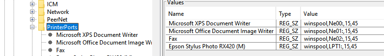

*Figure 106. Devices key listing installed printers in Autopsy.*

## 5. Case Assessment and Investigative Conclusions

The 36 registry findings, taken individually, establish routine system
facts: hostname, time zone, installed hardware and software, network
configuration, and user account structure. Their investigative value
emerges when read together against the account-activity and
file-activity findings.

### 5.1 Account Activity

Wes Mantooth is confirmed as the primary account of interest (Finding
18), with an active, day-to-day usage pattern. The Dracula account's
failed login within roughly one second of Wes Mantooth's own login event
(Finding 17) is close enough in time to warrant a full logon-timeline
reconstruction using the Security event log, rather than being dismissed
as coincidence.

### 5.2 Financial-Crime Indicators

Three artifacts, considered together, form the strongest evidentiary
thread in this examination: a spreadsheet named consistently with stored
credit card numbers (CC Nums.xls), a presentation titled
ATM_THEFTS1.ppt, and its resolved file path (Findings 22, 29–30). None
of these prove wrongdoing on their own, a filename is not content, but
they establish clear priorities for content recovery and review.

### 5.3 Anti-Forensic / Concealment Indicators

Multiple independent artifacts point toward active use of encryption and
remote-access tools: a registered TrueCrypt service (Finding 6),
Prefetch evidence of BestCrypt execution and a BitLocker recovery key
export (Finding 30), and a configured WinVNC remote-access server with a
recoverable password (Finding 34). A user handling sensitive financial
filenames who is also actively encrypting data and exporting recovery
keys is a pattern that, in a real investigation, would justify
prioritizing full-disk unallocated-space carving and a dedicated search
for encrypted container files.

### 5.4 Recommended Next Steps

- Recover, hash, and review the contents of CC Nums.xls and
ATM_THEFTS1.ppt.

- Attempt to locate the BitLocker-protected volume referenced by the
recovered recovery key.

- Search unallocated space and the file system for
TrueCrypt/BestCrypt container files.

- Reconstruct a combined logon timeline for the Wes Mantooth and
Dracula accounts using the Security event log.

- Decode and log the WinVNC password, and check for any inbound
remote-access connection history.

- Treat the securityevt.evtx reference in Finding 30 as a possible
log-tampering indicator and review the full Security log for gaps or
clearing events.

### 5.5 Methodology Note

Every finding above was corroborated across at least two independent
sources (Autopsy and RegRipper-parsed hive output), with a live host
system used as a behavioral baseline wherever the artifact type allowed
for it. No finding in this report relies on a single tool's
interpretation alone.

Appendix A, Registry Hive and Key Reference

Base hive locations extracted from the Mantooth.E01 image for offline
RegRipper analysis:

|                           |                                    |
|---------------------------|------------------------------------|
| **Hive**                  | **Source Path**                    |
| SAM                       | …\Windows\System32\config\SAM      |
| SECURITY                  | …\Windows\System32\config\SECURITY |
| SOFTWARE                  | …\Windows\System32\config\SOFTWARE |
| SYSTEM                    | …\Windows\System32\config\SYSTEM   |
| NTUSER.DAT (Wes Mantooth) | …\Users\Wes Mantooth\NTUSER.DAT    |
| NTUSER.DAT (Dracula)      | …\Users\Dracula\NTUSER.DAT         |

Key registry paths referenced across findings:

|                    |                                                                                       |
|--------------------|---------------------------------------------------------------------------------------|
| **Finding**        | **Registry Path**                                                                     |
| 1                  | SYSTEM\CurrentControlSet\Control\ComputerName\ComputerName                            |
| 2                  | SYSTEM\CurrentControlSet\Control\TimeZoneInformation                                  |
| 5                  | SYSTEM\CurrentControlSet\Control\Session Manager\Memory Management\PrefetchParameters |
| 6                  | SYSTEM\CurrentControlSet\Services\TrueCrypt                                           |
| 7                  | SYSTEM\CurrentControlSet\Control\Windows (ShutdownTime)                               |
| 8, 9, 13           | SYSTEM\CurrentControlSet\Enum\USBSTOR                                                 |
| 12                 | SOFTWARE\Microsoft\WZCSVC\Parameters\Interfaces\\GUID} (offset 0x47)                  |
| 14, 15             | SOFTWARE\Microsoft\Windows\CurrentVersion\Uninstall / CurrentVersion                  |
| 16                 | SOFTWARE\Microsoft\Windows NT\CurrentVersion\ProfileList                              |
| 17, 18             | SAM\SAM\Domains\Account\Users                                                         |
| 19, 20, 21, 29, 30 | NTUSER.DAT\Software\Microsoft\Windows\CurrentVersion\Explorer\RecentDocs / ComDlg32   |
| 22, 23             | NTUSER.DAT …\RecentDocs (resolved MRU path)                                           |
| 24, 25             | NTUSER.DAT\Software\Microsoft\Internet Explorer\Main                                  |
| 26                 | NTUSER.DAT\Software\Microsoft\Internet Explorer\Favorites                             |
| 27, 28             | NTUSER.DAT\Software\Microsoft\MediaPlayer\Player\RecentFileList                       |
| 31                 | NTUSER.DAT\Software\Microsoft\Windows\CurrentVersion\Run                              |
| 32                 | NTUSER.DAT\Software\Microsoft\Internet Explorer\TypedURLs                             |
| 34                 | SOFTWARE\RealVNC\WinVNC4 (Password)                                                   |
| 35                 | NTUSER.DAT\Software\Yahoo\Pager                                                       |
| 36                 | SOFTWARE\Microsoft\Windows NT\CurrentVersion\Devices / Windows (Device)               |

Appendix B, Tools and Versions

|                                   |                                                          |
|-----------------------------------|----------------------------------------------------------|
| **Tool**                          | **Version / Notes**                                      |
| Autopsy                           | 4.23.1, primary case platform for the Mantooth.E01 image |
| AccessData FTK Imager             | Used to browse the image and export registry hives       |
| RegRipper                         | 3.0 (master branch), plugin-based offline hive parsing   |
| Windows Registry Editor (regedit) | Native to host OS, used for live baseline comparison     |

Source worksheets: “Week 1, Windows Registry Practical” (question set)
and “System Forensic” (worked answers and screenshots), both authored by
the examiner as part of DFCS/CCFA coursework.
