# SAM Hash Extraction and Password Recovery

*The State vs. Wes Mantooth: Offline Credential Auditing*

**Author:** Awais Ahmed
**Program:** B.S. Digital Forensics and Cyber Security (DFCS)
**Certification Track:** Certified Computer Forensics Analyst (CCFA)

| Field | Detail |
|---|---|
| **Examiner**         | Awais Ahmed                                                                                                           |
| **Role**             | Digital Forensics Student / Examiner-in-Training                                                                      |
| **Source Practical** | “SAM Hash Extract” worksheet                                                                                          |
| **Evidence Source**  | SAM and SYSTEM hives extracted from the Mantooth.E01 image (companion Windows Registry examination in this portfolio) |
| **Environment**      | Offline, controlled lab environment, no network-connected or production systems involved                              |

---

## 1. Executive Summary

This report documents an offline credential-recovery exercise performed
against the SAM and SYSTEM registry hives of the Mantooth training
image, as part of Digital Forensics and Cyber Security (DFCS) coursework
aligned to Certified Computer Forensics Analyst (CCFA) competencies. It
is a direct continuation of the companion Windows Registry examination
in this portfolio, which identified five local user accounts on the
Mantooth system.

Password hashes for all five accounts were extracted offline using
PwDump7, then subjected to two independent cracking methods: a
rainbow-table attack using ophcrack with the Vista free table set, and a
dictionary attack using Hash Suite 4.0 Free with the rockyou.txt
wordlist. Both methods independently recovered the same two passwords,
tooth for Wes Mantooth and canine for Dracula, providing cross-tool
corroboration of the result. The remaining three accounts
(Administrator, Guest, Laurent) carry the well-known empty-password NT
hash and have no password set.

This report also addresses two points the original lab notes flagged for
follow-up: why a wordlist-based attack is a necessary complement to
rainbow tables, and why Hash Suite must be explicitly told the hash
format is NTLM rather than left to guess. Both are covered in Section 4.

## 2. Scope and Authorized Use

All actions in this report were performed offline, against hive files
extracted from a disk image used specifically for digital forensics
coursework (Mantooth.E01), in a controlled lab environment. No live,
production, or third-party system was accessed, and no network-based
attack was performed. This distinction matters because the same tools
and techniques documented here, password-hash dumping and offline
cracking, are dual-use: they are standard, lawful parts of a digital
forensics or authorized penetration-testing engagement, but unauthorized
use against systems one does not own or have written permission to test
is illegal in most jurisdictions. This report should be read strictly as
a record of coursework against a training image, not as guidance for use
against systems without proper authorization.

## 3. Background: SAM/SYSTEM Hashing and Cracking Methods

### 3.1 Why Both the SAM and SYSTEM Hives Are Required

|            |                                                                                                                   |
|------------|-------------------------------------------------------------------------------------------------------------------|
| **File**   | **Purpose**                                                                                                       |
| **SAM**    | Contains each local account's password hashes, but stored in an encrypted form, not in the clear.                 |
| **SYSTEM** | Contains the boot key, a machine-specific value used to decrypt the SAM's stored hashes into usable LM/NT hashes. |

Without the SYSTEM hive's boot key, the SAM's hash values cannot be
decrypted at all, this is why PwDump7 (and equivalent tools) always
require both files together, and why the command below points at both.

### 3.2 Reading a Hash-Dump Line

- Username, the account name (e.g. Administrator).

- RID, the account's Relative Identifier; 500 is always the built-in
Administrator, 501 is always the built-in Guest, and values from 1000
upward are ordinary user accounts in the order they were created.

- LM Hash, the legacy LAN Manager hash format. It is weak
(case-insensitive, split into two independently crackable 7-character
halves) and has been disabled by default since Windows Vista, which is
why every account here shows a constant “empty” placeholder rather than
a real LM hash.

- NT Hash, the modern hash format (technically an NTLM hash, an
unsalted MD4 digest of the UTF-16LE password). This is the value
actually targeted for cracking in this exercise.

- Trailing ::: , account flag/type separators in the pwdump output
format; a plain ::: here indicates a normal user account with no special
flags set.

### 3.3 Rainbow Tables vs. Dictionary/Wordlist Attacks

This exercise deliberately used two different cracking strategies, which
recover passwords in different ways and have different strengths:

- Rainbow tables (ophcrack), large precomputed tables mapping
candidate passwords to their hashes ahead of time, using a time–memory
trade-off (chains of reduction functions) so a hash can be looked up
quickly instead of recomputed on the fly. They are extremely fast once
loaded but are tied to a specific hash algorithm and
character-set/length assumption (hence downloading the “Vista free”
table set specifically, matched to this system's NT hashes).

- Dictionary/wordlist attacks (Hash Suite + rockyou.txt), hash each
candidate password from a list of real, previously-breached passwords on
the fly and compare the result to the target hash. rockyou.txt is a
well-known list of roughly 14 million real passwords leaked from a 2009
data breach, and is effective precisely because many users choose
common, previously-seen passwords rather than random ones, as was the
case here (“tooth” and “canine” are exactly the kind of short,
memorable, dictionary-style passwords this method is built to catch).

Running both methods independently and getting matching results (Section
5) is good forensic practice: it cross-validates the recovered passwords
using two unrelated tools and code paths, reducing the chance that
either tool's output reflects a bug or misconfiguration rather than the
true password.

## 4. Examination Environment and Tools

- PwDump7 (v1.0, by Andres Tarasco Acuña), extracts LM/NT password
hashes offline from a SAM hive, using the paired SYSTEM hive's boot key
for decryption. Download link is provided in Section 5.1.

- ophcrack, a rainbow-table-based password cracker; used here with
the Vista free table set, matched to the Mantooth system's Windows Vista
installation identified in the companion registry examination. Table
download links are provided in Section 5.2.

- Hash Suite 4.0 Free, a dictionary/brute-force password-auditing
tool; used here with the rockyou.txt wordlist for a dictionary attack.
Download links are provided in Section 5.3.


> **TECHNICAL NOTE: A Note on Antivirus Flags**
>
> PwDump7 is routinely flagged by Windows Defender and other antivirus products as a “HackTool” or PUP (Potentially Unwanted Program), not because it contains malicious code, but because the same hash-dumping capability that makes it useful for authorized password auditing also makes it attractive for credential theft if misused. Disabling real-time protection before downloading it (as the procedure notes require) is a standard, expected step for this class of dual-use security tool in a controlled lab environment, and protection should be re-enabled immediately afterward.


## 5. Procedure and Results

### 5.1 Extracting the Hashes with PwDump7

**Purpose:** Extracts the encrypted password hashes for every local
account directly from the SAM/SYSTEM hive pair, which is the necessary
first step before any cracking method can be attempted.

**PwDump7 download:**
[<u>https://download.openwall.net/pub/projects/john/contrib/pwdump/pwdump7.zip</u>](https://download.openwall.net/pub/projects/john/contrib/pwdump/pwdump7.zip)

Before downloading PwDump7, real-time protection (and automatic sample
submission) was turned off in Windows Security → Virus & threat
protection → Manage settings, since PwDump7 is routinely flagged by
antivirus as a dual-use “hacktool” (see the note below) and would
otherwise be quarantined on download.

```
PwDump7.exe -s "C:\..\pwdump7\man hives\SAM" "C:\..\pwdump7\man hives\SYSTEM"
```

Full paths were required for both the SAM and SYSTEM arguments, a
relative path did not work reliably in this environment.

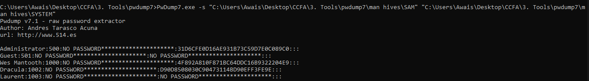

*Figure 1. PwDump7 output listing LM/NT hashes for all five local
accounts on the Mantooth system.*

**Result:** All five accounts (Administrator, Guest, Wes Mantooth,
Dracula, Laurent) were extracted successfully; results are consolidated
in the table below.

|                   |                                  |                  |                        |
|-------------------|----------------------------------|------------------|------------------------|
| **User**          | **NT Hash**                      | **Status**       | **Recovered Password** |
| **Administrator** | 31d6cfe0d16ae931b73c59d7e0c089c0 | Empty NT hash    | **(no password set)**  |
| **Guest**         | 31d6cfe0d16ae931b73c59d7e0c089c0 | Disabled / empty | **(no password set)**  |
| **Wes Mantooth**  | 4f892a810f871bc64ddc16b9322204e9 | Cracked          | **tooth**              |
| **Dracula**       | d9d08508030c90473114bd90eff3fe9e | Cracked          | **canine**             |
| **Laurent**       | 31d6cfe0d16ae931b73c59d7e0c089c0 | Empty NT hash    | **(no password set)**  |

The output was then redirected to a file, all_hashes.txt, for use as
input to both cracking tools.

```
PwDump7.exe -s "...\SAM" "...\SYSTEM" > all_hashes.txt
```

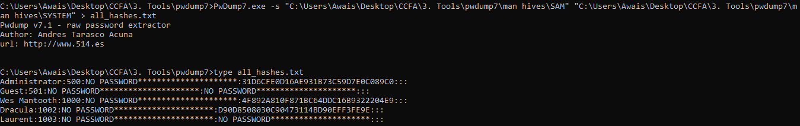

*Figure 2. Redirecting PwDump7's output to all_hashes.txt, and
confirming its contents with type.*

### 5.2 Cracking with ophcrack (Rainbow Tables)

**Purpose:** Attempts to recover the plaintext password behind each
extracted NT hash using precomputed rainbow tables, the fastest
available method when a matching table set exists for the target hash
type.

all_hashes.txt was loaded into ophcrack as a PWDUMP file (Load → PWDUMP
file → path to .txt).

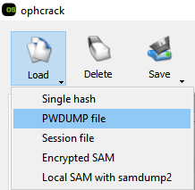

*Figure 3. ophcrack's Load menu, selecting the PWDUMP file source.*

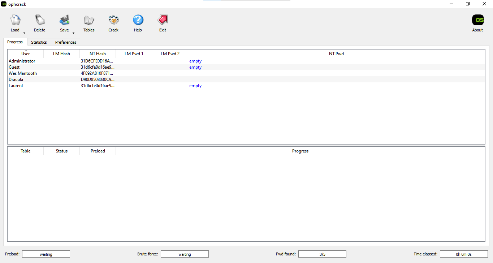

*Figure 4. all_hashes.txt loaded into ophcrack, listing all five
accounts and their hashes.*

**ophcrack XP free small table download:**
[<u>https://sourceforge.net/projects/ophcrack/files/tables/XP%20free/tables_xp_free_small.zip/download</u>](https://sourceforge.net/projects/ophcrack/files/tables/XP%20free/tables_xp_free_small.zip/download)

Because the companion Windows Registry examination identified the
Mantooth system as running Windows Vista, the Vista free rainbow table
set was downloaded and installed instead (rather than the XP tables
above) to match the target hash type, since mantooth had Vista
installed.

**ophcrack Vista free table download (table actually used):**
[<u>http://sourceforge.net/projects/ophcrack/files/tables/Vista%20free/tables_vista_free.zip/download</u>](http://sourceforge.net/projects/ophcrack/files/tables/Vista%20free/tables_vista_free.zip/download)

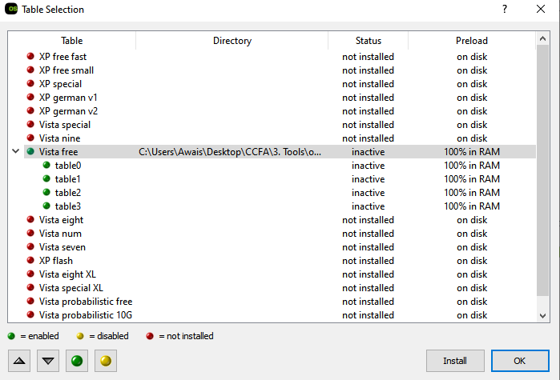

*Figure 5. Table Selection dialog, the Vista free table set installed
and preloaded 100% into RAM.*

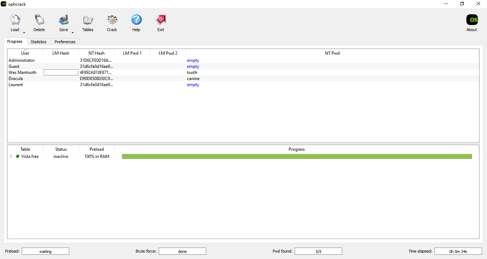

*Figure 6. ophcrack crack results: Wes Mantooth → tooth, Dracula →
canine; the remaining three accounts show as empty.*

**Result:** ophcrack recovered: Wes Mantooth = tooth; Dracula = canine.
Administrator, Guest, and Laurent confirmed empty (no password).

### 5.3 Cracking with Hash Suite (Dictionary Attack)

**Purpose:** Independently re-attempts password recovery using a
completely different method (on-the-fly dictionary hashing rather than
precomputed tables), to cross-validate the ophcrack results with an
unrelated tool.

**Hash Suite 4.0 Free download:**
[<u>https://hashsuite.openwall.net/downloads/Hash_Suite_Free_4_0.zip</u>](https://hashsuite.openwall.net/downloads/Hash_Suite_Free_4_0.zip)

**rockyou.txt wordlist download:**
[<u>https://github.com/brannondorsey/naive-hashcat/releases/download/data/rockyou.txt</u>](https://github.com/brannondorsey/naive-hashcat/releases/download/data/rockyou.txt)

As a second, independent method, the same all_hashes.txt file was
imported into Hash Suite 4.0 Free via Key → Import → From file.

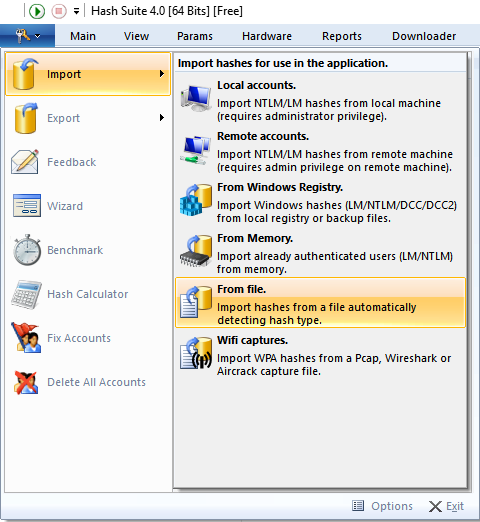

*Figure 7. Hash Suite's import menu, selecting Import from a local hash
file.*

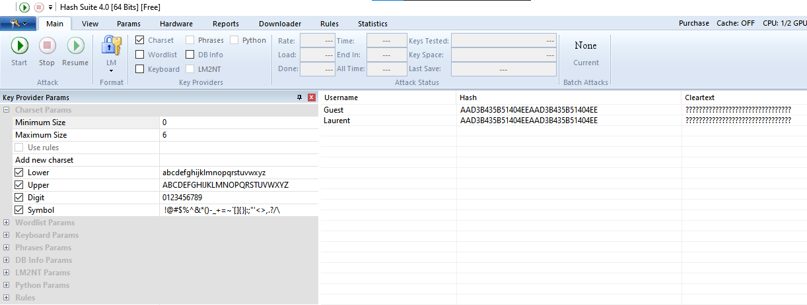

*Figure 8. all_hashes.txt imported into Hash Suite, listing all five
accounts.*

Under Params, the wordlist was set to rockyou.txt.

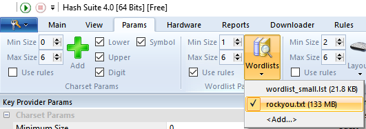

*Figure 9. Wordlist parameters configured to use rockyou.txt.*

Under Main, the attack format was explicitly set to NTLM.

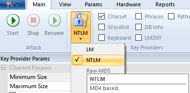

*Figure 10. Format selector set to NTLM.*


> **TECHNICAL NOTE: Why the Format Must Be Set to NTLM**
>
> A raw hash string like 4f892a810f871bc64ddc16b9322204e9 is just hexadecimal data, it carries no built-in indication of which algorithm produced it. The same 32-character length is also produced by plain MD5 and several other algorithms, which Hash Suite supports separately. If the format were left on the wrong setting (e.g. Raw-MD5, visible as a default option in Figure 10), Hash Suite would hash each dictionary candidate the wrong way and never match the target value, even with the correct password in the wordlist. Explicitly selecting NTLM tells Hash Suite to compute each candidate password as an MD4 digest of its UTF-16LE encoding, the actual algorithm Windows uses, which is what allows a correct dictionary match to succeed.


The attack was then started:

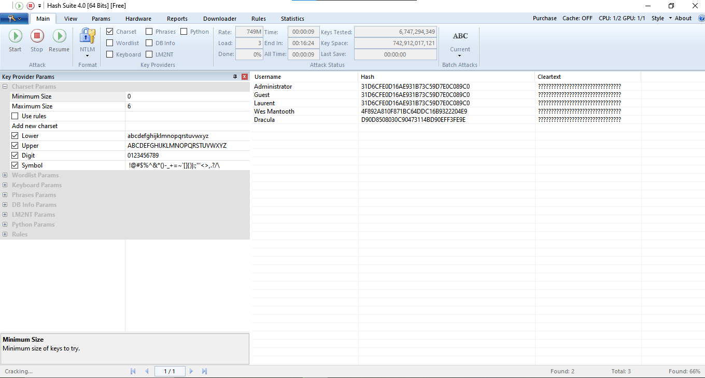

*Figure 11. Dictionary attack running against all five hashes using
rockyou.txt, NTLM format, 2 of 3 crackable hashes found in progress.*

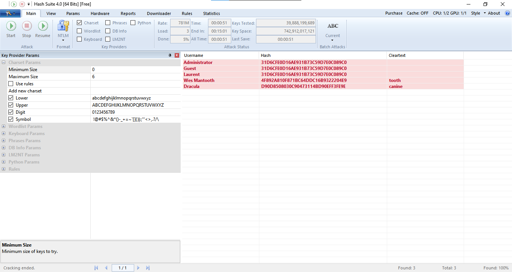

*Figure 12. Cracking ended: 3 of 3 found (100%), Wes Mantooth = tooth,
Dracula = canine, matching ophcrack's results exactly.*

**Result:** Hash Suite independently recovered the identical passwords
in roughly 51 seconds: Wes Mantooth = tooth; Dracula = canine, a full
cross-validation of the ophcrack result using an unrelated tool and
attack method.

## 6. Technical Discussion

### 6.1 Why a Wordlist Attack Was Still Needed Alongside Rainbow Tables

The original lab notes flagged “why wordlist is needed” as an open
question. Rainbow tables are extremely fast but are bounded by whatever
character set and maximum length was used to precompute them, a password
outside that bounded space simply will not be found, no matter how long
the table is searched. A wordlist attack instead tests actual known
passwords directly against the hash on the fly, with no such
precomputation ceiling, so it can catch real-world, previously-breached
passwords (like “tooth” and “canine”) that may fall outside a rainbow
table's coverage, and it works immediately for any hash algorithm Hash
Suite supports without needing gigabytes of prebuilt tables. Running
both here was not redundant, it was a deliberate cross-check, and the
matching results in Section 5.3 confirm both methods converged on the
same answer.

### 6.2 Cross-Tool Validation

Recovering identical passwords from two independently developed tools,
using two different cracking strategies (precomputed table lookup vs.
on-the-fly dictionary hashing), is strong corroborating evidence that
tooth and canine are in fact the correct passwords for Wes Mantooth and
Dracula, respectively, rather than an artifact of a bug or
misconfiguration in either tool.

## 7. Forensic Significance and Conclusion

This exercise directly extends the companion Windows Registry
examination of the Mantooth case in this portfolio: having identified
Wes Mantooth as the primary account of interest and Dracula as the
secondary account of interest from account-activity artifacts alone,
this exercise recovers their actual login credentials, which would allow
an investigator to authenticate as either user for further live-system
or application-level analysis (e.g. unlocking password-protected files
created by that user).

From a security-auditing standpoint, the results also demonstrate weak
password hygiene on the Mantooth system: two of five accounts used
short, dictionary-crackable passwords recoverable in under a minute with
a free, publicly available wordlist, and three accounts had no password
at all. In a real audit, this would be reported as a critical finding
independent of any criminal investigation, every account here would fail
a basic password-strength policy.

The exercise concluded successfully: hashes were extracted offline from
the SAM/SYSTEM hive pair, cracked independently by two different tools
and methods with matching results, and the full recovered credential set
(Administrator: none, Guest: none, Wes Mantooth: tooth, Dracula: canine,
Laurent: none) was documented and cross-validated.
