# NTFS File System and Master File Table Analysis

*The State vs. Wes Mantooth: Volume Structure, MFT Internals, and MAC-Time Behavior*

**Author:** Awais Ahmed
**Program:** B.S. Digital Forensics and Cyber Security (DFCS)
**Certification Track:** Certified Computer Forensics Analyst (CCFA)

| Field | Detail |
|---|---|
| **Examiner**         | Awais Ahmed                                                                                                  |
| **Role**             | Digital Forensics Student / Examiner-in-Training                                                             |
| **Source Practical** | “File System Analysis on NTFS” worksheet                                                                     |
| **Evidence Source**  | NTFS partition of the Mantooth.E01 image (companion Windows Registry and SAM examinations in this portfolio) |

---

## 1. Executive Summary

This report documents a file-system-level examination of the NTFS
partition on the Mantooth.E01 evidence image, as part of Digital
Forensics and Cyber Security (DFCS) coursework aligned to Certified
Computer Forensics Analyst (CCFA) competencies. It is the third report
in this portfolio's Mantooth case series, following the Windows Registry
examination and the SAM hash extraction, and moves one level lower, from
what the registry records about the system to how NTFS itself physically
organizes data on disk.

The examination covers the disk image's low-level structure (sector
size, sector count, partition layout), the internals of NTFS's core
metadata files ($MFT and $MFTMirr), a resident-vs-non-resident file
classification exercise, and a short live-system exercise on the
examiner's own machine demonstrating how MACB
(Modified/Accessed/Created/entry-modified) timestamps actually behave
when a file is opened and re-opened. It closes with a deleted-file
recovery exercise and a cross-validation pass using Eric Zimmerman's
MFTECmd tool against the same $MFT and $MFTMirr files examined earlier
in Autopsy.

Two points the original lab notes left for follow-up are addressed in
full in Section 6: why $MFTMirr always contains exactly 4 MFT records,
and what the MAC-time comparison in the live-system exercise actually
demonstrates about how modern Windows handles file access timestamps.

## 2. Case Background

This examination continues the Mantooth case introduced in the companion
Windows Registry report of this portfolio. Where that report
reconstructed system configuration and user activity from registry
artifacts, and the SAM Hash report recovered account credentials, this
report examines the NTFS file system itself, the structures that
determine where and how every file referenced in the earlier reports
(ATM_THEFTS1.ppt, CC Nums.xls, the BitLocker key files, and others) is
actually stored on disk.

## 3. Background: NTFS and the Master File Table

Every file and directory on an NTFS volume is represented by an entry in
the Master File Table (MFT), a single large table, itself stored as a
file named $MFT, where each entry is a fixed-size 1,024-byte record
describing one file or folder: its name, timestamps, security
identifiers, and either its actual content or a pointer to where that
content lives.

### 3.1 Resident vs. Non-Resident Files

A file small enough to fit inside its own 1,024-byte MFT record (roughly
under ~700–900 bytes depending on how much metadata the record already
carries) is stored resident, its content sits directly inside the MFT
record itself, with no separate disk allocation. A larger file cannot
fit, so NTFS instead stores a set of data runs inside the MFT record,
pointers describing which clusters elsewhere on the volume hold the
file's actual content, making the file non-resident. This distinction
matters forensically because a resident file's content can be recovered
directly from the MFT even if the rest of the file system context is
damaged, while a non-resident file requires following its data runs to
the correct clusters.

### 3.2 Core NTFS System Files

|                          |                                                                                                                              |
|--------------------------|------------------------------------------------------------------------------------------------------------------------------|
| **System File**          | **Purpose**                                                                                                                  |
| **$MFT (record 0)**     | The Master File Table itself, the complete index of every file and folder on the volume.                                     |
| **$MFTMirr (record 1)** | A backup copy of the first several critical MFT records, used to recover the volume if the primary $MFT's start is damaged. |
| **$LogFile (record 2)** | NTFS's transaction log, supporting crash recovery and journaling of metadata changes.                                        |
| **$Volume (record 3)**  | Volume-level metadata, including the volume label and NTFS version/dirty flag.                                               |

These four records, and only these four, are exactly what $MFTMirr
backs up, which is the basis for Finding 7 and its full explanation in
Section 6.1.

### 3.3 MACB Timestamps

NTFS tracks four timestamps per file, commonly abbreviated MACB:
Modified (content last changed), Accessed (last read/opened), Created
(first written to disk), and (MFT) entry-modified (the metadata record
itself last changed, e.g. a rename or permission change). The
live-system exercise in Section 5.5–5.6 tests how the Accessed timestamp
actually behaves in practice on a modern Windows installation, with the
result discussed fully in Section 6.2.

### 3.4 The E01 Evidence Format

Mantooth.E01 is stored in EnCase's Expert Witness (E01) format, a
forensically sound container that wraps the raw disk image together with
embedded MD5/SHA verification hashes, allowing an examiner to confirm
the image has not been altered since acquisition. This is why Finding 1
below recovers the image's verification hash directly from Autopsy's
data-source properties.

## 4. Examination Environment and Tools

- Autopsy 4.23.1, used to browse the Mantooth.E01 image's partition
layout and inspect $MFT/$MFTMirr file properties and raw NTFS metadata
directly.

- Eric Zimmerman's MFTECmd (part of the EZTools suite), a
purpose-built command-line parser that reads a raw $MFT or $MFTMirr
file and exports every record it contains to CSV, used here to
independently cross-validate the record counts found in Autopsy.

**EZTools (MFTECmd) source:**
[<u>https://github.com/EricZimmerman/MFTECmd</u>](https://github.com/EricZimmerman/MFTECmd)

- Windows File Explorer (examiner's own system), used for the live
MACB-timestamp exercise in Section 5.5–5.6.

## 5. Procedure and Results

### 5.1 Image and Volume Properties

**Purpose:** Establishes the low-level physical layout of the evidence
file before examining anything at the file-system level, sector size,
total sector count, and container format.

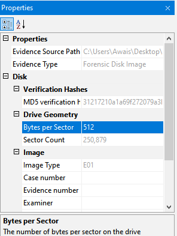

*Figure 1. Autopsy's data source properties for Mantooth.E01: evidence
path, verification hash, drive geometry, and image type.*

**Finding:** Bytes per sector: 512. Sector count: 250,879. Image type:
E01 (EnCase Evidence File format). The MD5 verification hash embedded in
the E01 container was also confirmed present, supporting the image's
forensic integrity.

### 5.2 Partition Layout

**Purpose:** Confirms how many partitions exist on the volume and
identifies which one holds the NTFS file system to be examined for the
remainder of this report.

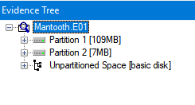

*Figure 2. Partition layout in Autopsy: the Mantooth E01 partition and
an Unpartitioned Space region.*

**Finding:** 2 partitions: the primary Mantooth NTFS partition and a
region of unpartitioned space.

### 5.3 NTFS Partition Starting Sector

**Purpose:** Records exactly where the NTFS partition begins on the
physical disk, which anchors every subsequent cluster/sector offset
calculated for files inside it.

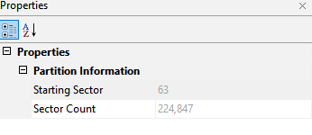

*Figure 3. Partition Information properties for the NTFS partition in
Autopsy.*

**Finding:** The Starting Sector and Sector Count values were not
clearly legible in the captured screenshot (the property labels are
visible but their values were cropped out of frame), this should be
re-confirmed directly from Autopsy's Volume/Partition properties pane on
re-examination rather than assumed.

### 5.4 The $MFT and $MFTMirr System Files

**Purpose:** Examines the two most critical NTFS metadata files in
detail, their size, physical location, and (for $MFTMirr) exactly which
and how many records they contain, since every other file on the volume
is indexed through them.

**$MFT**

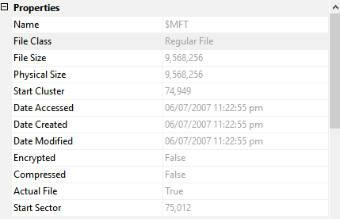

*Figure 4. $MFT file properties in Autopsy: size, physical size, and
start cluster.*

**Finding:** $MFT size: 9,568,256 bytes (≈ 9.1 MB). Start cluster:
74,949. Start sector: 75,012.

**$MFTMirr**

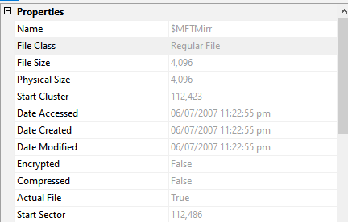

*Figure 5. $MFTMirr file properties in Autopsy: size, physical size,
and start cluster.*

**Finding:** $MFTMirr size: 4,096 bytes. Start cluster: 112,423. Start
sector: 112,486.

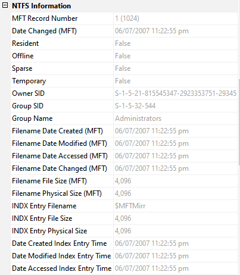

*Figure 6. $MFTMirr's own NTFS Information panel in Autopsy, including
its MFT record number and owner/group SIDs.*

**Finding:** MFT record number for $MFTMirr: 1 (consistent with NTFS's
fixed convention that $MFTMirr always occupies MFT record 1). Owner
SID: S-1-5-21-815545347-2923353751-20345\[...\]; Group: S-1-5-32-544
(Administrators).

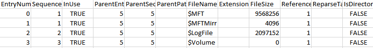

*Figure 7. MFTECmd's parsed listing of the first four MFT records:
$MFT, $MFTMirr, $LogFile, and $Volume.*

**Finding:** $MFTMirr contains 4 records, obtained by dividing its
4,096-byte file size by the fixed 1,024-byte MFT record size (4,096 ÷
1,024 = 4). The full reasoning for why it is always exactly these four
records is given in Section 6.1.

### 5.5 Volume Serial Number

**Purpose:** Recovers the NTFS volume's unique serial number, a value
that can be used to positively match this specific formatted volume
against other artifacts (e.g. shortcut files or registry MountedDevices
entries) that reference it elsewhere.

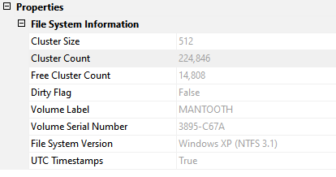

*Figure 8. File System Information panel in Autopsy, listing cluster
size, volume label, and volume serial number fields.*

**Finding:** The Volume Serial Number value was not clearly legible in
the captured screenshot (the field labels are visible but the value
column was cropped out of frame), this should be re-confirmed directly
from Autopsy's File System Information pane on re-examination.

### 5.6 MFT Record 44: Resident or Non-Resident?

**Purpose:** Applies the resident/non-resident distinction from Section
### 3.1 to a specific real file, to demonstrate how to make that
determination directly from MFT evidence rather than by definition
alone.

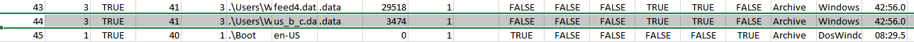

*Figure 9. MFTECmd output for MFT record 44, showing the file
us_b_c.data and its data-run allocation.*

**Finding:** MFT record 44 (us_b_c.data, 3,474 bytes) is non-resident. A
3,474-byte file cannot fit inside a 1,024-byte MFT record, and the
record's data runs (53726249 569) confirm its content is stored in
clusters outside the MFT rather than inline, resident files store their
content directly in the record and carry no data runs at all.

### 5.7 Live MACB-Timestamp Exercise, Part 1

**Purpose:** Establishes a timestamp baseline for a newly downloaded,
opened, and closed file, as a controlled real-world test of how NTFS
actually records Created/Modified/Accessed times, to be compared against
a second check in Section 5.8.

A picture (sample.jpg) was downloaded from the internet to the Desktop
of the examiner's own Windows system, opened to confirm it displayed
correctly, and closed.

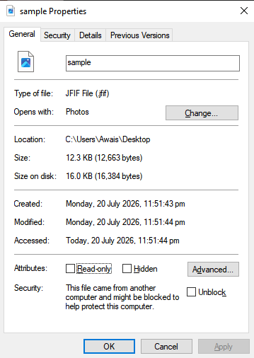

*Figure 10. sample.jpg's file properties (General tab) immediately after
the first open/close.*

**Finding:** Created: 20 July 2026, 11:51:43 pm. Modified: 20 July 2026,
11:51:44 pm. Accessed: 20 July 2026, 11:51:44 pm (“Today”).

### 5.8 Live MACB-Timestamp Exercise, Part 2

**Purpose:** Re-checks the same file's timestamps roughly a minute
later, after opening and closing it a second time, to directly observe
whether simply viewing a file changes its recorded Accessed time on a
modern Windows system.

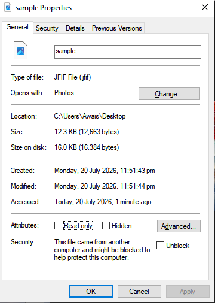

*Figure 11. sample.jpg's file properties after waiting one minute and
re-opening/closing it a second time.*

**Finding:** Created: 20 July 2026, 11:51:43 pm (unchanged). Modified:
20 July 2026, 11:51:44 pm (unchanged). Accessed: shown as “1 minute ago”
by Explorer's relative-time display, tied to the same underlying
timestamp as the first check rather than a newly updated one, analyzed
fully in Section 6.2.

### 5.9 Comparing the Two Timestamp Checks

**Purpose:** Directly compares the two checks above to draw a concrete
forensic conclusion about NTFS timestamp behavior, rather than leaving
the two readings side by side unexplained.

**Finding:** Created and Modified were identical across both checks,
which is expected, simply opening an image file to view it does not
rewrite its content or its original creation record. Accessed did not
meaningfully change either: opening the file a second time, a full
minute later, did not produce a new, later Accessed timestamp. The
technical reason why is explained in Section 6.2.

### 5.10 Further Work: Recovering a Deleted File

**Purpose:** Extends the examination to deleted-data recovery,
demonstrating that a file's metadata can often still be reconstructed
from its MFT record even after the file itself has been deleted from the
visible file system.

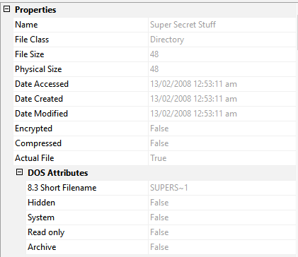

*Figure 12. Properties of the recovered deleted item “Super Secret
Stuff” in Autopsy, including its DOS 8.3 short filename.*

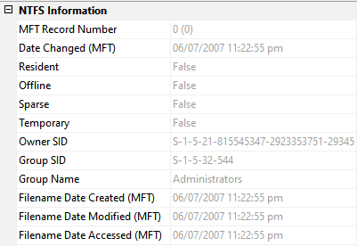

*Figure 13. NTFS Information panel for the same item, including its MFT
record number and owning SIDs.*

**Finding:** Name: Super Secret Stuff (8.3 short filename: SUPERS~1).
File class: Directory. Size: 48 bytes (a directory's own record size,
not the size of its contents). Created / Modified / Accessed: 13/02/2008
12:53:11 am (all three identical, consistent with the folder never being
modified after creation). Owner SID:
S-1-5-21-815545347-2923353751-20345\[...\]; Group: S-1-5-32-544
(Administrators), the same SID family recovered from $MFTMirr in
Section 5.4, confirming both belong to the same volume.

*This folder name directly matches “Super Secret Stuff.zip”, identified
as a Recent Documents artifact in Finding 30 of the companion Windows
Registry examination of this portfolio, this deleted directory is very
likely where that archive was extracted to or staged from, and is worth
pursuing jointly with that finding in any follow-up review.*

### 5.11 Cross-Validation with EZTools (MFTECmd)

**Purpose:** Independently re-parses the same $MFT and $MFTMirr files
examined in Autopsy using a completely different, purpose-built
command-line tool, to confirm the earlier findings rather than relying
on a single tool's interpretation.

```
MFTECmd.exe -f "C:\Users\Awais\Desktop\$MFT" --csv "C:\Users\Awais\Desktop\new_out"
```

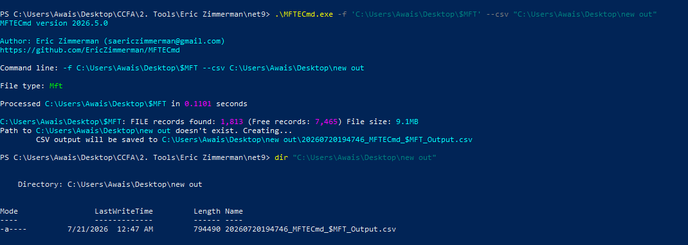

*Figure 14. MFTECmd parsing the extracted $MFT file: 1,313 FILE records
found (7,465 free records), file size 9.1 MB.*

**Finding:** MFTECmd independently confirms $MFT's size (9.1 MB,
matching the 9,568,256-byte value from Section 5.4) and reports 1,313
active FILE records alongside 7,465 free (deleted/reusable) record
slots.

```
MFTECmd.exe -f "C:\Users\Awais\Desktop\$MFTMirr.copy0" --csv "C:\Users\Awais\Desktop\new_out"
```

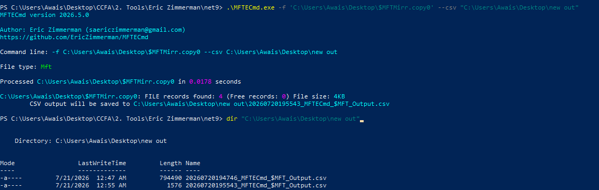

*Figure 15. MFTECmd parsing the extracted $MFTMirr copy: exactly 4 FILE
records found, 0 free records, file size 4 KB.*

**Finding:** MFTECmd confirms $MFTMirr contains exactly 4 FILE records
and 0 free records, an independent, tool-based confirmation of the 4,096
÷ 1,024 = 4 calculation in Finding 7, closing the loop between manual
reasoning and empirical tool output.

## 6. Technical Discussion

### 6.1 Why $MFTMirr Always Contains Exactly 4 Records

The original lab notes flagged this for further elaboration. $MFTMirr
exists purely as a disaster-recovery backup: if the beginning of the
primary $MFT is damaged or overwritten, NTFS needs at least enough
information back to reconstruct the volume's most critical structures
without having to trust the very table that may be corrupted.
Microsoft's NTFS design fixes this backup to exactly the first four MFT
records, $MFT itself (record 0), $MFTMirr (record 1), $LogFile
(record 2), and $Volume (record 3), because these four are precisely
the minimum set of files needed to identify the volume, locate the full
MFT, and begin transaction-log-based recovery. Since every MFT record is
a fixed 1,024 bytes regardless of the file it describes, backing up
exactly four records produces a fixed $MFTMirr size of 4 × 1,024 =
4,096 bytes on every standard NTFS volume, which is exactly the size
recovered in Section 5.4, and exactly what both the manual division and
the independent MFTECmd parse in Section 5.11 confirm.

### 6.2 What the MAC-Time Comparison Actually Shows

The comparison in Section 5.9 is a useful, if slightly counterintuitive,
real-world demonstration: opening and viewing an image file a second
time, a full minute later, did not produce a visibly later Accessed
timestamp. This is expected behavior on modern Windows, not a testing
error. Beginning with Windows Vista, NTFS's automatic last-access-time
updates (NtfsDisableLastAccessUpdate) have been disabled by default
system-wide, specifically for performance reasons: updating the Accessed
timestamp on every single file read used to generate significant, mostly
pointless disk I/O. As a direct consequence, on a modern default Windows
installation, simply opening a file to view it typically does not update
its recorded Access time at all.

This has a direct forensic implication that goes beyond this one
exercise: an examiner cannot assume, on a modern Windows system, that a
file's Accessed timestamp reflects the last time someone actually opened
it, it may reflect only the last time the file was created, copied, or
otherwise had its content or metadata written, since ordinary viewing
leaves no trace in that field by default. Access-time evidence of this
kind should be treated as unreliable unless the specific system is
confirmed to have last-access-time updates explicitly re-enabled.

## 7. Findings Summary and Conclusion


> **TECHNICAL NOTE: Overall Assessment**
>
> Image and volume properties (512 bytes/sector, 250,879 sectors, E01 format, 2 partitions) were established as the structural baseline for the entire examination.
>
> $MFT and $MFTMirr were fully characterized, size, cluster/sector location, and (for $MFTMirr) an exact, independently-confirmed record count of 4, explained fully by NTFS's fixed backup design in Section 6.1.
>
> MFT record 44 was correctly classified as non-resident by direct evidence (data runs present, file size exceeding the 1,024-byte record limit), demonstrating the resident/non-resident distinction on a real file.
>
> The live MACB-timestamp exercise showed no meaningful change in Accessed time across two file views a minute apart, explained in Section ### 6.2 as expected behavior on modern Windows, with a direct implication for how much weight an examiner should place on Access-time evidence going forward.
>
> A deleted directory, Super Secret Stuff, was recovered with its full MFT metadata intact, and its name directly connects to a Recent Documents artifact already identified in the companion Windows Registry report of this portfolio.
>
> Independent cross-validation with MFTECmd (EZTools) confirmed both the $MFT and $MFTMirr findings from Autopsy, reinforcing the same source-corroboration discipline used throughout this report series.


Two items, the NTFS partition's exact starting sector (Finding 5.3) and
the volume serial number (Finding 5.5), were not clearly legible in the
screenshots captured for this exercise and are flagged rather than
guessed; both should be quickly re-confirmed directly in Autopsy on any
follow-up pass, as they are straightforward to recapture cleanly.

Together with the companion Windows Registry and SAM Hash reports, this
examination completes a three-layer picture of the Mantooth system: what
the registry says about its configuration and use, who could log into it
and with what credentials, and now, how the file system itself
physically stores and timestamps the evidence referenced throughout the
case.
