# Live Memory Forensics with Volatility 3

*Acquisition and Plugin-Based Triage of a Windows Memory Image*

**Author:** Awais Ahmed
**Program:** B.S. Digital Forensics and Cyber Security (DFCS)
**Certification Track:** Certified Computer Forensics Analyst (CCFA)

| Field | Detail |
|---|---|
| **Examiner**         | Awais Ahmed                                                                    |
| **Role**             | Digital Forensics Student / Examiner-in-Training                               |
| **Source Practical** | “Volatility” memory-forensics worksheet                                        |
| **Subject Media**    | Physical memory image of the examiner's own system, captured for this exercise |

---

## 1. Executive Summary

This report documents a live memory (RAM) forensics exercise performed
as part of Digital Forensics and Cyber Security (DFCS) coursework
aligned to Certified Computer Forensics Analyst (CCFA) competencies. A
full physical memory image was captured from the examiner's own Windows
10 laptop using DumpIt, then analyzed with the Volatility 3 Framework to
demonstrate the standard triage workflow an examiner would follow
against any Windows memory capture.

Seven Volatility plugins were run against the image in sequence,
windows.info, windows.pslist, windows.netscan, windows.pstree,
windows.cmdline, windows.malware.malfind, and windows.filescan, each
targeting a different category of volatile evidence: system
identification, running processes, active network connections, process
ancestry, process launch arguments, injected-code detection, and open
file handles.

No malicious activity was identified. windows.malware.malfind flagged
three processes with executable-writable memory regions, all of which
were assessed as expected false positives tied to legitimate OEM and
antivirus software rather than injected code (Section 5.6). The report
closes with the command syntax for narrowing a Volatility search around
a specific suspicious process, which would be the next step if this had
been a live incident-response engagement rather than a clean baseline
system.

## 2. Scope and Authorized Use

All actions in this report were performed against a memory image of the
examiner's own personal system, captured specifically for this
coursework exercise, in a controlled lab environment. Capturing and
analyzing full system memory is a standard, lawful step in an authorized
digital forensics or incident-response engagement; performing the same
capture against a system one does not own or have written authorization
to examine would not be lawful. This report should be read strictly as a
record of coursework against the examiner's own machine, not as guidance
for use against systems without proper authorization.

## 3. Background: Why Memory Forensics Matters

Traditional (“dead-box”) forensics, as in the companion Windows Registry
examination of this portfolio, recovers evidence from a disk image after
the system has been shut down. Memory forensics instead captures the
contents of RAM while a system is running, and analyzes that snapshot
afterward. This matters because a large amount of forensically valuable
information exists only in memory and is lost the moment a system powers
off or a process exits:

- Running processes and their exact command-line arguments,
including ones that never wrote a trace to disk.

- Active and recently-closed network connections, tied to the
specific process that owned them.

- Decrypted data, plaintext credentials, or encryption keys that
exist in memory only while a program is actively using them.

- Malicious code injected directly into a legitimate process's
memory space, which may never exist as a file on disk at all.

Volatility 3 is the current generation of the Volatility Framework, an
open-source tool purpose-built to parse these raw memory images and
reconstruct operating-system structures (the process list, network
tables, loaded modules, and so on) directly from the raw bytes of a
memory dump, without needing the original live system.

## 4. Examination Environment and Tools

- Python 3.12, required runtime for Volatility 3.

- Volatility 3 Framework 2.28.1, installed in editable mode from
source with the full optional dependency set (yara-python, capstone,
pycryptodome, leechcorepyc, pefile), enabling malware-scanning and
disassembly features used later in this report.

**Volatility 3 source:**
[<u>https://github.com/volatilityfoundation/volatility3</u>](https://github.com/volatilityfoundation/volatility3)

- DumpIt (h4sh5/DumpIt-mirror), a lightweight Windows
memory-acquisition utility used to capture the full physical memory
image analyzed in this report.

**DumpIt-mirror source:**
[<u>https://github.com/h4sh5/DumpIt-mirror</u>](https://github.com/h4sh5/DumpIt-mirror)

## 5. Procedure and Results

### 5.1 Installing Volatility 3

Volatility 3 was installed in editable mode with its full optional
dependency set, which pulls in pefile, yara-python, capstone,
pycryptodome, and leechcorepyc, the packages that specifically enable PE
parsing, YARA pattern scanning, disassembly, and low-level memory-layer
support used by later plugins in this report.

```
pip install --user -e ".[full]"
```

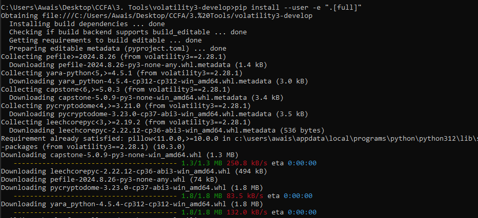

*Figure 1. Installing Volatility 3 and its full dependency set via pip.*

### 5.2 Acquiring the Memory Image with DumpIt

DumpIt was run directly on the target system and, when prompted,
confirmed with ‘y’ to begin capture. It wrote the full physical memory
contents to a timestamped .dmp file, alongside a small companion .json
metadata file.

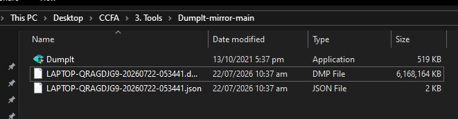

*Figure 2. DumpIt's output folder: the captured memory image
(LAPTOP-QRAGDIG9-20260722-053441.dmp, ≈ 5.9 GB) and its .json metadata
file.*

**Finding:** A complete physical memory image (≈ 6,168,164 KB) was
captured successfully and used as the input file for every Volatility
command that follows.

### 5.3 Identifying Available Windows Plugins

Volatility 3 organizes its plugins by operating system (windows.\*,
linux.\*, mac.\*). Running the tool with just the bare category name
windows returns a disambiguation error listing every plugin available
under that category, this is what produced the full plugin listing
below, which serves as a reference for the operating-system-level
artifacts Volatility 3 can extract from a Windows memory image.

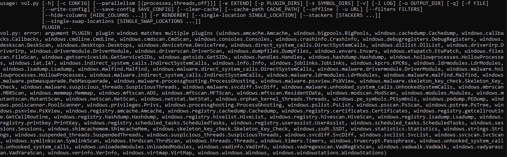

*Figure 3. Volatility 3's plugin disambiguation error, listing all
available windows.\* plugins (e.g. windows.pslist, windows.netscan,
windows.malware.malfind, windows.registry.hashdump) as a category
reference.*

*Of this full plugin catalog, the seven plugins used for this exercise
are detailed in Sections 5.4–5.10 below, each with its purpose and
findings.*

### 5.4 windows.info: System Identification

**Purpose:** Confirms which build of Windows produced the memory image,
the kernel base address, and the symbol table Volatility resolved
against, establishing that the correct OS profile was used before
trusting any later plugin's output.

```
python vol.py -f "...\LAPTOP-QRAGDIG9-20260722-053441.dmp" windows.info
```

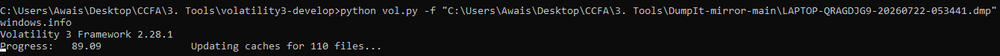

*Figure 4. windows.info command invocation.*

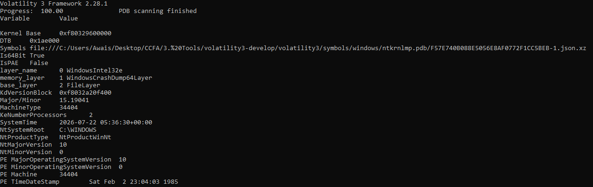

*Figure 5. windows.info output: kernel base, symbol file, and system
version details.*

**Finding:** Windows 10 (NtMajorVersion 10), 2 logical processors,
64-bit, SystemTime 2026-07-22 05:36:30 UTC, confirming the image is a
valid, correctly-profiled Windows 10 memory capture matching the capture
time in Section 5.2.

### 5.5 windows.pslist: Running Process List

**Purpose:** Enumerates every active process at the moment of capture by
walking the kernel's process list, giving PID, parent PID, thread/handle
counts, and creation time for each, the starting point for almost any
memory investigation.

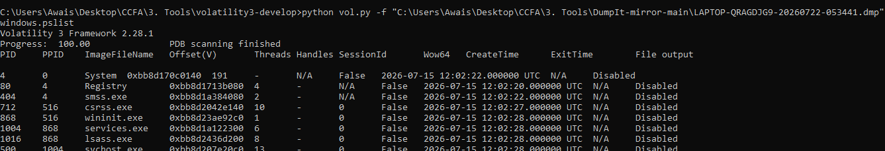

*Figure 6. windows.pslist output: System, Registry, smss.exe, csrss.exe,
wininit.exe, services.exe, lsass.exe, and further processes with their
PIDs and creation times.*

**Finding:** A normal, expected core Windows process set was present
(System, Registry, smss.exe, csrss.exe, wininit.exe, services.exe,
lsass.exe), each with a plausible parent PID and no unexpected process
names, no findings of concern at this stage.

### 5.6 windows.netscan: Network Connections

**Purpose:** Scans memory for network-connection structures (TCP/UDP
endpoints), independent of the live pslist walk, recovering both active
and some recently-closed connections along with the owning process,
which is useful for identifying command-and-control traffic, data
exfiltration, or unexpected listening services.

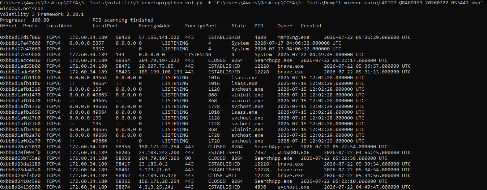

*Figure 7. windows.netscan output: TCP/IPv4 and IPv6 endpoints with
local/foreign address, port, state, and owning process.*

**Finding:** All identified connections resolved to expected, legitimate
processes: MsMpEng.exe (Windows Defender, ESTABLISHED to a Microsoft
telemetry/definition-update endpoint), brave.exe (multiple ESTABLISHED
HTTPS connections, consistent with normal browsing), SearchApp.exe
(Windows Search, CLOSED connections to Microsoft/Bing endpoints), and
svchost.exe/lsass.exe/wininit.exe listening on standard Windows service
ports (135, 139, 49664–49666). No connections to unrecognized or
suspicious foreign addresses were observed.

### 5.7 windows.pstree: Process Hierarchy

**Purpose:** Presents the same process list as pslist but organized by
parent–child relationship (indentation shows which process launched
which), which is useful for spotting a process running from an
unexpected parent, a classic sign of process injection or masquerading.

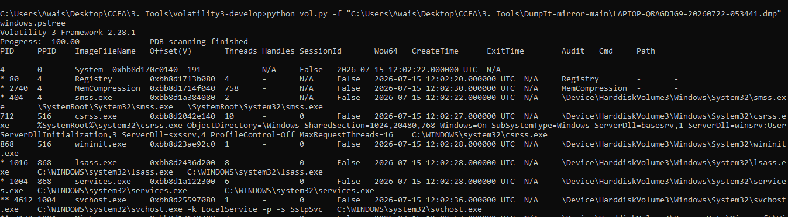

*Figure 8. windows.pstree output showing System → smss.exe / Registry /
MemCompression, and csrss.exe / wininit.exe → lsass.exe, services.exe →
svchost.exe, with full paths and command lines.*

**Finding:** Every process observed had a parent consistent with the
normal Windows Vista/10 boot sequence (System spawning smss.exe and
Registry; wininit.exe spawning services.exe and lsass.exe; services.exe
spawning svchost.exe instances), no orphaned or unexpectedly-parented
processes were found.

### 5.8 windows.cmdline: Process Command-Line Arguments

**Purpose:** Recovers the exact command line each process was launched
with, including service-hosting arguments passed to generic executables
like svchost.exe, which is critical for distinguishing a legitimate
system service from a malicious process disguising itself under a common
process name.

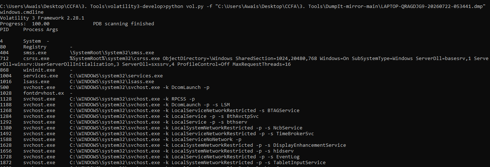

*Figure 9. windows.cmdline output listing each process's full command
line, including svchost.exe instances with their -k service-group
arguments (e.g. -k LocalService -p -s BthAvctpSvc).*

**Finding:** Every svchost.exe instance carried a plausible, named -k
service-group argument (DcomLaunch, RPCSS,
LocalServiceNetworkRestricted, EventLog, and others) matching known
legitimate Windows service groups, none were found running with a blank,
malformed, or suspicious argument, which would be the classic red flag
for a process masquerading as svchost.exe.

### 5.9 windows.malware.malfind: Injected Code Detection

**Purpose:** Scans each process's memory for regions that are both
writable and executable (PAGE_EXECUTE_READWRITE) with no backing file on
disk, which is a strong indicator of injected shellcode or a
reflectively-loaded malicious module, since legitimate code is normally
either executable-only (loaded from a file) or writable-only (ordinary
data), rarely both at once.

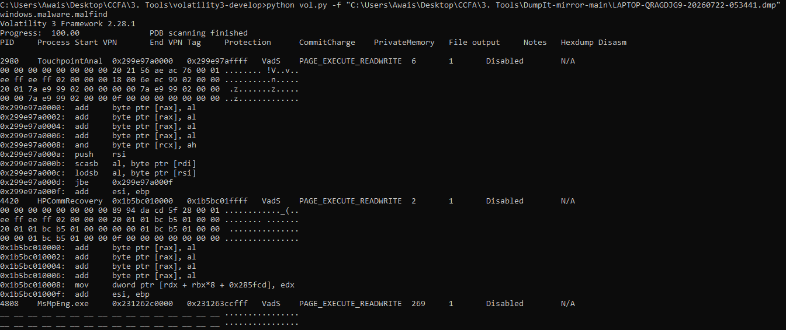

*Figure 10. windows.malware.malfind output flagging three processes with
PAGE_EXECUTE_READWRITE regions: TouchpointAnalytics (PID 2988),
HPCommRecovery (PID 4420), and MsMpEng.exe (PID 4808), with hex dumps
and disassembly.*

**Finding:** Three processes were flagged: TouchpointAnalytics and
HPCommRecovery (both pre-installed HP laptop utilities) and MsMpEng.exe
(Windows Defender's own scanning engine).


> **TECHNICAL NOTE: Assessing the malfind Flags**
>
> malfind is intentionally broad, it flags the memory permission pattern associated with code injection, not injection itself, so a certain rate of false positives on a clean system is expected and must be triaged rather than reported at face value.
>
> MsMpEng.exe is a textbook example: antivirus engines legitimately allocate RWX memory for their own emulation/unpacking sandboxes to safely detonate suspicious code, which is exactly the pattern malfind is designed to catch. Flagging Windows Defender's own process is one of the most common and well-documented malfind false positives.
>
> TouchpointAnalytics and HPCommRecovery are OEM telemetry/support utilities bundled with HP laptops (consistent with the HP hardware identified in the companion Windows Registry examination of this portfolio); vendor utilities of this kind sometimes use RWX regions for legitimate JIT-compiled or self-updating code, another common source of benign flags.
>
> Assessment: all three flags are consistent with expected false positives on a clean baseline system, not evidence of compromise. In a real investigation, the next step for any of these would be to export the flagged region (--dump), hash it, and check it against a known-good hash or submit it for reputation/YARA analysis rather than accept or dismiss the flag on process name alone.


### 5.10 windows.filescan: Open File Handles

**Purpose:** Scans memory for file-object structures, recovering the
names of files that were open (or recently open) at capture time,
including system files, NTFS metadata structures, and driver files,
which is useful for identifying files a suspicious process had open that
may not otherwise be visible from a live directory listing.

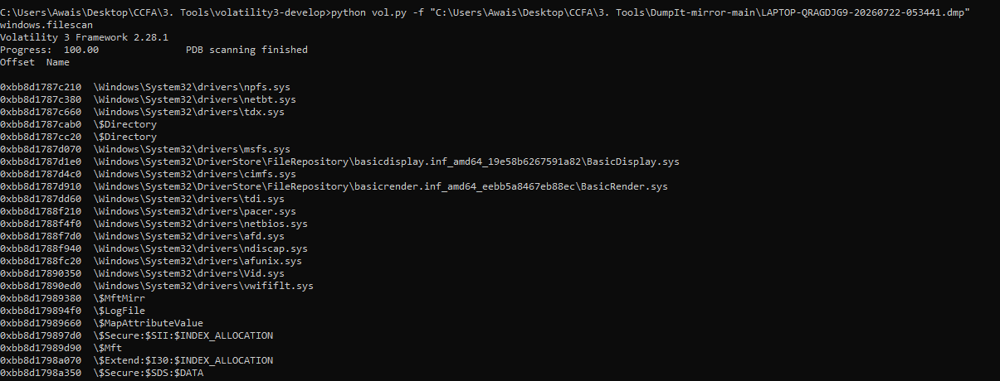

*Figure 11. windows.filescan output listing open file objects: Windows
driver files (npfs.sys, netbt.sys, tdx.sys, afd.sys) and NTFS metadata
structures ($LogFile, $Secure, $Extend).*

**Finding:** The recovered file handles were entirely standard Windows
kernel driver files and NTFS metadata structures (e.g. $LogFile,
$Secure:$SDS:$DATA), consistent with normal system operation and
containing no unexpected or user-suspicious file paths.

## 6. Narrowing an Investigation: Targeted Filtering

The plugins above were run unfiltered, returning every
process/connection/region system-wide, appropriate for an initial
baseline triage. Once a specific process becomes a focus of interest
(for example, one of the malfind hits in Section 5.9, in a case where it
could not be dismissed as a false positive), Volatility supports
narrowing any plugin's scope directly, rather than manually filtering
its full output:

- `--pid`, restrict the plugin to a single specific process ID.

- `--name`, filter by process name, supporting wildcard patterns.

- `--regex`, filter using a full regular expression for more complex
pattern matching.

- `--dump`, combined with malfind, exports the flagged memory region
itself to disk for hashing, YARA scanning, or manual
reverse-engineering, rather than only reporting its presence.

For example, to focus malfind on a single suspicious PID:

```
# Target a specific suspicious PID
vol -f memory.dmp windows.malware.malfind --pid 1724
```

To filter by process name pattern instead of a fixed PID:

```
# Filter by process name pattern
vol -f memory.dmp windows.malware.malfind --name "powershell*"
```

Combining a targeted PID filter with --dump extracts the flagged region
itself for offline analysis:

```
# Use regex to find injected code in specific processes
vol -f memory.dmp windows.malware.malfind --pid 1724 --dump
```

Beyond these, Volatility also supports narrowing by memory region using
--base, or combining several of the filters above at once, to isolate
only the most relevant artifacts for a given threat model rather than
paging through a full system-wide dump on every plugin run.

## 7. Findings Summary and Conclusion


> **TECHNICAL NOTE: Overall Assessment**
>
> System identification (windows.info) confirmed a valid Windows 10 image with a correctly resolved symbol table.
>
> Process listing and hierarchy (windows.pslist, windows.pstree) showed an expected, normally-parented Windows process set with no orphaned or misplaced processes.
>
> Network connections (windows.netscan) resolved entirely to legitimate, identifiable applications with no unrecognized foreign endpoints.
>
> Command-line arguments (windows.cmdline) showed every svchost.exe instance carrying a valid, named service-group argument.
>
> Injected-code detection (windows.malware.malfind) flagged three processes; all three were assessed as expected false positives (an antivirus engine and two OEM utilities) rather than evidence of compromise.
>
> Open file handles (windows.filescan) showed only standard system driver and NTFS metadata files.


This exercise reproduces the standard first-pass triage workflow an
examiner runs against any newly acquired Windows memory image: confirm
the image and profile, enumerate processes and their relationships,
check network activity, and screen for injected code, before deciding
whether deeper analysis is warranted. In this case, every plugin's
output was consistent with a normal, uncompromised baseline system, but
the same seven-plugin sequence, together with the targeted
--pid/--name/--regex/--dump filtering shown in Section 6, is exactly
what would be applied first against a genuinely suspicious system, where
the findings at each step would be expected to look materially
different.
