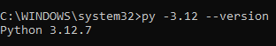
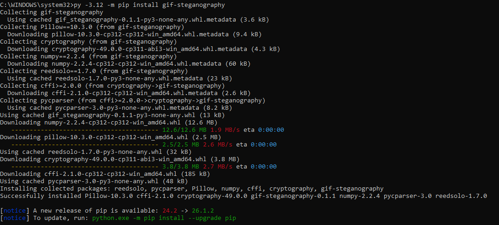
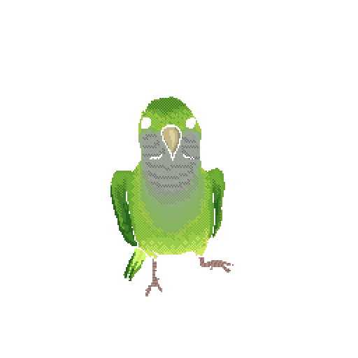
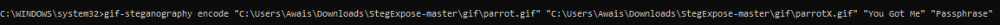
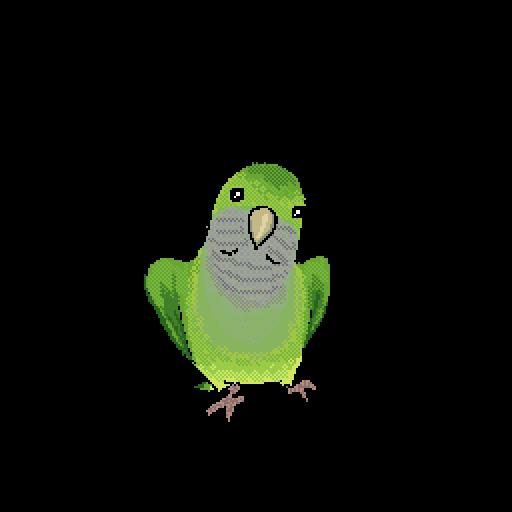
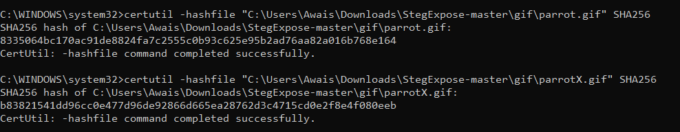
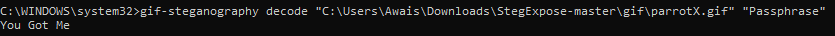

# GIF Steganography: Embedding and Extraction

*Covert Data Concealment in Indexed-Color Images via LSB Encoding*

**Author:** Awais Ahmed
**Program:** B.S. Digital Forensics and Cyber Security (DFCS)
**Certification Track:** Certified Computer Forensics Analyst (CCFA)

| Field | Detail |
|---|---|
| **Examiner**         | Awais Ahmed                                                |
| **Role**             | Digital Forensics Student / Examiner-in-Training           |
| **Source Practical** | “GIF Steganography” worksheet                              |
| **Subject File**     | parrot.gif, sourced from a local StegExpose test-image set |

---

## 1. Executive Summary

This report documents a hands-on steganography exercise performed as
part of Digital Forensics and Cyber Security (DFCS) coursework aligned
to Certified Computer Forensics Analyst (CCFA) competencies. The
objective was to embed a short text message inside a GIF image using
Least Significant Bit (LSB) steganography, verify at the byte level that
the embedding operation altered the file, and then successfully recover
the original message.

The exercise used the open-source Python package gif-steganography
(v0.1.1) running under Python 3.12. A message (“You Got Me”) was encoded
into a 512×512 indexed-color GIF (parrot.gif) using a passphrase,
producing a modified file (parrotX.gif). SHA-256 hashing confirmed the
two files are byte-for-byte different despite near-identical visual
appearance, and the decode operation returned the exact original message
and passphrase-protected payload intact.

Beyond the mechanical steps, this report addresses three questions the
original lab notes left open: why different steganography tools are
generally incompatible with one another, why encoding a message into a
palette-indexed GIF can produce visible pixel changes (and why that
isn't universal), and why hashing is a meaningful, if optional,
verification step in this workflow. These are covered in Section 3 and
Section 5.

## 2. Background: Steganography and LSB Encoding

Steganography is the practice of concealing a message inside another,
innocuous-looking piece of data so that the existence of the hidden
message itself is not apparent, as distinct from cryptography, which
scrambles a message's content but does not hide the fact that a message
exists. It is commonly applied to images, audio, video, text, and even
network traffic; this exercise focuses on image steganography,
specifically within the GIF format.

### 2.1 Least Significant Bit (LSB) Steganography

LSB steganography works by replacing the least-significant
(lowest-order) bit of individual bytes in the carrier file with bits
from the secret message. Because the least-significant bit contributes
the smallest possible amount to a byte's value, overwriting it
introduces only a minimal change to the underlying data, in an
uncompressed true-color image, a 1-bit change to a color channel shifts
that channel's value by at most 1 out of 255, which is generally
imperceptible to the human eye.

### 2.2 Why One Tool's Output Often Can't Be Decoded by Another

The original lab notes correctly observed that a message encoded with
one steganography tool often cannot be decoded with a different tool.
This is because “LSB steganography” is a family of techniques, not a
single standardized format, and implementations differ in several
independent ways:

- Bit position: some tools embed in the least-significant bit,
others use the second-least-significant bit for slightly higher
robustness at the cost of more visible distortion; “leftmost” vs
“rightmost” bit ordering (as the original notes described) is one
variant of this.

- Channel and pixel-order selection: which color channel(s) are used
(red/green/blue, or the palette index in an indexed image), and in what
scan order pixels are visited (sequential, or a pseudo-random order
derived from a key).

- Payload framing: how the tool encodes the message length, whether
it compresses the payload first, whether it encrypts it, and whether it
adds error-correcting redundancy, all of which change the exact bit
sequence written into the carrier.

- Container format assumptions: a tool built for BMP/PNG's raw RGB
pixel grid will not correctly interpret a GIF's palette-indexed pixel
data, and vice versa.

Because decoding requires reversing the exact scheme used to encode, a
tool without the matching bit-position, channel, ordering, and framing
logic will either extract garbage or fail outright, this is why
gif-steganography's own encoder and decoder were used as a matched pair
in this exercise, rather than mixing tools.

### 2.3 GIF's Indexed-Color Constraint

Unlike a true-color format (24-bit RGB), a GIF pixel does not store a
color directly, it stores a small integer that is an index into a
limited color-lookup table, or palette, of at most 256 entries. This
distinction matters directly for LSB steganography and is the basis for
the pixel-visibility question raised in the original notes, addressed
fully in Section 5.1.

## 3. Examination Environment and Tools

The exercise was carried out on a Windows workstation using the
following environment:

- Python 3.12.7, required specifically because gif-steganography's
dependency set (see below) targets this interpreter version; the lab
notes correctly flag 3.12 as the version to install.

- gif-steganography 0.1.1, the steganography package itself,
installed via pip.

- Pillow 10.3.0, used internally for reading and writing the GIF's
pixel and palette data.

- numpy 2.2.4, used internally for efficient array-level
manipulation of pixel/bit data.

- cryptography, used internally to encrypt the message payload with
the supplied passphrase before it is embedded, rather than storing it as
plain LSB-encoded text.

- reedsolo 1.7.0, a Reed–Solomon error-correcting-code library, used
internally to add redundancy to the embedded payload so it can still be
recovered even if a small number of embedded bits are altered or lost.

- certutil (Windows built-in), used to compute SHA-256 hashes of the
carrier file before and after encoding, for integrity verification.



*Figure 1. Confirming the active Python interpreter is version 3.12.7.*



*Figure 2. Installing gif-steganography and its dependencies via pip.*


> **TECHNICAL NOTE: Why This Dependency Set Matters**
>
> The presence of cryptography and reedsolo alongside the expected image-handling libraries (Pillow, numpy) indicates gif-steganography is not a naive LSB tool: it appears to encrypt the message with the passphrase first, then adds Reed–Solomon redundancy before embedding, so that the payload is both confidential and resilient to minor bit-level corruption. This also explains why a passphrase is required for both encode and decode, it is functioning as an encryption key, not merely an access gate.


## 4. Procedure and Results

### 4.1 Baseline Carrier Image

**Purpose:** Records the carrier file's original, unmodified state so it
can be compared visually and cryptographically against the file produced
after encoding.

The carrier file selected was parrot.gif, a 512×512 indexed-color GIF
sourced from a local test-image set. Its appearance before any
modification was recorded as a baseline for later visual and
cryptographic comparison.



*Figure 3. parrot.gif prior to encoding, the unmodified baseline carrier
image.*

### 4.2 Encoding the Message

**Purpose:** Embeds the secret message into the carrier image using a
passphrase, producing the actual steganographic output file this
exercise sets out to create.

```
gif-steganography encode "parrot.gif" "parrotX.gif" "You Got Me" "passphrase"
```

**Result:** Command syntax: encode \<input GIF\> \<output GIF\>
\<message\> \<passphrase\>. The message “You Got Me” was embedded into a
new file, parrotX.gif, protected by the passphrase “passphrase”.



*Figure 4. Encode command and its arguments, executed successfully.*



*Figure 5. parrotX.gif after encoding, the message is now embedded but
not visually obvious at a glance.*

### 4.3 Integrity Verification via SHA-256 Hashing

**Purpose:** Provides rigorous, byte-level proof that the encoding
operation actually changed the file, rather than relying on visual
comparison alone.

Hashing the carrier file before and after encoding is not required for
the encode/decode workflow to function, the notes correctly flag this
step as optional. It was performed to provide rigorous, byte-level proof
that the encoding operation changed the file, rather than relying on
visual inspection alone, which is unreliable and subjective. A
cryptographic hash (SHA-256) changes completely if even a single bit of
the input changes, so a differing hash is conclusive evidence that
parrot.gif and parrotX.gif are not identical at the byte level.

**Result:** SHA-256 hashes were computed for both parrot.gif and
parrotX.gif using certutil -hashfile; the two hashes differ completely
(see Figure 8), confirming the encode operation modified the underlying
file data despite the images looking almost the same.



*Figure 6. SHA-256 hashes of parrot.gif and parrotX.gif, computed with
certutil, the two values differ completely.*

### 4.4 Decoding the Message

**Purpose:** Confirms the full round trip works, that the embedded
message can actually be recovered intact using the correct passphrase,
which is the ultimate test of whether the encoding succeeded.

```
gif-steganography decode "parrotX.gif" "passphrase"
```

**Result:** Output: You Got Me, the exact original message was
recovered, confirming the embedding survived intact and the
passphrase-based decryption/decoding round-trip is correct.



*Figure 7. Decode command returning the original message, “You Got Me”.*

## 5. Technical Discussion

### 5.1 Why Are the Pixel Changes Visible After Encoding? Does This Always
Happen?

The lab notes observed that pixel-level changes were visible between
parrot.gif and parrotX.gif after encoding, and asked why this happens
and whether it always does. The answer lies in GIF's indexed-color
structure described in Section 2.3:

- In a true-color image (e.g. an uncompressed BMP or 24-bit PNG),
flipping a pixel's least-significant bit changes one color channel by
1/255, a change far below the threshold of human color perception.

- In a palette-indexed GIF, a pixel does not store a color directly;
it stores an index number pointing into a palette of up to 256 colors.
Flipping the least-significant bit of that index number does not shift
the resulting color by a small amount, it swaps the pixel to whatever
color happens to occupy the neighboring palette slot, which may be
perceptually very different from the original color, depending entirely
on how that particular image's palette happened to be ordered.

- This means visible artifacts from GIF LSB steganography are common
but not universal: if a palette happens to have perceptually similar
colors in adjacent index slots (which some steganography-aware encoders
deliberately arrange), the visual change from an index swap can be
minimal. If the palette is arranged arbitrarily (as is typical for a
general-purpose image not built for steganography), an index swap can
land on a very different color, producing a visible artifact, which is
what happened in this exercise.

In short: the visibility of pixel changes here is a direct consequence
of encoding into a palette index rather than a raw color channel, not a
flaw in the tool or the procedure. The same LSB technique applied to a
true-color, non-indexed image format would typically produce no visually
detectable change at all.

### 5.2 Detectability and Steganalysis

The presence of a StegExpose-master folder alongside the working
directory in the command paths used throughout this exercise (Figures 2,
6, and 7) indicates this lab sits within a broader steganalysis unit.
StegExpose is a statistical steganalysis tool that scores images for the
likelihood of LSB-style manipulation by analyzing pixel/palette
statistics rather than looking for visible artifacts. It was not run as
part of this specific exercise, but is the natural next step: because
the visible artifact identified in Section 5.1 already gives away this
particular stego image to the naked eye, running a statistical detector
like StegExpose against both parrot.gif and parrotX.gif would be a
useful follow-on exercise to see whether the modification is flagged
even in cases where no visible difference is present.

## 6. Forensic Significance and Conclusion

Although this exercise used steganography constructively (embedding a
benign test message), the same technique is a real data-exfiltration and
covert-communication method encountered in digital forensics casework, a
suspect can hide messages, credentials, or stolen data inside
ordinary-looking image files shared over email, chat, or public
image-hosting sites, defeating casual inspection and even some automated
content filters.

This exercise demonstrates three practical takeaways for an examiner:

- Visual inspection alone is not reliable evidence of file integrity
or tampering, SHA-256 hashing provided a rigorous, reproducible way to
prove parrot.gif and parrotX.gif differ, and should be standard practice
whenever comparing a suspect file against a known-good baseline.

- Palette-indexed formats (GIF, indexed PNG, BMP with a color table)
can make LSB steganography visually detectable in a way that true-color
formats generally do not, an examiner reviewing a set of images for
possible steganography should treat unusual color-banding or dithering
artifacts in indexed-color images as a low-cost visual triage signal,
while still relying on statistical tools (e.g. StegExpose) for a
rigorous determination.

- Recovering a hidden message requires knowing (or successfully
identifying) the specific tool, and in this case the passphrase, used to
embed it, reinforcing why cataloguing installed software (as in the
companion Windows Registry examination of this portfolio) is directly
relevant to steganography investigations: finding gif-steganography
installed on a suspect system would be the lead that points an examiner
toward attempting this exact recovery procedure.

The exercise concluded successfully: the message “You Got Me” was
embedded into parrot.gif using a passphrase-protected LSB technique, the
modification was independently confirmed via SHA-256 hashing, and the
original message was recovered intact via decoding, validating the full
encode/verify/decode workflow.
