# Mobile Device Forensics via ADB

*Live Data Acquisition and Triage of a Personal Android 13 Device*

**Author:** Awais Ahmed
**Program:** B.S. Digital Forensics and Cyber Security (DFCS)
**Certification Track:** Certified Computer Forensics Analyst (CCFA)

| Field | Detail |
|---|---|
| **Examiner**         | Awais Ahmed                                                            |
| **Role**             | Digital Forensics Student / Examiner-in-Training                       |
| **Source Practical** | Android ADB mobile forensics worksheet                                 |
| **Evidence Source**  | Examiner's own Android 13 device (OPPO CPH2365), acquired live via ADB |

---

## 1. Executive Summary

This report documents a live mobile forensics exercise performed against
the examiner's own Android 13 smartphone using the Android Debug Bridge
(ADB), as part of Digital Forensics and Cyber Security (DFCS) coursework
aligned to Certified Computer Forensics Analyst (CCFA) competencies.
Unlike the disk-image examinations elsewhere in this portfolio, this
exercise works against a live, running device connected over USB rather
than a static forensic image.

The exercise covers the full ADB triage workflow: enabling and
authorizing device access, pulling system identification, enumerating
installed applications, capturing real-time logs, extracting battery and
network state, acquiring accessible files and directories, and reviewing
device usage history. It closes with a direct look at where Android 13's
security model blocks further access (contacts, call logs, SMS, and
protected system files), and what a rooted device or forensic-mode image
would additionally make available.

A small number of screenshots in this report have been redacted. Two
network addresses (a global-scope IPv6 address and a recurring public
IPv4 address) were blacked out to protect the examiner's personal
network identity; everything else, including account emails and the
device serial number, is shown as captured, since none of it identifies
anyone beyond the examiner on their own device.

## 2. Scope and Authorized Use

All actions in this report were performed by the examiner against their
own personally-owned device, with Developer Options and USB Debugging
deliberately enabled for this exercise, in a controlled lab environment.
ADB access requires the device owner to physically accept an on-screen
authorization prompt, meaning this kind of acquisition cannot be
performed silently or without the device holder's knowledge and consent.
This report should be read strictly as a record of self-directed
coursework, not as guidance for accessing a device without its owner's
authorization.

## 3. Background: ADB and Android Forensics

The Android Debug Bridge (ADB) is a command-line tool, included in the
Android SDK Platform-Tools, that lets a connected workstation issue
commands directly to an Android device over USB. It is a developer and
debugging tool first and a forensic tool second, but because it exposes
shell access, file transfer, and system service dumps, it is widely used
for live, non-invasive triage of Android devices when a full physical or
file-system image is not available or not necessary.

### 3.1 Enabling Access

ADB access is disabled by default and must be deliberately enabled on
the device itself: Developer Options is unlocked by tapping the Build
Number seven times under Settings → About Phone, after which USB
Debugging can be turned on. The first time a new workstation connects,
the device displays an authorization prompt that the owner must accept;
declining it, or not responding, leaves the device listed as
unauthorized rather than device when queried.

### 3.2 Android 13 and Scoped Access

Beginning with Android 11, and continuing through the Android 13 device
examined here, Google's platform restricts ADB shell access to sensitive
content providers, contacts, call logs, and SMS, and to protected system
directories such as /data, unless the device is rooted or running a
special forensic build. This is a deliberate privacy and security
boundary, not a limitation of ADB itself, and it directly shapes which
parts of this exercise succeeded and which did not, covered in Section
6.

## 4. Examination Environment and Tools

- Android SDK Platform-Tools (includes ADB), installed on the
examiner's forensic workstation.

**Android SDK Platform-Tools download:**
[<u>https://developer.android.com/tools/releases/platform-tools</u>](https://developer.android.com/tools/releases/platform-tools)

- Target device: an OPPO CPH2365 smartphone running Android 13,
connected via USB in File Transfer (MTP) mode with USB Debugging
enabled.

- Notepad (Windows) was used to review larger exported text files
(logcat output, battery statistics) once redirected to disk.

## 5. Procedure and Results

### 5.1 Device Connection and Authorization

**Purpose:** Confirms the workstation can see and has been granted
authorized access to the target device before any data collection
begins; an unauthorized device will not respond to further commands.

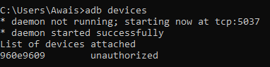

*Figure 1. Initial adb devices query, showing the device listed as
unauthorized before the on-device prompt was accepted.*

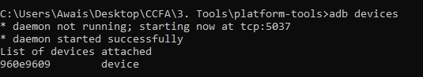

*Figure 2. adb devices confirming the device now shows as device
(authorized) after accepting the USB debugging prompt.*

**Finding:** Device serial 960e9609 initially listed as unauthorized,
then device once the on-screen USB debugging prompt was accepted on the
phone itself.

### 5.2 Basic System Information

**Purpose:** Establishes the device's model, OS version, and serial
number, the minimum identifying information any examination report needs
before presenting further findings.

adb shell getprop dumps the full Android system property list; the full
dump is extensive; individual properties were then queried directly for
the values that matter for reporting.

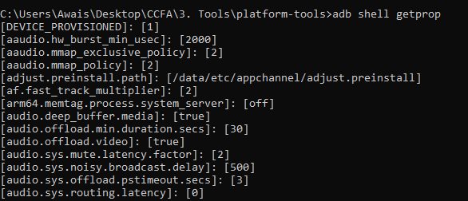

*Figure 3. adb shell getprop, showing the beginning of the full system
property dump.*

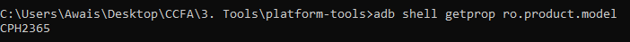

*Figure 4. Querying ro.product.model directly.*

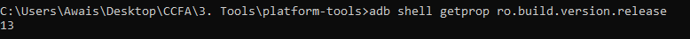

*Figure 5. Querying ro.build.version.release directly.*

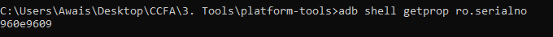

*Figure 6. Querying ro.serialno directly.*

**Finding:** Model: CPH2365 (OPPO). Android version: 13. Serial number:
960e9609.

### 5.3 Installed Applications

**Purpose:** Builds a complete inventory of installed software and where
each package physically lives on the device, useful for identifying
non-default or unusual applications and for correlating with other
artifact categories.

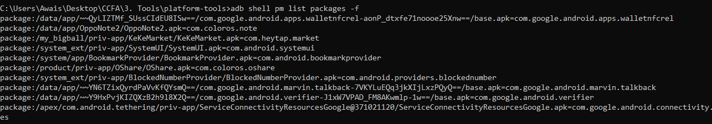

*Figure 7. adb shell pm list packages -f, listing installed package
paths and identifiers.*

The output was then redirected to a file for easier review and
preservation, rather than left only on-screen.

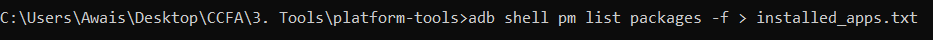

*Figure 8. Redirecting the package list to installed_apps.txt.*

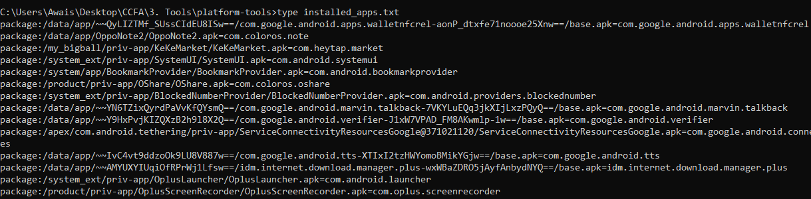

*Figure 9. Reviewing the saved installed_apps.txt with type.*

**Finding:** Installed packages included standard OEM/system components
(SystemUI, BookmarkProvider, OShare) alongside user-installed software
(Google Wallet, TalkBack, IDM Internet Download Manager, OPPO Note);
nothing outside the expected profile of a personal daily-use device was
identified.

### 5.4 Real-Time and Historical Logs

**Purpose:** Captures the device's rolling system log buffer, which can
contain crash traces, application activity, and system events not
recorded anywhere else, valuable for timeline reconstruction, but only
for as long as the buffer has not yet been overwritten.

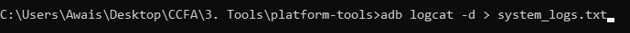

*Figure 10. Redirecting adb logcat -d (dump-and-exit mode) to
system_logs.txt.*

The exported log was opened in Notepad rather than read on the command
line, since a raw logcat dump is large and difficult to scan line by
line in a terminal.

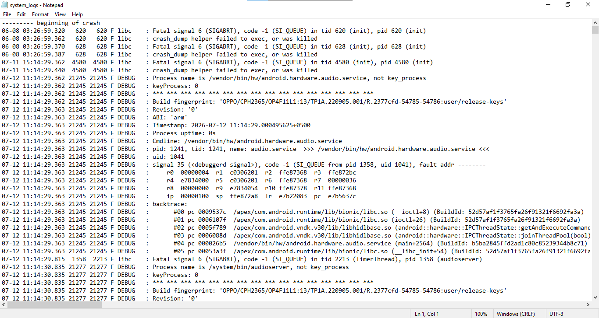

*Figure 11. system_logs.txt opened in Notepad, showing native crash
traces (SIGABRT) tied to specific process IDs and build fingerprints.*

**Finding:** The captured buffer included several native crash events
(Fatal signal 6 / SIGABRT) tied to system services such as
android.hardware.audio.service, each timestamped and attributed to a
specific process ID, alongside the exact build fingerprint
(OPPO/CPH2365/OP4F11L1:13/...) of the device at capture time.

### 5.5 Battery and Power Data

**Purpose:** Records the device's power state at the time of
acquisition, which can help establish whether a device was actively
charging, idle, or under load around the time of an event of interest.

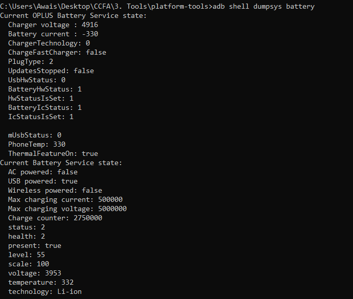

*Figure 12. adb shell dumpsys battery output: charger voltage, battery
current, and charging state.*

**Finding:** The device was on AC charge at the time of capture, with
charger voltage and instantaneous current values recorded directly from
the battery service.

### 5.6 Network Configuration

**Purpose:** Captures the device's active network interfaces and live
connections, useful for establishing what the device was communicating
with, and over what kind of network, at the moment of acquisition.

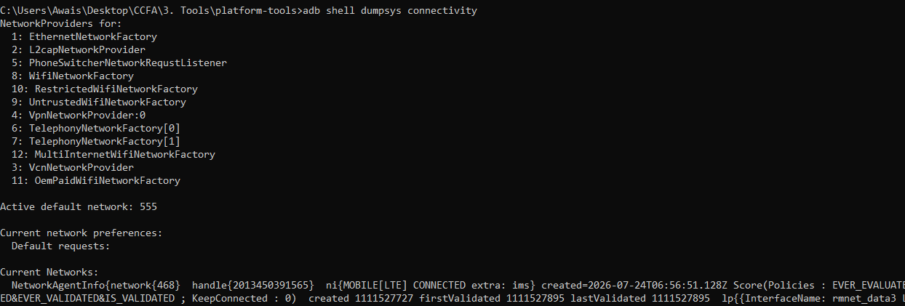

*Figure 13. adb shell dumpsys connectivity / wifi summary of the active
network state.*

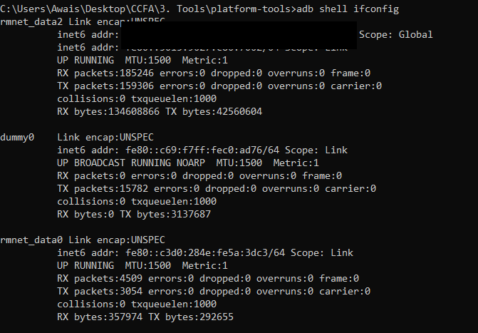

*Figure 14. adb shell ifconfig, listing network interfaces and their
addresses. The device's global-scope IPv6 address has been redacted
(solid black bar) to protect the examiner's personal network identity.*

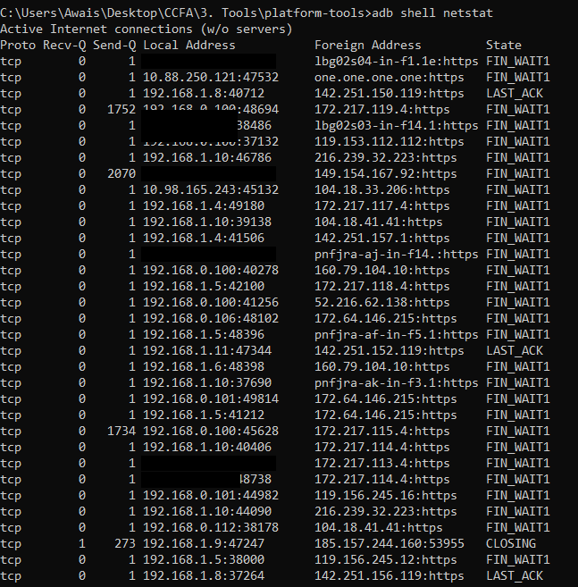

*Figure 15. adb shell netstat, part 1: active TCP connections by
local/foreign address and state. A recurring public IPv4 address has
been redacted throughout.*

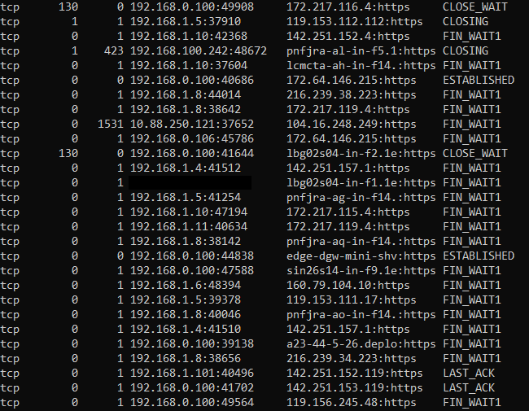

*Figure 16. adb shell netstat, part 2, continuing the connection
listing, with the same public IPv4 address redacted.*

**Finding:** Two connections were captured in an ESTABLISHED state (to
Cloudflare and Meta edge infrastructure); the remainder were in
FIN_WAIT1, LAST_ACK, or CLOSE_WAIT, meaning they were already in the
process of closing rather than actively open at the moment of capture.


> **TECHNICAL NOTE: TECHNICAL NOTE: Reading netstat Connection States**
>
> ESTABLISHED means a connection was genuinely live and open at the exact moment netstat ran, both sides had an active session. FIN_WAIT1, LAST_ACK, and CLOSE_WAIT all describe a connection somewhere in TCP's multi-step closing handshake: the session had already been torn down or was actively being torn down, and would disappear from the list entirely within seconds.
>
> For an examiner, this distinction matters: an ESTABLISHED entry is strong evidence of an active session at a specific timestamp, while a closing-state entry only proves a connection existed recently, not that it was still meaningfully in use. The two ESTABLISHED connections captured here are the most forensically significant entries in this network snapshot for exactly that reason; everything else is a trailing record of very recent, already-finished activity.


### 5.7 Directory and File Acquisition

**Purpose:** Tests direct file-level acquisition of accessible storage
locations, and, separately, of a protected system path, to demonstrate
both what ADB can retrieve without root and where it is blocked.

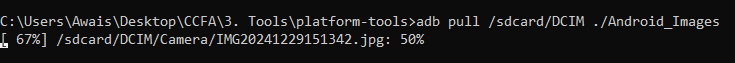

*Figure 17. adb pull of /sdcard/DCIM to a local Android_Images folder,
in progress.*

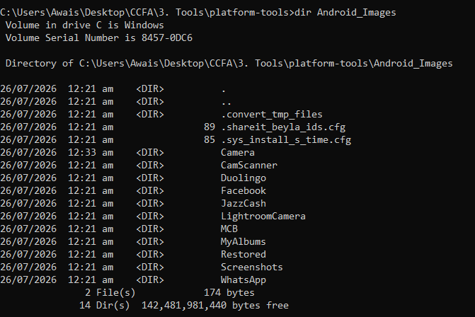

*Figure 18. Local directory listing of the pulled DCIM contents: camera
photos alongside app-specific media folders (JazzCash, MCB, Facebook,
WhatsApp, Duolingo, CamScanner).*

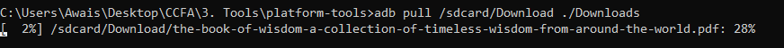

*Figure 19. adb pull of /sdcard/Download to a local Downloads folder, in
progress.*

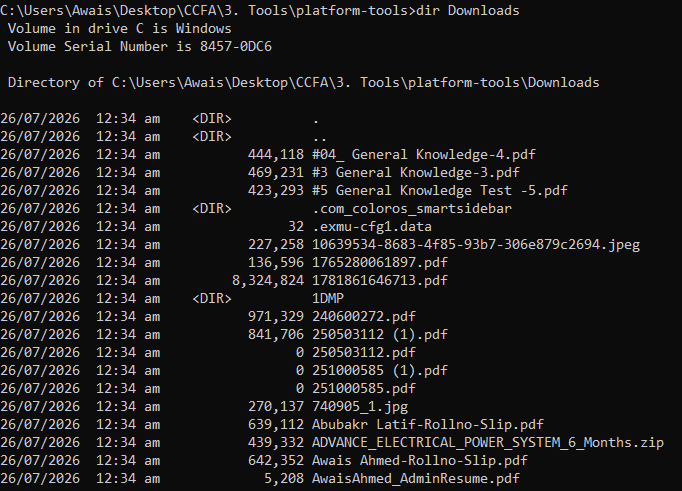

*Figure 20. Local directory listing of the pulled Downloads contents:
academic documents, a resume, and other personal files.*

**Finding:** Both /sdcard/DCIM and /sdcard/Download were fully
accessible without root, and were pulled successfully; the resulting
local folders reflect ordinary personal device use, camera photos,
e-wallet and banking app storage folders, and personal/academic
documents, with nothing indicating anomalous or hidden activity.

A further attempt was made to pull a protected system file directly:

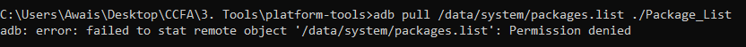

*Figure 21. adb pull of /data/system/packages.list, failing with
Permission denied.*

**Finding:** Access to /data/system/packages.list was denied. Paths
under /data are protected by Android's application sandboxing and are
not accessible over a standard (non-root) ADB shell; retrieving them
would require a rooted device or a forensic-mode system image, which is
why this step returned no result rather than partial data.

### 5.8 Device Timeline and Activity Data

**Purpose:** Reconstructs recent usage patterns and system-level state
from Android's own usage-tracking and settings services, without needing
access to the restricted content providers covered in Section 6.

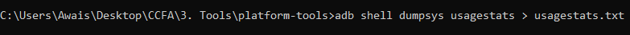

*Figure 22. Redirecting adb shell dumpsys usagestats to usagestats.txt.*

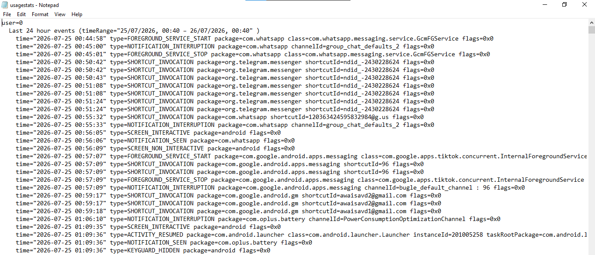

*Figure 23. usagestats.txt excerpt, showing recent app and shortcut
activity, including Gmail account shortcut identifiers.*

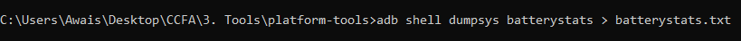

*Figure 24. Redirecting adb shell dumpsys batterystats to
batterystats.txt.*

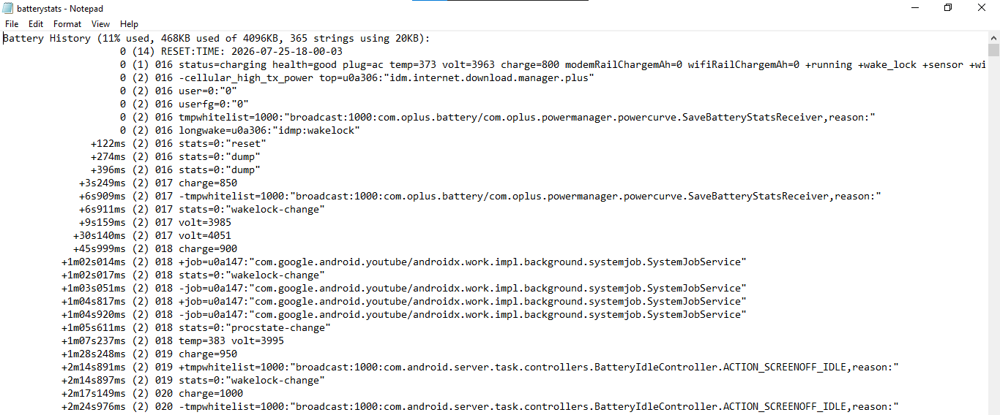

*Figure 25. batterystats.txt excerpt: a timestamped battery history log
of charge level, screen state, and background job activity.*

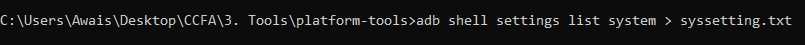

*Figure 26. Redirecting adb shell settings list system to
syssetting.txt.*

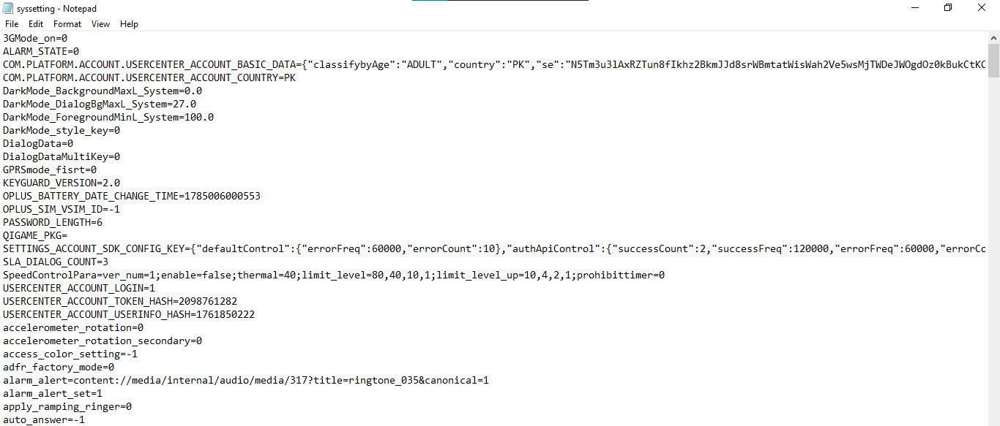

*Figure 27. syssetting.txt excerpt, showing an OPPO account entry with
country code and an account session token.*

**Finding:** Usage-stats data surfaced the device's two configured Gmail
accounts (awaisavd2@gmail.com, awaisavd1@gmail.com) via their shortcut
identifiers. Battery history provided a fine-grained, second-by-second
timeline of charge level and background activity. System settings
confirmed an active OPPO account tied to Pakistan (PK) as the registered
country, along with its session token.

## 6. Where Android 13 Blocks Further Access

On Android 11 and higher, ADB shell access to contacts, call logs, and
SMS is restricted unless the device is rooted or a special forensic
build is used, exactly the same protection boundary already encountered
directly in Section 5.7's failed /data pull. Because the examiner's
device is an unmodified, non-rooted Android 13 phone, the commands below
could not be executed against it in this exercise. They are documented
here as reference material: this is what a rooted device or a
forensic-mode image would additionally make available, not a record of
data actually recovered in this exercise.


> **TECHNICAL NOTE: Documented but Not Executed**
>
> Every command in this section targets a Content Provider (Android's structured inter-app data-access layer), rather than a plain file, which is precisely the layer Android 11+ locks down for third-party and shell access. A rooted device, or an official forensic acquisition build, bypasses this restriction because it runs the ADB shell with elevated (system/root) privileges instead of the standard, sandboxed shell user.


#### List All Applications with Registered Accounts

```
adb shell dumpsys account | grep -i com.*$ -o | cut -d' ' -f1 | cut -d} -f1 | grep -v com$
```

Lists all app package names that have registered accounts on the device.

#### List Email Addresses Registered on the Device

```
adb shell dumpsys | grep -E -o "\b[A-Za-z0-9._%+-]+@[A-Za-z0-9.-]+\[A-Za-z]{2,6}\b"
```

Extracts every detected email address from the Account Manager service.

#### Count Number of Device Reboots

```
adb shell settings list global | grep "boot_count=" | cut -d= -f2 | head -n 1 | xargs echo "Booted:" | sed 's/$/ times/g'
```

Retrieves the device boot counter from global system settings.

#### List Every Contact and Phone Number

```
adb shell content query --uri content://contacts/phones/ --projection display_name:number | cut -f 3- -d " "
```

Shows all stored contact names and phone numbers.

#### Extract All Contact Info

```
adb shell content query --uri content://contacts/phones/
```

Lists raw contact provider data for quick inspection.

#### Dump Call Log

```
adb shell content query --uri content://call_log/calls
```

Retrieves call history entries including number, type, and timestamp.

#### Dump SMS Messages

```
adb shell content query --uri content://sms/
```

Exports SMS database contents such as address, date, and body,
redirected to sms.txt on a device where this provider is accessible.

## 7. Findings Summary and Conclusion


> **TECHNICAL NOTE: Overall Assessment**
>
> Device identification (model, Android version, serial number) was recovered cleanly and matches the known physical device throughout.
>
> Installed applications, real-time logs, and battery/power state were all fully accessible without root, and reflect ordinary, expected personal device use with no anomalous findings.
>
> Network configuration captured two genuinely live (ESTABLISHED) connections at the moment of acquisition, distinct from several already-closing sessions, a distinction that matters for any timeline built from this data.
>
> Accessible storage (DCIM, Download) was pulled successfully; the protected /data path correctly returned Permission denied, demonstrating Android's sandboxing working as intended against a non-rooted shell.
>
> Usage statistics, battery history, and system settings together reconstructed a detailed activity timeline without needing access to the restricted contacts/call-log/SMS providers covered in Section 6.


Because this device is an unmodified, non-rooted Android 13 phone, this
exercise reached the practical ceiling of what standard ADB access can
recover: everything documented in Section 5 was retrieved directly,
while contacts, call logs, and SMS, along with protected system files,
remained out of reach and are only documented as reference commands in
Section 6. On a rooted device or with a proper forensic-mode image, the
same command set would extend directly into those restricted categories
with no change in method, only in the privilege level the shell is
running under.

As a self-examination exercise, this report also demonstrates the flip
side of mobile forensics: exactly how much of a person's daily activity,
accounts, app usage, network behavior, and file history, a standard,
non-rooted ADB session can reconstruct without ever touching the
device's most protected data stores.
